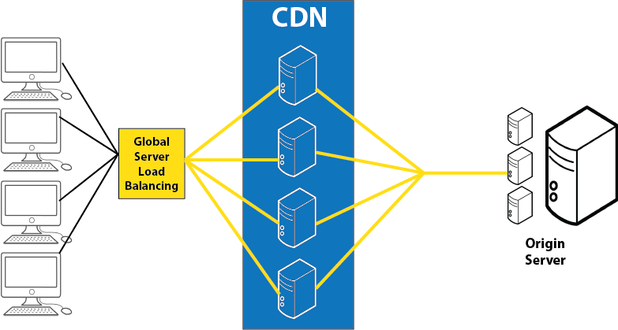
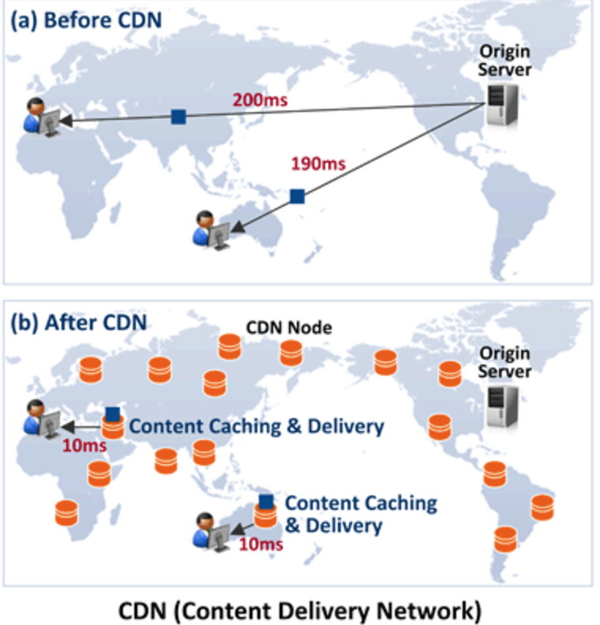

# CDN

> 콘텐츠 전송 네트워크(Content Delivery Network)는 콘텐츠를 효율적으로 전달하기위해 여러 노드를 가진 네트워크에 데이터를 저장하여 제공하는 시스템이다.

CDN은 사용자가 인터넷상에서 가장 가까운 곳의 서버로 콘텐츠를 전송받게해, 트래픽이 특정 서버에 집중되지않고 각 서버로 분산되도록 하는 기술이다.

멀리있는 Origin Server에 요청하지 않고, 가까운 CDN Server에서 요청 결과를 받으면 된다.

 

정리해보자.

1. 웹 브라우저는 특정 주소에 접근하며 HTML, CSS, JS, 이미지 등 화면 렌더링에 필요한 여러 콘텐츠를 서버로 요청한다.
2. DNS는 콘텐츠에 대한 각 요청이 발생하면 End User와 가장 가까운 위치에 최적으로 배치된 CDN서버에 End User가 맵핑되고, 해당 서버는 요청된 파일의 캐싱된 버전으로 리스폰스를 전달한다.
3. 서버가 파일을 찾는데 실패하는 경우, 다른 CDN 서버에서 콘텐츠를 찾으며 최종적으로는 Origin Server까지 찾게된다.

 

### CDN 캐싱 방식

#### 1. Static Caching

- Origin Server에 있는 콘텐츠를 미리 Cache Server에 복사
- 미리 복사해두었기때문에 사용자가 Cache Server에 콘텐츠 요청 시, 무조건 Cache Server에 있다.

#### 2. Dynamic Caching

- Origin Server에 있는 콘텐츠를 미리 Cache Server에 복사하지 않는다.
- 사용자가 콘텐츠 요청 시 해당 Content가 없는 경우 Origin Server로부터 다운로드받아 전달한다.
- 각각의 콘텐츠는 일정 시간 이후 Cache Server에서 삭제될 수도 있다.

### Reference

https://mygumi.tistory.com/67

https://ijbgo.tistory.com/32