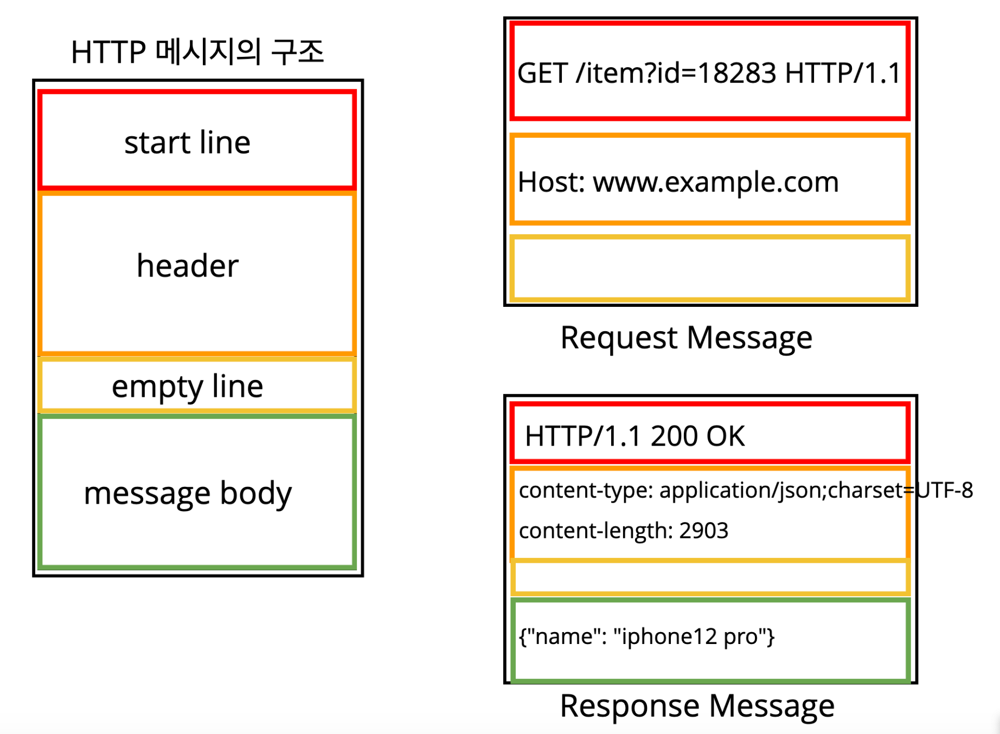
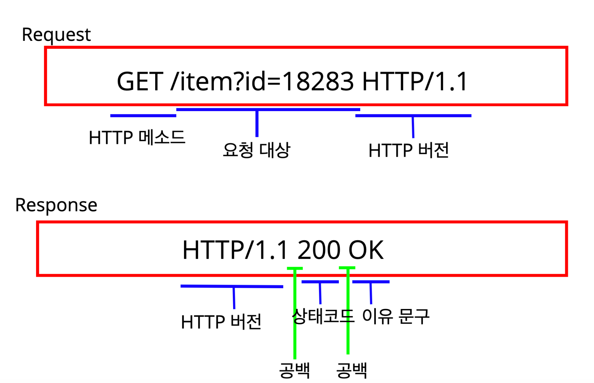
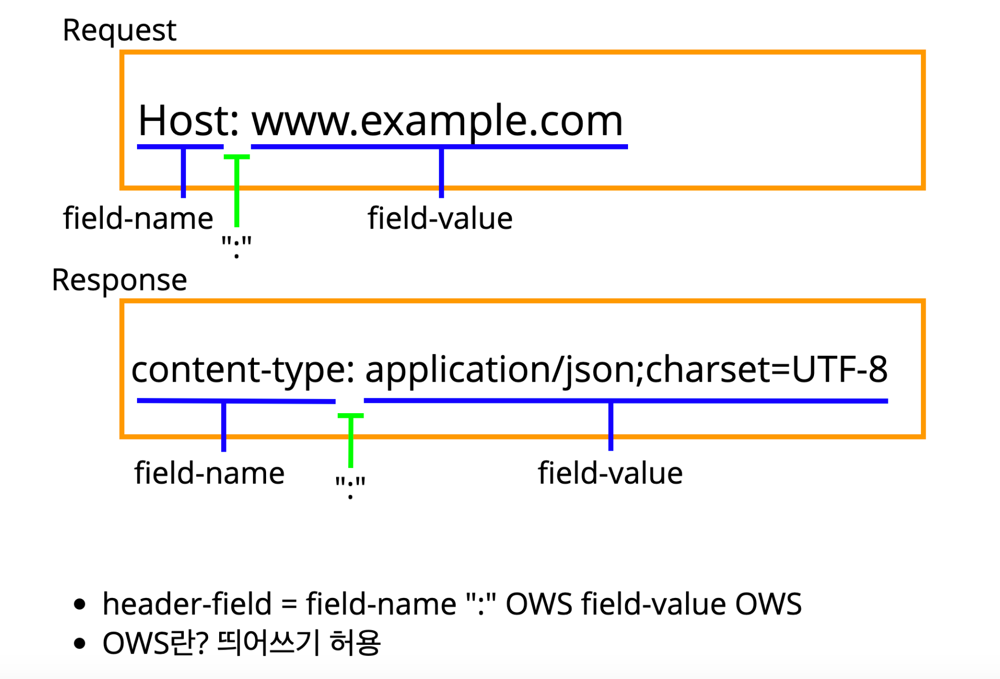

# HTTP 개요

## HTTP의 진화

- HTTP/0.9
- HTTP/1.0
- HTTP/1.1 (1997년)- **우리가 주로 사용하는 표준 프로토콜**
  - RFC 2616(1999년)
  - RFC 7230-RFC 7235(2014년)
- HTTP/2
- HTTP/3

## HTTP의 특징

### - Stateless 무상태 프로토콜

- stateful

  - A: 치킨얼마에요?

    B: 2만원이요.
    A: 2마리 주세요.
    B: 결제는 어떻게 하시겠어요?
    A: 신용카드로 할게요.

- stateless

  - A: 치킨얼마에요?

    B: 2만원이요.

    ... 5분 후
    A: 2마리 주세요.
    C: 뭘 몇마리 달라는 거에요?

    ... 5분 후
    A: 신용카드로 할게요.
    D: 뭘 신용카드로 한다는 거에요?

  - A: 치킨얼마에요?

    B: 2만원이요.
    A: **치킨 2마리 주세요.**
    B: 결제는 어떻게 하시겠어요?
    A: **치킨 2마리 신용카드로 결제할게요.**

> Stateful할 때, 점원이 다른사람으로 바뀌면 **장애가 발생할 수 있다.**
>
> Stateless에서는 필요한 정보를 항상 준다. 점원이 바뀌어도 문제가 없음.

### - 비연결성

> HTTP는 기본적으로 연결을 유지하지 않는 모델이다.
>
> 즉, 수천명이 서비스를 사용하더라도 실제 서버에서 동시에 처리하는 요청은 수십개 이하로 매우 작다.
>
> 이렇게 비연결되어있다면, 서버 자원을 매우 효율적으로 사용할 수 있다.

하지만 단점이 있다.

- TCP/IP 연결을 계속 새로 맺어야한다.
  - 3 way handshake 시간이 계속 추가된다.
- 이러한 단점을 HTTP 지속 연결(Persistent Connections)로 문제를 해결한다.

---

## HTTP 메시지

 

#### - 시작 라인

#### - 헤더

- 헤더에는 HTTP전송에 필요한 모든 부가정보가 다 들어있다.
  Ex) 압축, 인증, 브라우저 정보, 메시지 바디의 크기 등등..

#### - 바디

- 실제 전송할 데이터
- HTML, JSON, 이미지, 영상 등 byte로 표현할 수 있는 모든 데이를 전송할 수 있다.

