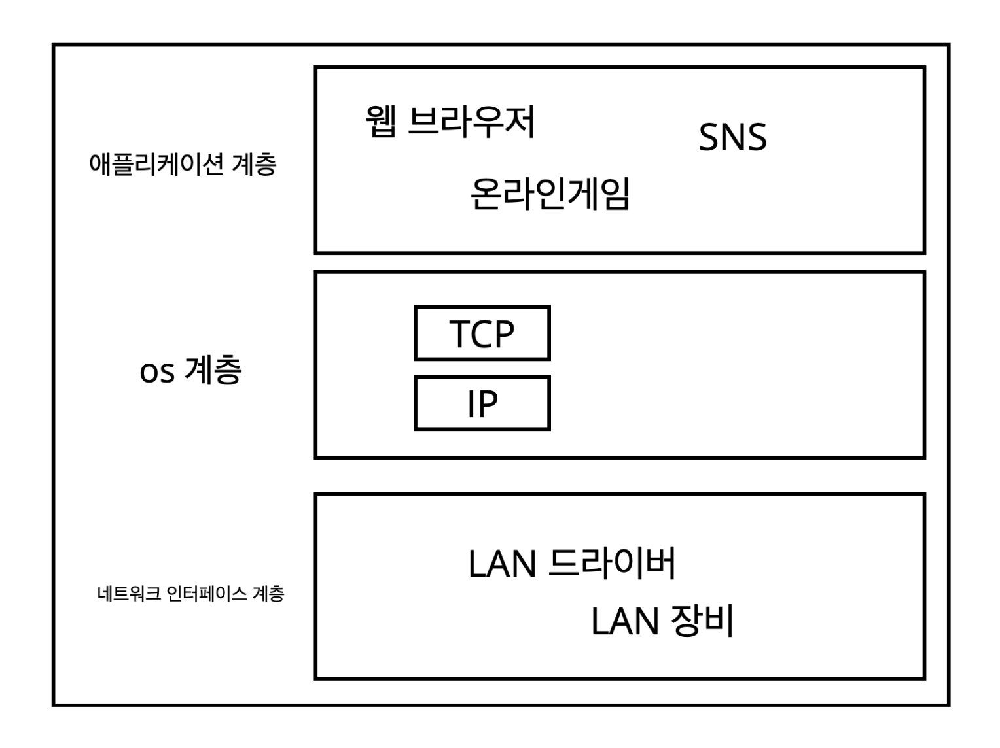
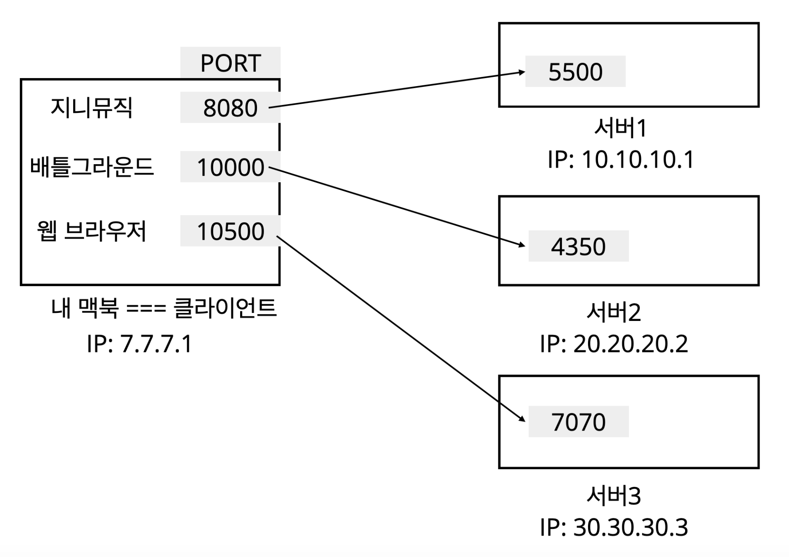

# HTTP

## IP(인터넷 프로토콜)

### IP란?

> 정보를 주고받는데 사용되는 규약(프로토콜)이다.
>
> **패킷** 이라는 통신 단위로 정보를 주고받는다.

이 패킷에는 **출발지**, **도착지**, **메시지(정보)** 등의 데이터가 들어가는데, 이러한 규칙으로 내가 전달한 메시지가 도착지에 보내지게된다.

마찬가지로, 도착지에서는 잘받았다는 의미로 똑같이 패킷에 출발지, 도착지, 메시지(정보) 등의 데이터를 담아서 리스폰스를 준다.

### IP 프로토콜의 한계

- 비연결성

  > 난 도착지가 있을거라고 생각하고 보냈는데 사실 이러한 ip를 가진 도착지는 없는 경우

- 비신뢰성

  - 중간에 패킷이 사라지는 경우
  - 패킷이 순서대로 도착하지 않는 경우

이러한 문제를 해결해주는 것이 **TCP** 이다.

 

## TCP

### 인터넷 프로토콜 스택

- 애플리케이션 계층 - HTTP, FTP
  - 애플리케이션에서 사용하는 계층.
- 전송 계층 - TCP, UDP
  - IP계층을 보완해주는 영역으로 이해하자.
- 인터넷 계층 - IP
  - 위에서 살펴본 계층.
- 네트워크 인터페이스 계층
  - 실제 물리적인 영역과 관련된 프로토콜 영역.

### 프로토콜 계층

1. 애플리케이션 계층에서 "Hello World" 메시지를 전달한다.
2. os계층의 TCP레이어에서 메시지 데이터를 포함한 TCP정보를 생성한다.
3. os계층의 IP 레이어에서 TCP데이터를 포함한 IP 패킷을 생성한다.
4. 네트워크 인터페이스를 통해 `이더넷 프레임` 이 포함되어 최종적으로 **인터넷**을 통해 **서버**로 전달된다.

 

### TCP(전송 제어 프로토콜 Transmissio Control Protocol) 특징

더 많은 특징이 있지만,

- 연결지향(TCP 3 way handshake)
  - 나와 도착지가 연결되어있는지 확인

- 데이터 전달 보증
  - 전송 중 패킷이 손실되거나 누락되었는 내가 알 수 있다. 
- 순서 보장

### TCP/IP 패킷 정보

- 위에서 알아보았듯이, IP 패킷만으로는 순서를 보장할 수 없었는데 그러한 단점을 TCP가 보완을 해준다.

> TCP는 이러한 정보들을 추가로 가지고 있기 때문에, 위에서 본 특징이 나타날 수 있었구나.

## PORT

> 같은 IP 내에서의 프로세스 구분

내 맥북으로 지니뮤직도 듣고 있고, 스팀으로 온라인 게임도 하고 있고 공략을 보기위해 웹 브라우저 요청도 날리고 있다.

즉, 하나의 클라이언트가 여러 서버와 통신하고 있는 상황.

내 IP로 패킷들이 도착할텐데, 이게 지니뮤직인지 게임인지 웹 브라우저 요청인지 어떻게 알까?

IP만으로는 알 수가 없다.

그래서 `TCP/IP 패킷 정보` 에는 **PORT** 정보가 담긴다.

### DNS(도메인 네임 시스템 Domain Name System)

#### 이게 왜 있는거야?

- IP는 기억하기 어렵다.
  - `321.28.48.3`? `403.123.492.9`??? ~~아니 이걸 어떻게 외워요~~
- IP는 쉽게 변경될 수 있다.
  - 어제는 `839.291.583.7` 인데 오늘은 `839.291.583.3` 이네

#### 요약

