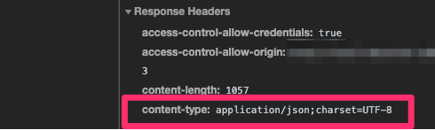
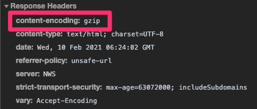
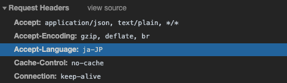

# HTTP 헤더


### 어디에 쓰여?

- HTTP 전송에 필요한 모든 부가정보가 담긴다.
  - ex) 메시지 바디의 내용 & 크기, 압축, 인증, 캐시 관리 정보 등등...


## 1. 표현

표현 헤더는 **리퀘스트**, **리스폰스** 모두에서 사용된다.

- Content-Type: 표현 데이터의 형식

```
HTTP/1.1 200 OK
Content-Type: text/html;charset=UTF-8
...
```




- Content-Encoding: 표현 데이터의 압축 방식
  - 데이터를 전달하는 쪽에서 압축을 진행한다. 
    그리고 헤더에 인코딩 표현을 추가한다.
  - 데이터를 받는 쪽에서는 `content-encoding: gzip` 이라는 인코딩 헤더의 정보를 사용해서 압축을 해제한다.



- Content-Language: 표현 데이터의 자연 언어
  - ex) ko, en, en-US

- Content-Length: 표현 데이터의 길이


## 2. 콘텐츠 협상(Contentes Negotiation)

클라이언트가 선호하는 표현 요청.

콘텐츠 협상 헤더는 **리퀘스트** 에서만 사용한다.

- Accept: 클라이언트가 선호하는 미디어 타입 전달
- Accept-Charset: 클라이언트가 선호하는 문자 인코딩
- Accept-Encoding: 클라이언트가 선호하는 압축 인코딩

- Accept-Language: 클라이언트가 선호하는 자연 언어



> 난 한국어로 보고싶은데, 서버에서는 일본어 >영어 순서로만 언어를 지원하는 경우는 어떻게 할까?

### 2-1 협상과 우선순위

#### Quality Values(q) 를 사용한다.

- 0~1 사이값이며, 클수록 높은 우선순위를 가진다.
- 생략하면 1

```
Accept-Language: ko-KR;ko;q=0.9,en-US;q=0.8;en:q=0.7
```

> ko-KR;q=1(q 생략) -> 1순위
>
> ko;q=0.9 -> 2순위
>
> en-US;q=0.8; -> 3순위
>
> en;q=0.7 -> 4순위

