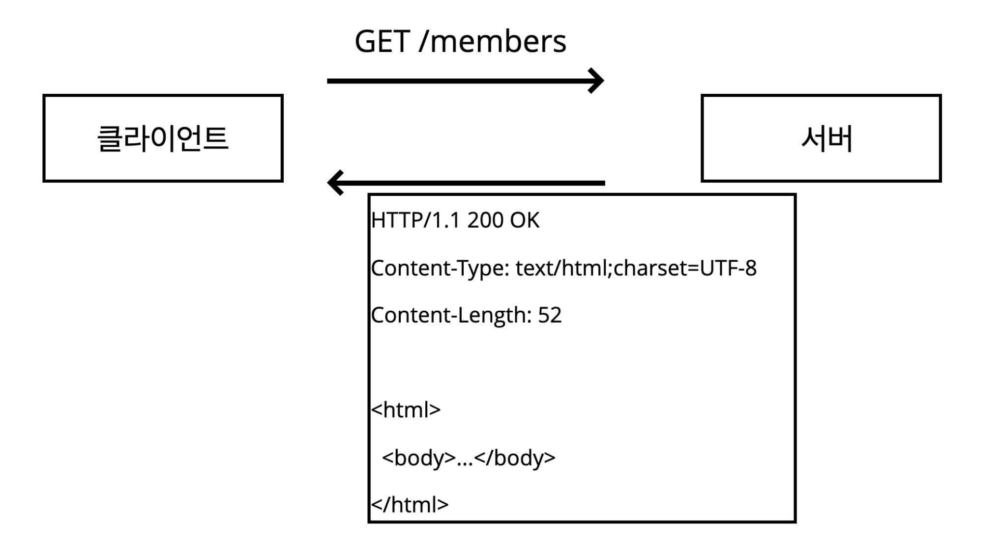
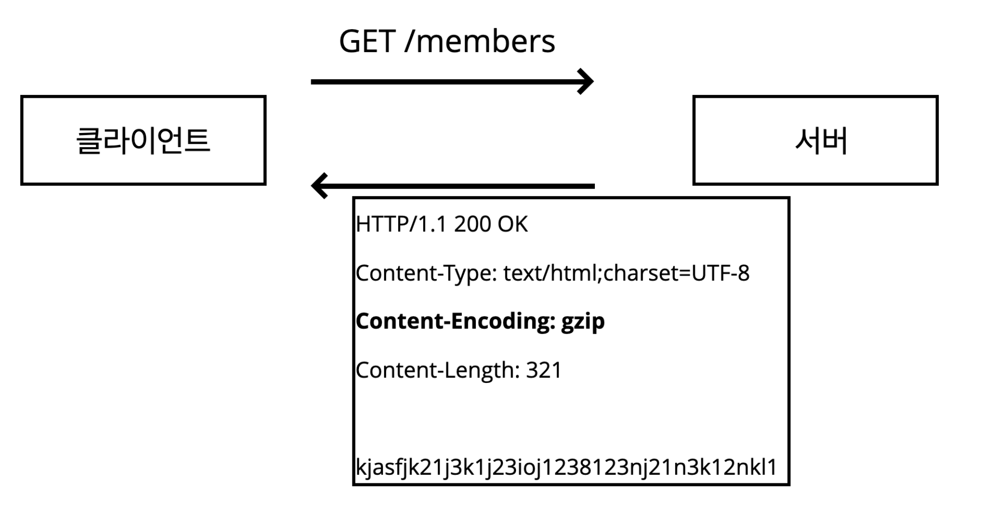
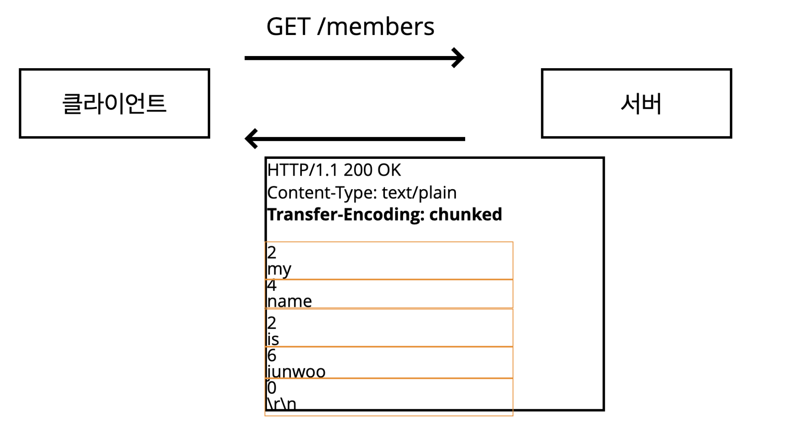
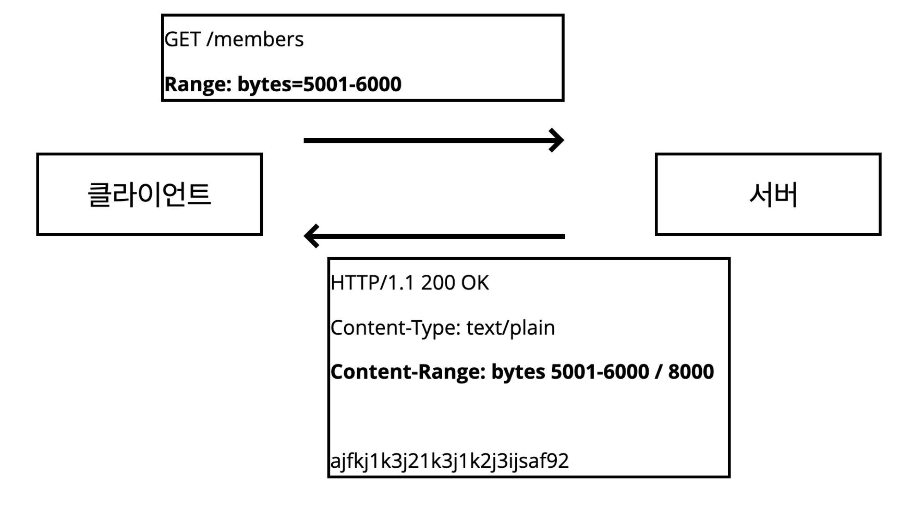
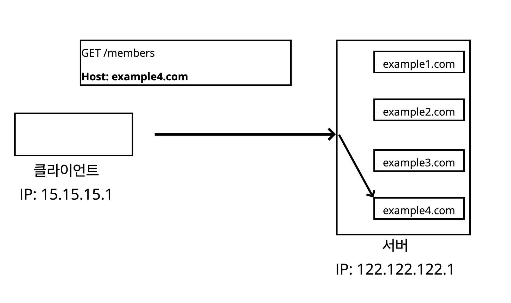
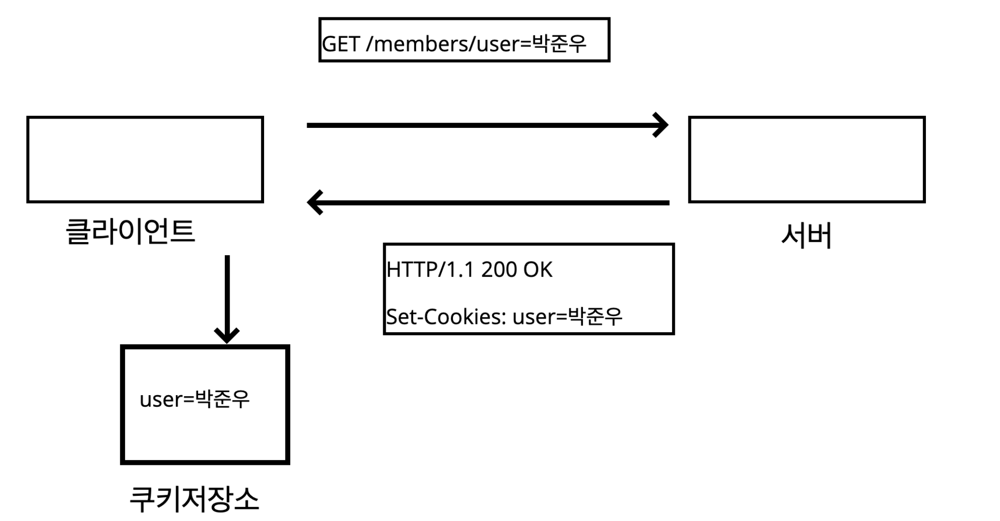
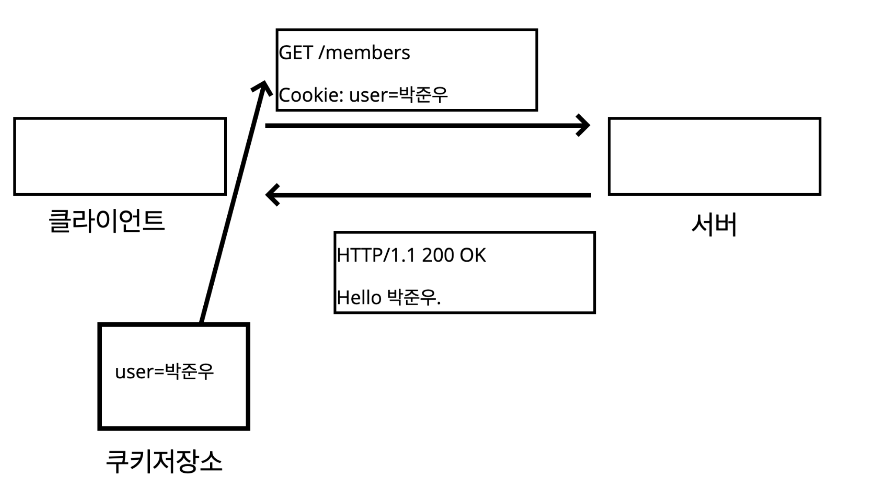

# HTTP 헤더


### 어디에 쓰여?

- HTTP 전송에 필요한 모든 부가정보가 담긴다.
  - ex) 메시지 바디의 내용 & 크기, 압축, 인증, 캐시 관리 정보 등등...


## 1. 표현

표현 헤더는 **리퀘스트**, **리스폰스** 모두에서 사용된다.

- Content-Type: 표현 데이터의 형식

```
HTTP/1.1 200 OK
Content-Type: text/html;charset=UTF-8
...
```


- Content-Encoding: 표현 데이터의 압축 방식
  - 데이터를 전달하는 쪽에서 압축을 진행한다. 
    그리고 헤더에 인코딩 표현을 추가한다.
  - 데이터를 받는 쪽에서는 `content-encoding: gzip` 이라는 인코딩 헤더의 정보를 사용해서 압축을 해제한다.


- Content-Language: 표현 데이터의 자연 언어
  - ex) ko, en, en-US

- Content-Length: 표현 데이터의 길이


## 2. 콘텐츠 협상(Contentes Negotiation)

클라이언트가 선호하는 표현 요청.

콘텐츠 협상 헤더는 **리퀘스트** 에서만 사용한다.

- Accept: 클라이언트가 선호하는 미디어 타입 전달
- Accept-Charset: 클라이언트가 선호하는 문자 인코딩
- Accept-Encoding: 클라이언트가 선호하는 압축 인코딩

- Accept-Language: 클라이언트가 선호하는 자연 언어


> 난 한국어로 보고싶은데, 서버에서는 일본어 >영어 순서로만 언어를 지원하는 경우는 어떻게 할까?

### 2-1 협상과 우선순위

#### Quality Values(q) 를 사용한다.

- 0~1 사이값이며, 클수록 높은 우선순위를 가진다.
- 생략하면 1

```
Accept-Language: ko-KR;ko;q=0.9,en-US;q=0.8;en:q=0.7
```

> ko-KR;q=1(q 생략) -> 1순위
>
> ko;q=0.9 -> 2순위
>
> en-US;q=0.8; -> 3순위
>
> en;q=0.7 -> 4순위


## 3. 전송 방식

- 단순 전송



- 압축 전송



- 분할 전송
  - 나눠서 전송한다.



- 범위 전송
  - range를 정해서 요만큼만 전송한다.



<br>

## 4. 헤더에서 알 수 있는 정보

### Referer

- 현재 요청된 페이지의 이전 웹페이지 주소를 알 수 있다.
- Referer를 활용하여 유입 경로 분석이 가능하다.

### User-Agent

사용자 애플리케이션 정보

- 어떤 브라우저에서 장애가 발생하는지 파악 가능

### Server

요청을 처리하는 ORIGIN 서버의 소프트웨어 정보

### Host

요청한 호스트 정보(도메인)

- 필수값
- 하나의 서버가 여러 도메인을 처리해야할 때.
- 하나의 IP 주소에 여러 도메인이 적용되어 있을 때.



### Location

페이지 리다이렉션

- 웹 브라우저는 3XX 응답의 결과에 따라 Location 헤더가 있으면 Location으로 자동 이동한다.(리다이렉트)

<br>

## 5. 인증

### Authorization

클라이언트의 인증 정보를 서버에 전달하는 헤더.

<br>

## 6. 쿠키

쿠키를 사용할 때는 2개의 헤더를 사용한다.

- Set-Cookie: 서버에서 클라이언트로 쿠키를 전달.
- Cookie: 클라이언트가 서버에서 받은 쿠키를 저장하고 HTTP 요청시 서버로 전달.




서버에서 클라이언트로 리스폰스를 내려줄때 `Set-Cookies` 헤더에 쿠키를 구워준다.

클라이언트에서는 해당 정보를 쿠키저장소에 저장한다.



서버에 요청을 날릴때, 이제 항상 쿠키저장소를 뒤져서 저장된 정보들을 `Cookie` 헤더에 담는다.


- 사용처
  - 사용자 로그인 세션을 관리할 때 주로 쓰인다.
  - 광고 정보 트래킹할 때도 자주 쓰인다.
- 쿠키 정보는 항상 서버에 전송된다. 따라서,
  - 네트워크 트래픽을 추가적으로 유발한다. 그러므로,
  - 최소한의 정보만 사용하는 것이 권장된다.(세션id, 인증 토큰 등...)
- 주민등록번호, 카드정보 등 보안에 민감한 데이터는 저장하면 안된다.


### 쿠키의 생명주기

쿠키를 영원히 보관하기엔 좀 그렇다.

그래서 만료일을 지정한다. 만료일이 지나면 쿠키는 삭제된다.

```
Set-Cookie: expires=Mon, 15-Feb-2021 04:32:11 GMT
```

또한 아래 처럼 타이머를 걸기도한다.

(7200초)

```
Set-Cookie: max-age=7200
```

이럴 경우 0이나 음수를 지정하면 쿠키를 삭제된다.


이러한 만료일을 생략하면 **브라우저 종료시 쿠키는 모두 삭제된다.**

하지만 만료일을 입력하면 해당 날짜, 시간까지 유지된다.


### 쿠키 - 도메인

```
domain=example.org
```

쿠키의 도메인을 직접 입력하거나 생략하는 2가지 경우가 있다.

- 명시
  - 명시한 도메인 + 서브 도메인에 모두 쿠키를 포함시킨다.
    ex) `domain=example.org` 를 지정하여 쿠키를 생성한 경우,
    example.org 쿠키 접근.
    dev.example.org도 쿠키 접근.
- 생략
  - 현재 문서 기준 도메인만 적용된다.
    ex) example.org에서 쿠키를 생성했지만 domain을 지정하지 않은 경우,
    example.org 쿠키 접근.
    dev.example.org는 쿠키 미접근


### 쿠키 - 경로

이 경로를 포함한 하위 경로 페이지만 쿠키 접근 가능하다.

일반적으로는 `path=/` 루트로 지정한다.

ex) `path=/members` 으로 지정한 경우

- /members -> 가능
- /members/1234 -> 가능
- /members/1234/items -> 가능
- /info -> 불가능


### 쿠키 - 보안

#### Secure

- 쿠키는 http, https를 구분하지 않고 전송가능하다.
- `Secure` 를 적용하면 https인 경우에만 전송가능하다.

#### HttpOnly

- XSS 공격 방지
- HTTP 전송에만 사용한다.
- 자바스크립트에서 접근 불가하도록 막는다. (document.cookie)

#### SameSite

- XSRF 공격 방지
- 요청 도메인과 쿠키에 설정된 도메인이 같은 경우에만 쿠키 전송 가능하도록 강제.

