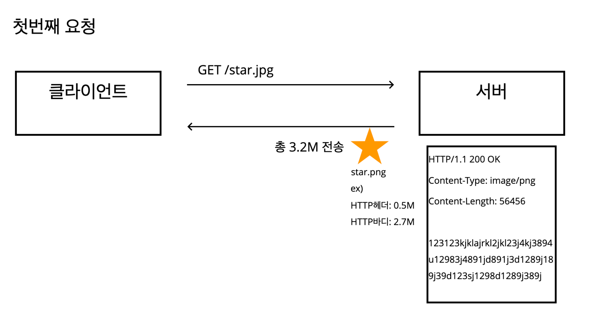
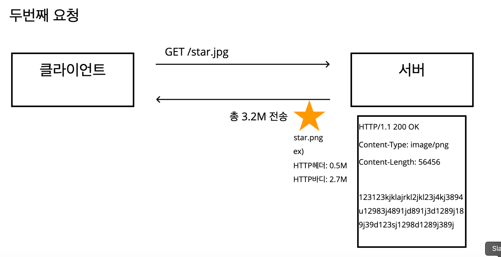
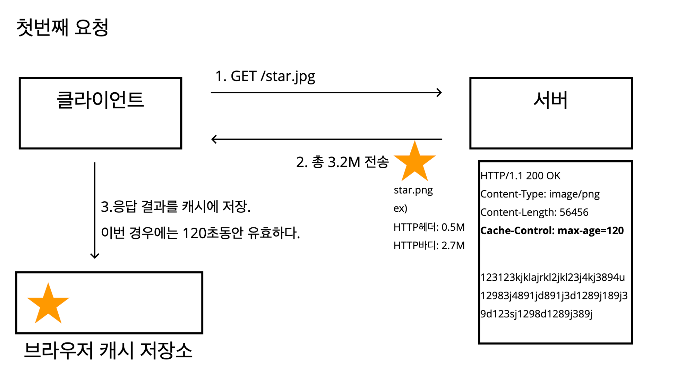
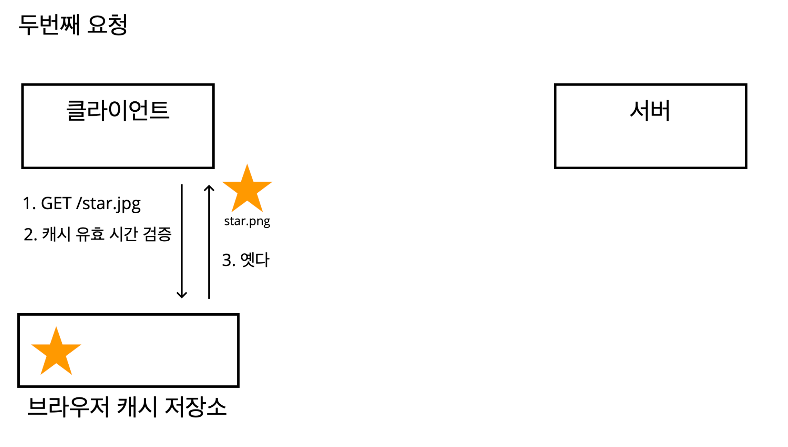

# HTTP 헤더 - 캐시와 조건부 요청

`star.png` 이미지를 요청하면 다음과같이 3.2M 용량의 이미지를 가져온다고 생각해보자.

캐시가 없다면, 두번째 요청에서도 마찬가지로 3.2M의 데이터를 가져오게된다.

이렇게 캐시가 없다면,

- 데이터가 변경되지 않아도 네트워크를 통해 계속해서 데이터를 다운받아야한다.
- 브라우저 로딩 속도가 느리다.
  - 즉, 사용자 경험을 해친다.

캐시를 적용해보자.

`Cache-Control:max-age=120` 처럼 헤더에 추가한다.

단위는 초단위이다.

두번째 요청에서는, 우선 브라우저 캐시 저장소를 먼저 확인한다.

캐시 유효 시간을 확인 후, 유효하다면 브라우저 캐시 저장소에서 바로 꺼내간다.

만약 캐시 유효 시간이 유효하지 않다면, 처음과 마찬가지로 네트워크를 타게된다.

