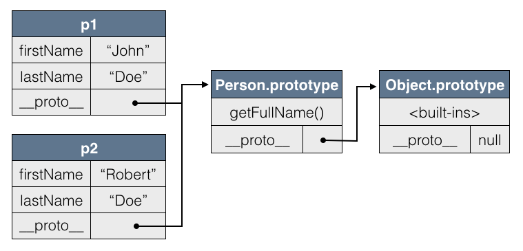
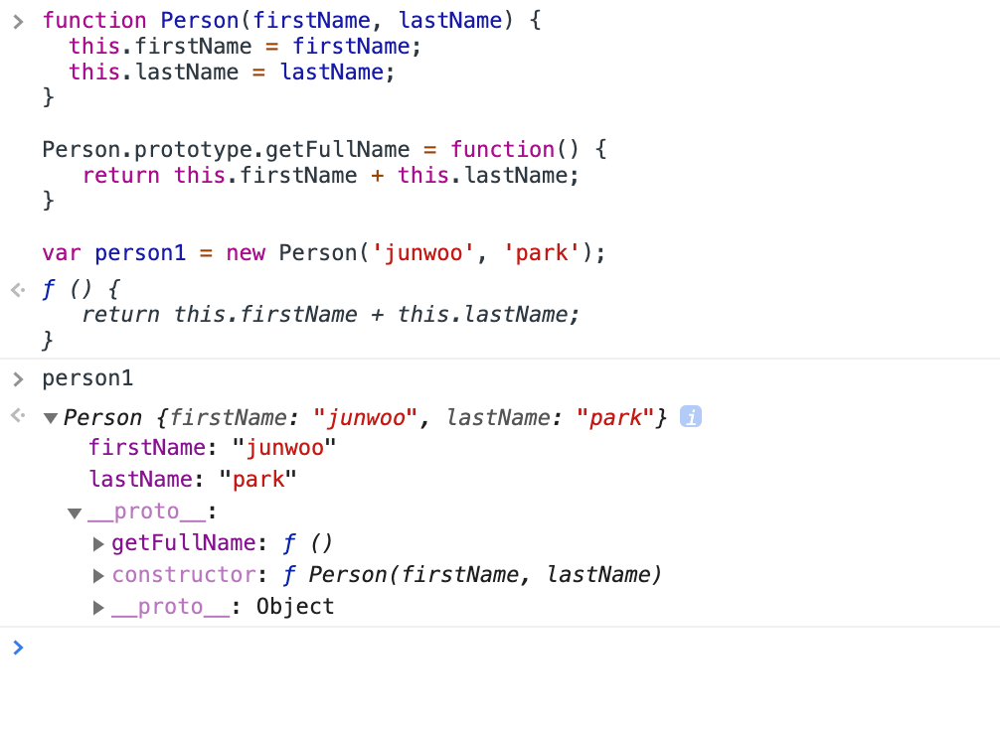
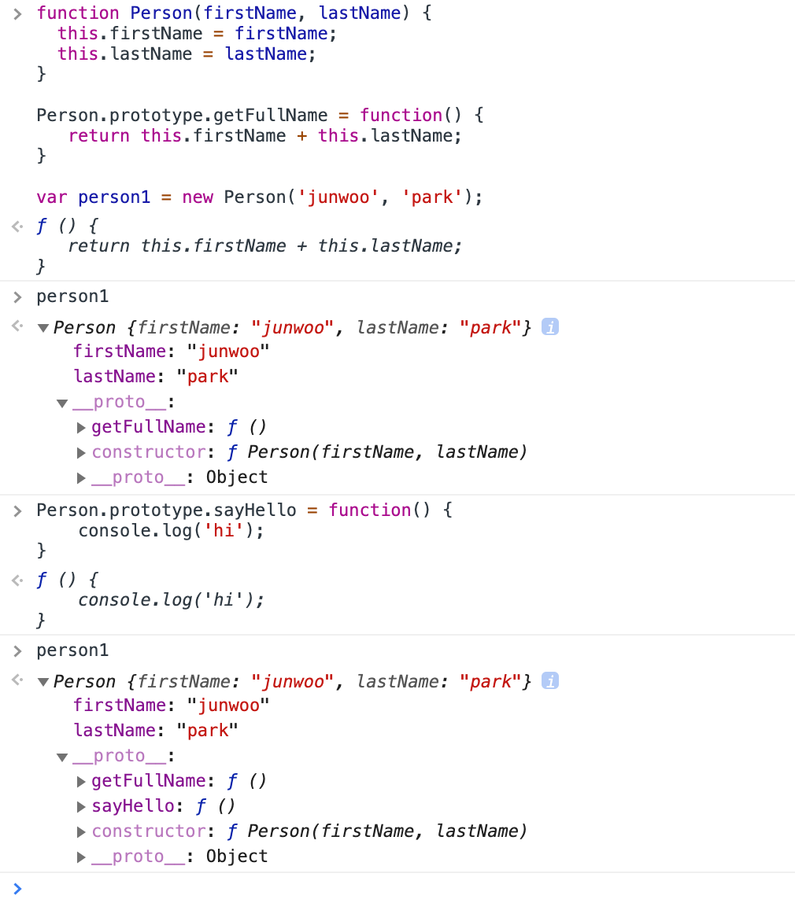
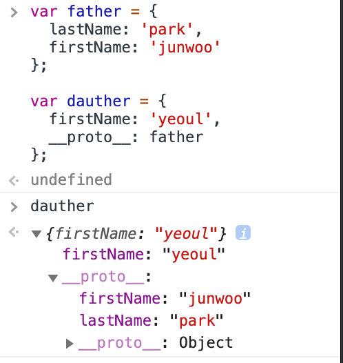
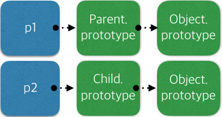
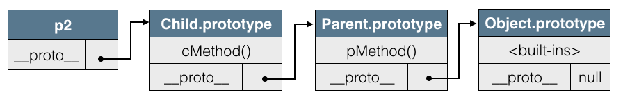

# 자바스크립트 객체지향 프로그래밍

- 자바스크립트에서의 객체는 모두 Object타입의 인스턴스입니다.


## 객체접근 - 프로퍼티 추가

```javascript
var obj = {
  gender: 'male',
  age: 100
};

obj.name = 'aaa';	//프로퍼티가 없으면 프로퍼티 추가
obj.name = 'bbb';	//프로퍼티가 있으면 값변경
```

- key값이 숫자로 시작한다면, dot notaion은 사용못하고 배열의 인덱스 형태로만 접근 가능합니다.

```javascript
obj.1st	//error
obj['1st'] = 'first';
```

- 배열의 인덱스형태에서는 자바스크립트 표현식이 모두 가능합니다.

```javascript
var personName = 'name';
obj[personName] = 'junwoo';	//obj.name = 'junwoo'
obj[personName + 'Deleted'] = 'junwoo';	//obj.nameDeleted = 'junwoo'
```


## 객체 접근 - 프로퍼티 삭제

```javascript
var obj = {
  name: 'junwoo'
};

//null값을 넣어도 지워지는것이 아닙니다!
obj.name = null;
'name' in obj === true;

//delete로 삭제해야합니다! 지워지면 true를 리턴합니다.
delete obj.name;
'name' in obj === false;
obj.name === undefined	//true
```


## 객체접근 - 객체삭제

- 객체로의 참조는 끊을 수 있어도, 객체를 직접 삭제할 수는 없습니다.

```javascript
var foo = {};

foo = null;
//변수 foo가 참조하던 객체의 참조가 끊겼습니다.
//{}는 삭제된 것이 아닙니다!
//하지만 언젠가 가비지콜렉터에의해 객체는 메모리 상에서 소멸될 것입니다.
```


## Object.defineProperty()

- 객체의 프로퍼티에 특별한 속성을 적용시킵니다.
- 속성으로 프로퍼티의 접근 권한을 설정할 수 있습니다.
- getter와 setter를 만들 수 있습니다.

```javascript
var obj = {};

Object.defineProperty(obj, 'name', {
  value: 'junwoo',
  configurable: true,	//삭제
	writable: true,	//값 변경
  enumarable: true	//for-in문에서 해당 프로퍼티를 반환하는지.
});	
//옵션의 속성을 생략하면 디폴트로 모두 false가 설정됩니다.
```

테스트해보겠습니다!

```javascript
var obj = {};

Object.defineProperty(obj, 'name', {
  value: 'junwoo',
  configurable: false,	
	writable: true,
  enumarable: true
});	
//configurable값을 false로 주고

delete obj.name;
obj.name === 'junwoo';	//삭제가 불가능 합니다!
```

```javascript
var obj = {};

Object.defineProperty(obj, 'name', {
  value: 'junwoo',
  configurable: true,	
	writable: false,
  enumarable: true
});	
//writable값만 false로 주고

obj.name = 'mike';
obj.name === 'junwoo';	//변경 불가능
```

```javascript
var obj = {
  name: 'junwoo',
  age: 100
};

Object.defineProperty(obj, 'id', {
  value: 'abcdefg',
  configurable: true,	
	writable: true,
  enumarable: false
});	
//enumarable값만 false로 주고

for(var key in obj) {
  console.log("key : ", key);
}
// key : name
// key : age
// id값은 출력되지 않습니다!
```


## Object.defineProperty() - getter와 setter

```javascript
var obj = {};
var randomNum = 100;

Object.defineProperty(obj, 'age', {
  set: function(value) {
    randomNum = value;
  },
  get: function() {
    return randomNum + '살';
  }
});

obj.age = 100;
console.log(obj.age);	//'100살'
```


## call, apply, bind

####우선 call과 apply먼저..

```javascript
var person = {
  name: 'paul',
  title: '반갑습니다.'
};

function setName(name) {
  this.name = name;
}

setName('junwoo');

window.name === 'junwoo';
```

- 현재 person객체와 setName함수는 아무런 관계도 없습니다.
- setName함수를 실행하게되면, this는 window를 가리키고있기에, 글로벌 컨텍스트에 name이라는 프로퍼티가 생성될 뿐…...
- 저는 setName함수가 person객체를 바꾸게 하고 싶습니다! 어떻게 해야할까요?

```javascript
var person = {
  name: 'paul',
  title: '반갑습니다.'
};

function setName(name) {
  this.name = name;
}

setName.call(person, 'junwoo');
//혹은
//setName.apply(person, ['junwoo']);

person.name === 'junwoo';
```

### bind

- this가 특정 객체로 고정된 함수를 리턴합니다.

```javascript
var person = {
  name: 'paul',
  title: '반갑습니다.'
};

function setName(name) {
  this.name = name;
}

var setNameOfPerson = setName.bind(person);
setNameOfPerson('gagaga');

person.name === 'gagaga'	//true
```


####call메소드를 이용해서 bind함수를 직접 구현해보기.

```javascript
var person = {
  name: 'junwoo'
};

function printPersonName() {
  console.log(this.name);
}

function makeBindMethod(func, context) {
  return function() {
    func.call(context);
  }
}

var customBind = makeBindMethod(printPersonName, person);
customBind();	//'junwoo'
```

printPersonName함수의 this를 person객체와 연결시키고싶습니다.

custonBind변수에 담기는 makeBindMethod에 printPersonName함수와 person 객체를 인자로 넣고,

makeBindMethod는 익명함수 function(){func.call(context)}를 리턴하죠.

즉, customBind는...

```javascript
customBind = function() {
	printPersonName.call(person)
} 
```

이 담기게 됩니다.


## 객체 생성 패턴

### 팩터리 함수

- 리터럴은 여러개의 객체를 생성할때는 부적합합니다.

```javascript
var person1 = {
  name: 'junwoo'
};

var person2 = {
  name: 'pogba'
};

var person3 = {
  name: 'eriksen'
};

...
```

- 팩터리패턴 : 객체의 생성과정을 캡슐화합니다.
- 만드려고하는 객체를 생성하는 함수를 작성해서 여러개의 객체를 만들 수 있습니다!

```javascript
function createPerson(name) {
  var newPerson = {};
  
  newPerson.name = name;
  
  return newPerson;
}

var person1 = createPerson('junwoo');
var person2 = createPerson('pogba');
var person3 = createPerson('eriksen');
```


### 생성자

- 클래스의 역할을 합니다!
- 일반 함수를 new 키워드와 함께 실행하면 생성자로 동작합니다!
- new키워드를 사용했을 때 this는 빈 객체를 가리킵니다.

```javascript
function Person(name) {
  this.name = name;
}

var person1 = new Person('junwoo');
```


### new연산자의 내부 동작(1)

```javascript
//new 없이 실행하게되면...
var person = Person('junwoo');

function Person(name) {
  //1. this = window입니다.
  this.name = name;	//2. 코드를 실행합니다.
  
  //3. return undefined : 리턴값이 없으면 undefined를 리턴합니다.
}

//즉, person변수에는 undefined이 담기게 됩니다.
```

### new연산자의 내부 동작(2)

```javascript
//new와 함께 실행하면..!
var person = new Person('junwoo');

function Person(name) {
  //1. this = {}; : 새로운 객체를 만들고 this는 그 객체를 가리킵니다!
  //2. 객체와 생성자의 프로토타입을 연결합니다!
  
  this.name = name; //3.코드를 실행합니다.
  //4. return this; : 생성자는 만들어진 객체를 자동으로 리턴합니다. 따라서 person변수에 만들어진 객체가 담깁니다!
}
```


### 객체 타입 비교

- 생성자를 이용해서 객체를 생성하면 생성자의 타입을 가질 수 있습니다.
- 타입은 constructor와 instanceof연산자를 이용해서 구할 수 있습니다.

```javascript
function Person() {};

var man = new Person();

typeof man;	//'object'
man.constructor === Person;	//true
man instanceof Person;	//true
```


## 프로토타입

### 생성자만 사용했을때의 문제

- 생성자가 만들어낸 객체들의 메소드들은 메로리상에서 중복해서 생성됩니다.

```javascript
function Person(firstName, lastName) {
  this.firstName = firstName;
  this.lastName = lastName;
  
  this.getFullName = function() {
    return this.firstName + this.lastName;
  }
}

var person1 = new Person('junwoo', 'park');
var person2 = new Person('abc', 'def');

person1.getFullName !== person2.getFullName;	
//기능적으로는 동일한 메소드지만 같은 인스턴스가 아닙니다!
//낭비라고 할 수 있습니다.
```

### 프로토타입의 기본적인 아이디어

```javascript
//생성자에서는 고유한 데이터에 해당하는 프로퍼티만 만듭니다.
function Person(firstName, lastName) {
  this.firstName = firstName;
  this.lastName = lastName;
}

//공통적인 메소드들은 따로 정의해서 공용으로 사용합니다!!~
ver personMethods = {
  getFullName: function() {
    return this.firstName + this.lastName;
  }
};
```

### 프로토타입의 실제 적용

```javascript
//생성자에서는 고유한 데이터에 해당하는 프로퍼티만 만듭니다.
function Person(firstName, lastName) {
  this.firstName = firstName;
  this.lastName = lastName;
}

//prototype에 공통 메소드들을 선언합니다.
Person.prototype.getFullName = function() {
   return this.firstName + this.lastName;
}

var person1 = new Person('junwoo', 'park');
var person2 = new Person('abc', 'def');

person1.getFullName === person2.getFullName
//이제 프로토타입의 getFullName을 공유함으로 getFullName은 동일한 메소드입니다!!!
```

### 프로토타입 위임의 동작원리

```javascript
//1.
var p1 = new Person('John', 'Doe');

// 2.new키워드를 사용하게 되면 엔진내부에서 다음 코드가 실행됩니다.
p1.__proto__ = Person.prototype;

// 인스턴스마다 Person.prototype으로 향하는 포인터를 만드는 거라고 생각하면 됩니다.

//3. 다음코드가 실행되면, 포인터로 연결되었으므로 prototype에 존재하는 메서드가 실행됩니다.
p1.getFullName();
```



1. 현재 객체(p1)에서 getFullName메소드를 찾았는데 없다?
2. 현재 객체(p1)의 \_\_proto\_\_프로퍼티가 가리키는 객체(Person.prototype)으로 이동해서 찾는다!
3. Person.prototype에서 getFullName메소드를 찾아서 실행!
4. 만약에 Person.prototype에도 없다?
5. 현재 객체(Person.prototype)의 \_\_proto\_\_프로퍼티가 가리키는 객체(Object.prototype)으로 이동해서 찾아서 실행!!


### 프로토타입의 특징(1)

- 프로토타입의 내용을 동적으로 변경하면, 미리 생성된 객체에도 적용됩니다.



- 우선, Person생성자 함수를 new키워드로 이용해서 person1변수에 담아보았습니다.

- person1 객체를 확인해봅니다.
- 던더프로토를 클릭해서 열어보면 Person.prototype에 등록한 getFullName메소드가 잘 보입니다.

- 다시한번 Person.prototype에 메소드를 등록해보겠습니다.



- 뒤늦게 sayHello메소드를 Person.prototype에 등록하고 person1객체를 확인해봅니다.
- 던더프로토 안에 sayHello가 들어와있는것을 볼 수 있습니다!


### 프로토타입의 특징(2)

- 객체 인스턴스에서는 프로토타입의 내용을 **읽을 수**는 있지만, **쓸 수**는 없습니다.
- 이 점을 이용해서 뒤에 나오는 상속 구조에서 메서드 오버라이드를 구현합니다.

```javascript
function Person() {...}

Person.prototype.getFullName = function() {...}

var person1 = new Person('junwoo', 'park');
person1.getFullName = function() {console.log('changed?')}
//person1객체에 getFullName이라는 새로운 메서드가 생길 뿐, Person.prototype에는 영향이 없습니다!
```


## 상속

### Prototypal 상속(1)

- 자바스크립트에서는 상속이라기보다는 **자신에게 없는 메서드나 속성을 다른 객체로 위임**해주는 개념입니다.
- 사실은 위아래도 없다고합니다. 링크드리스트같은.. 모습이려나요
- 던더프로토(\_\_proto\_\_)는 표준이 아닙니다. 따라서 개발할때 확인할때만 사용하는걸로...
- 이러한 프로토타입 위임의 끝은 항상 Object.prototype이라고 합니다.

### Prototypal 상속(2)

- 객체 리터럴이나 Object생성자로 인스턴스를 생성하면, \_\_proto\_\_프로퍼티는 Object.prototype을 가리킵니다!!

```javascript
var obj10 = {
  name: 'mama'
};

obj10.__proto__ === Object.prototype

var obj100 = new Object();

obj100.__proto__ === Object.prototype
```

### Prototypal 상속(3)

```javascript
var father = {
  lastName: 'park',
  firstName: 'junwoo'
};

var dauther = {
  firstName: 'yeoul'
};
```

- dauther객체가 프로토타입 위임을 통해 father의 메서드에 접근할 수 있게 만들어보면..!

```javascript
var father = {
  lastName: 'park',
  firstName: 'junwoo'
};

var dauther = {
  firstName: 'yeoul',
  __proto__: father
};

//이렇게 dauther의 __proto__프로퍼티의 값을 father객체로 덮어씌웁니다!
```



### Prototypal 상속(4)

- grandChild도 같은 방법으로 만들 수 있습니다!

```javascript
var father = {
  lastName: 'park',
  firstName: 'junwoo'
};

var dauther = {
  firstName: 'yeoul',
  __proto__: father
};

var grandChild = {
  firstName: 'baby',
  __proto__: dauther
}
```

### Prototypal 상속(5)

- 하지만 처음에 말했듯이, <mark>\_\_proto\_\_</mark> 는 표준이 아닙니다..!
- 객체와 객체의 프로토타입 연결은 표준 API인 **Object.create()** 메서드를 사용합니다!

```javascript
var father = {
  lastName: 'park',
  firstName: 'junwoo'
};

var dauther = Object.create(father);
//dauther.__proto__ -> father

dauther.firstName = 'yeoul';
```

- 이런식으로 우선 Object.create() 메소드를 사용해주고, 
- 그 다음에 dauther만의 프로퍼티를 생성해주면됩니다.


### 생성자 기반 프로토타입 체인 상속(1)

```javascript
function Parent() {}
function Child() {}

var p1 = new Parent();
var p2 = new Child();
```



p1과 p2는 현재 서로 다른 프로토타입 체인을 가지고 있습니다.


### 생성자 기반 프로토타입 체인 상속(2)

- 생성자의 상속 구조는 생성자의 프로토타입 객체들을 프로토타입 체인으로 연결하는 것으로 만들어집니다.
- Child 타입이 Parent타입을 상속받으려면...
  - Child 생성자의 프로토타입 객체가 \_\_proto\_\_ 로 Parent 생성자의 프로토타입 객체와 연결되면 됩니다.




### 생성자 기반 프로토타입 체인 상속(3)

- Parent 생성자의 prototype객체를 상속받는 Child타입 구조

```javascript
function Parent() {}
Parent.prototype.pMethod = function() {}

function Child() {}
Child.prototype = Object.create(Parent.prototype);
//var dauther = Object.create(father)처럼 우선 연결먼저 시키고
Child.prototype.constructor = Child;
Child.prototype.cMethod = function() {}

var p2 = new Child();
```


## class 키워드 사용

### ES6 class

- 지금까지 공부한 프로토타입과 생성자를 이용한 패턴을 쉽게 사용할 수 있도록하는 편의 문법이 class키워드 입니다!
- 내부적으로는 지금까지 공부한 내용과 똑같이 동작합니다.

### 기본문법

```javascript
class Person {
  //생성자
  constructor(firstName, lastName) {
    this.firstName = firstName;
    this.lastName = lastName;
  }
  
  //메소드
  getFullName() {
    return this.firstName + this.lastName;
  }
}
```

### 상속

```javascript
class Parent {
  constructor(name) {
    this.name = name;
  }
  
  getName() {
    return this.name;
  }
}

class Child extends Parent {
  constructor(name) {
    super(name);
  }
  
  getName() {
    return super.getName() + ' 주니어 2세';
  }
}

var person1 = new Parent('준우');
var person2 = new Child('준우');

person1.getName();	//'준우'
person2.getName();	//'준우 주니어 2세'
```


---

TOAST FORWARD 김성호 책임님께서 진행해주신"자바스크립트 OOP 꼭꼭 씹어 먹기"를 듣고 정리한 내용입니다!

