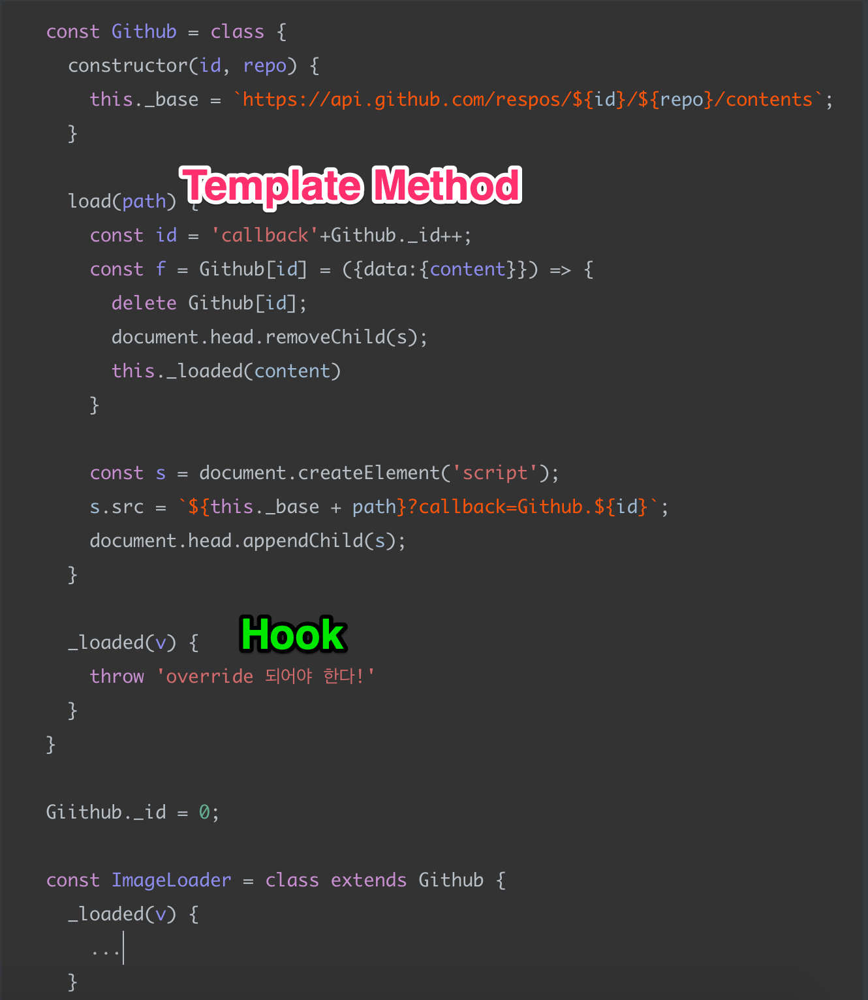
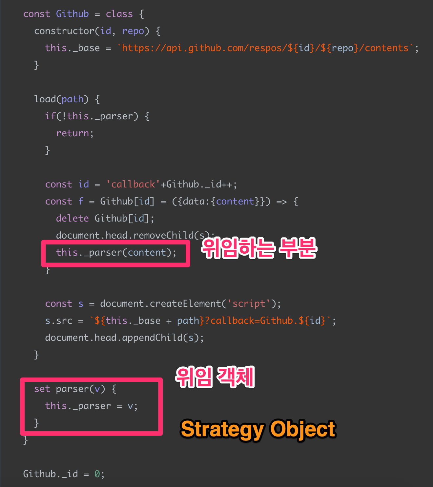

# 디자인패턴

디자인패턴을 공부하면 깔끔한 커뮤니케이션을 이룰 수 있다.

개발자들 사이의 약속. 프로토콜이다.

## 상속 위임

**상속 위임** 패턴을 공부할 때, 가장 자주 보는 패턴이 Template Method Pattern이다.

```javascript
// 부모 클래스
const Github = class {
  constructor(id, repo) {
    this._base = `https://api.github.com/respos/${id}/${repo}/contents`;
  }
  
  load(path) {
    const id = 'callback'+Github._id++;
    const f = Github[id] = ({data:{content}}) => {
      delete Github[id];
      document.head.removeChild(s);
      this._loaded(content)
    }
    
    const s = document.createElement('script');
    s.src = `${this._base + path}?callback=Github.${id}`;
    document.head.appendChild(s);
  }
  
  _loaded(v) {
    throw 'override 되어야 한다!'
  }
}

Github._id = 0;

// 자식 클래스
const ImageLoader = class extends Github {
  _loaded(v) {
    ...
  }
}
```


이러한 패턴을 `템플릿 메소드 패턴` 이라고 부른다.

위임하는 hook을 호출하는 함수 자체를 `템플릿 메소드`라고 부른다.

부모 클래스나 자식 클래스의 `_loaded` 함수를 hook이라고 부른다.



<br>

## 소유 위임 - 전략 패턴(Strategy Pattern)

```javascript
const Github = class {
  constructor(id, repo) {
    this._base = `https://api.github.com/respos/${id}/${repo}/contents`;
  }
  
  load(path) {
    if(!this._parser) {
      return;
    }
    
    const id = 'callback'+Github._id++;
    const f = Github[id] = ({data:{content}}) => {
      delete Github[id];
      document.head.removeChild(s);
      this._parser(content);
    }
    
    const s = document.createElement('script');
    s.src = `${this._base + path}?callback=Github.${id}`;
    document.head.appendChild(s);
  }
  
  set parser(v) {
    this._parser = v;
  }
}

Github._id = 0;
```

<br>

Set parser를 통해 _parser를 정의해주고 있다. 

그리고 이때 정의된 _parser에게 content를 넘겨준다.

_parser가 없으면 load함수가 호출되었을때 return된다.

즉, load함수를 호출하기 전, set parser를 반드시 호출해주어야 한다.

_parser가 무엇이느냐에 따라, `위임하는 부분` 의 처리내용이 달라지게 된다.



<br>

```javascript
const loader = new Github('junwoo', 'hello');

//img인 경우
const img = value => {
  ...value를 가공하는 로직
}
// 반드시 parser를 set해주어야 한다.
loader.parser = img;
// 그 뒤 load를 호출해야한다.
loader.load('xx.png');

//markdown인 경우
const md = > value => {
  ...markdown을 가공하는 로직
}
// parser만 교체하면 되기 때문에, Github클래스의 인스턴스를 새로 만들 필요가 없다는 장점이 있다!
loader.parser = md;
loader.load('xx.md');
```

