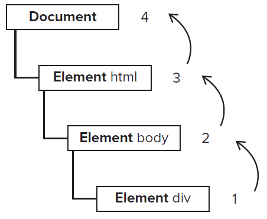
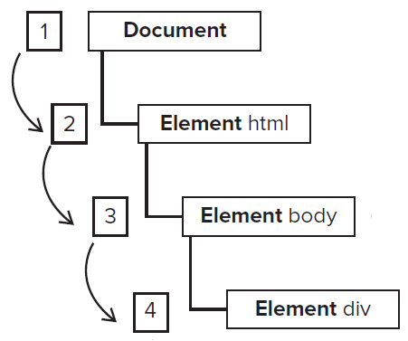

# Event Delegation


HTML 엘리먼트는 계층적 구조로 이루어져있다.

HTML 엘리먼트에 이벤트가 발생할 때, 이 구조를 따라서 이벤트가 전파(Event Propagation)된다.

전파 방향에 따라 Event Bubbling과 Event Capturing으로 구분한다.

---

## Event Bubbling

디폴트는 버블링이다.

버블링은 이름처럼 물 속에서 거품이 수면으로 올라오는 듯한 모양이다.

하위 엘리먼트에서부터 상위 엘리먼트로 이벤트를 전파한다.



<center><small>출처: http://www.java2s.com/Book/JavaScript/DOM/Event_Flow_capture_target_and_bubbling.htm</small></center>

<br>

## Event Capturing

이벤트 캡쳐링은 버블링의 반대다.

개인적으로 난 엄마가 말썽쟁이 아들을 잡으러 쫓아다니는 모습이 떠오른다.



캡쳐링은 `addEventListener()` 메서드의 옵션으로 설정할 수 있다.

```typescript
target.addEventListener('click', () => {
  console.log('clicked!');
}, {
  capture: true
});
```

`capture` 의 디폴트 값은 false이다. 

즉, 다음 코드는 Event Bubbling이 발생한다.

```typescript
target.addEventListener('click', () => {
  console.log('clicked!');
}, {
  capture: false
});
```

<br>

---

## Event.stopPropagation()

이벤트 캡쳐링과 버블링의, 현재 이벤트 이후의 전파를 막는다.

즉, 클릭한 엘리먼트의 이벤트만 발생시키고 상위 혹은 하위 엘리먼트로의 이벤트 전파를 막는다.

<br>

언젠가, `Event.preventDefault()` 메서드와 헷갈린 적이 있었다.

`form` 태그를 `submit` 하거나 하이퍼링크를 클릭하면, 다른 페이지로 이동한다.

이러한 엘리먼트가 가지고 있는 기본동작을 중단시키는 것이 `preventDefault()` 메서드이다.

```typescript
const goToKakaoTalk = document.querySelector('a');

a.addEventListener('click', (e) => {
  e.preventDefault();
})
```


<br>

---

## Event Delegation

```html
<ul id="item-list">
  <li id="item1"></li>
  <li id="item2"></li>
  <li id="item3"></li>
  <li id="item4"></li>
  <li id="item5"></li>
</ul>
```

```typescript
function sayMyName() {
  console.log('i am junwoo');
}

document.querySelector('#item1').addEventListener('click', sayMyName);
document.querySelector('#item2').addEventListener('click', sayMyName);
document.querySelector('#item3').addEventListener('click', sayMyName);
document.querySelector('#item4').addEventListener('click', sayMyName);
document.querySelector('#item5').addEventListener('click', sayMyName);
```

모든 `li` 엘리먼트에 이벤트 핸들러를 바인딩하려면... 정말 힘들다.

이러한 엘리먼트가 하루에 1만개씩 추가된다면... 정말 힘들다.

더군다나, 동적으로 `li` 엘리먼트가 생성된다면, DOM에 존재하지 않던 `li` 엘리먼트에게는 이벤트 핸들러가 바인딩되지 않을 것이다. 

이러한 상황에서 사용되는 것이 `Event Delegation` 이다.

`Event Delegation`은 다수의 자식 요소에 하나하나 이벤트 핸들러를 바인딩하지 않고, 하나의 상위 부모 요소에 이벤트 핸들러를 바인딩하는 방식이다.

위 코드는 다음과 같이 바꿀 수 있다.

```html
<ul id="item-list">
  <li id="item1">item1</li>
  <li id="item2">item2</li>
  <li id="item3">item3</li>
  <li id="item4">item4</li>
  <li id="item5">item5</li>
</ul>
```

```typescript
function sayMyName() {
  console.log('i am junwoo');
}

document.querySelector('#item-list').addEventListener('click', sayMyName);
```

앞에서 알아봤던, `Event Bubbling` 의 특성을 이용한 것이다.

<br>

정확히 어떤 element에서 이벤트가 발생했는지 알기 위해서는, `Event 객체` 를 이용한다.

```
function whoAmI(e) {
  console.log('event.currentTarget : ', event.currentTarget);
  console.log('event.target : ', event.target)
}

document.querySelector('#item-list').addEventListener('click', whoAmI);
```

`item3` 을 클릭하면, `event.currentTarget` 은 `ul` 엘리먼트를, `event.target` 은 `li` 엘리먼트를 찍는다.

이벤트 핸들러 내부에서는 `this` 를 쓸 일이 없다.

<br>

---

### Reference

- [https://developer.mozilla.org/ko/docs/Web/API/Event/stopPropagation](https://developer.mozilla.org/ko/docs/Web/API/Event/stopPropagation)

- [https://poiemaweb.com/js-event](https://poiemaweb.com/js-event)

- [https://joshua1988.github.io/web-development/javascript/event-propagation-delegation/](https://joshua1988.github.io/web-development/javascript/event-propagation-delegation/)

  