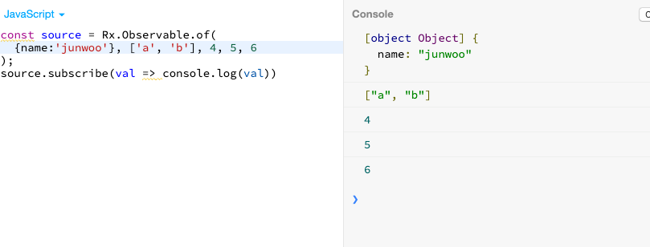

# Observable 생성함수

## range

:전달된 범위의 숫자를 생성해낸다.

jsbin에서 실행해보았다.

 

## of

:전달된 값들을 생성해낸다.

 

## interval

:정해진 시간 간격으로 숫자를 생성해낸다.

 

## timer

: 주어진 지속시간 후에, 지정된 시간마다 순서대로 숫자를 생성해낸다.

아래는 2초뒤부터, 500ms 시간마다 숫자를 생성해낸 모습.

 

## from

: 배열이나 프로미스, 또는 이터러블을 옵저버블로 바꿔준다.

#### Observable from array

배열의 요소 하나하나가 next메소드를 통해 옵저버에게 전달된다.

 

완료가 되면 옵저버에게는 complete notification이 전달 되고, 실행된다.

####Observable from promise

####Observable from collection

## fromEvent

:DOM 이벤트를 옵저버블로 바꿔줍니다.

