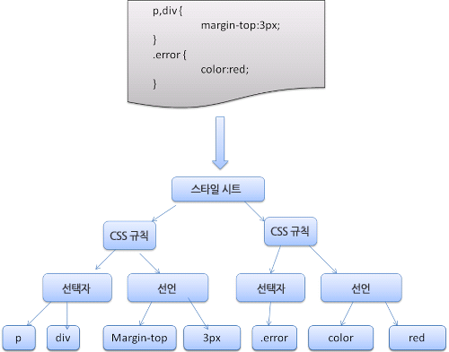

# 0610


그동안 나의 커밋메세지를 보면...

- 재학증명서는 textarea 삭제
- 보육/전문교사 checkbox로 수정&CSS수정
- professional_type을 string처리
- 선생님 리스트에 레이블 표시

이런식인데 반해, 상자님의 커밋메시지를 보면

- 관리자콘솔 > 자란쌤 > 상세화면 > 보육교사 - 보육교사 체크 시 원래 시급 계산 루틴 적용
- app.yaml 주석처리 원복
- 관리자콘솔 > 자란쌤 > 상세화면 > 자격 등록 - 자격증설명 입력란 UI 업데이트

이런식으로 어느 부분에 변경이 발생했는지 처음보는 나도 찾아볼 수 있게 쓰셨음.

지금 당장 다음 커밋메시지부터 나도 이렇게 적용하고 습관화시켜야겠다!!!


<h1>
  브라우저는 어떻게 동작하는가?를 읽으며
</h1>


<h2>
  브라우저의 기본 구조
</h2>

(렌더링 엔진과 성능을 최적화하는 방법에서 공부했었지만 한번 더 작성해보겠습니다!)

1. 사용자 인터페이스 : 주소표시줄, 이전/다음 버튼, 북마크 메뉴 등 요청한 페이지를 보여주는 창을 제외한 나머지 모든 부분
2. 브라우저 엔진 : 사용자 인터페이스와 렌더링 엔진 사이의 동작을 제어합니다.
3. 렌더링 엔진 : 요청한 콘텐츠를 표시. ex) HTML을 요청하면 HTML과 CSS를 파싱하여 화면에 표시합니다.
4. 통신 : HTTP요청과같은 네트워크 호출에 사용됩니다.
5. UI 백엔드 : 콤보박스와 창같은 기본적인 장치를 그림. 
6. 자바스크립트 해석기 : 자바스크립트 코드를 해석하고 실행합니다.
7. 자료 저장소 : 자료를 저장하는 계층입니다. 


## 렌더링엔진

렌더링엔진의 주역할은 **요청받은 내용을 브라우저 화면에 표시** 하는 일입니다.


## 동작과정

렌더링엔진은 통신으로부터 요청한 문서의 내용을 얻는것으로 시작하는데 문서의 내용은 보통 8kb단위로 전송됩니다.

렌더링 엔진의 기본적인 동작과정은 다음과 같습니다.

1. DOM트리 구축을위한 HTML파싱
2. 렌더 트리 구축
3. 렌더 트리 배치
4. 렌더 트리 그리기

렌더링 엔진은 HTML문서를 파싱하고, "콘텐츠 트리" 내부에서 태그를 DOM노드로 변환합니다.

그 다음, 외부 CSS파일과 함께 포함된 스타일 요소도 파싱합니다.

스타일 정보와 HTML표시 규칙은 "렌더 트리"라고 부르는 또 다른 트리를 생성합니다.

렌더 트리는 색상이나 면적같은 **시각적 속성**이 있는 사각형을 포함하고 있으며 정해진 순서대로 화면에 표시됩니다.

이 다음에 각 노드가 화면의 정확한 위치에 표시되도록 배치가 시작됩니다.

그 다음엔 그리기 과정이 시작됩니다.

렌더링 엔진은 **좀 더 나은 사용자경험** 을 위해서 모든 HTML을 파싱할때까지 기다리지않고 배치와 그리기과정을 시작합니다.

네트워크로부터 나머지 내용이 전송되기를 기다림과 동시에 받은 내용의 일부를 화면에 먼저 표시하는 것입니다!


## 파싱과 DOM트리 구축

문서 파싱은 브라우저가 코드를 이해하고 사용할 수 있는 구조로 변환하는 것을 의미합니다.

파싱의 결과는 보통 문서구조를 나타내는 노드 트리입니다.

이것을 **파싱트리**, 또는 **문법트리**라고 부릅니다.


## HTML파서

HTML파서는 HTML마크업을 파싱트리로 변환합니다.


## CSS파싱



## 스크립트와 스타일 시트의 진행 순서

웹은 파싱과 실행이 동시에 수행되는 동기화모델입니다.

파서가 script태그를 만나면 즉시 파싱하고 실행하려고 합니다.

그리고 스크립트가 실행되는 동안에는 문서의 파싱은 중단되죠.

스크립트가 외부에 있는 경우엔, 네트워크로부터 자원을 가져와야하는데 이때에도 자원을 받을때까지 파싱은 중단됩니다.


## 렌더 트리 구축

DOM트리가 구축되는 동안 브라우저는 렌더트리를 구축한다고 합니다.

표시해야할 순서와 문서의 시각적인 구성요소로써 올바른 순서대로 내용을 그려낼 수 있도록 하는 행위입니다.

이러한 구성요소를 "렌더러"라고 하는데요.

렌더러는 자신과 자식요소를 어떻게 배치하고 그려내야하는지 알고있습니다.

각 렌더러는 CSS명세에따라서 노드의 CSS박스에 부합하는 사각형을 표시합니다.

그리고 렌더러는 높이, 너비, 위치와같은 기하학적 정보를 포함하고 있습니다.

이러한 박스 유형은 노드와 관련된 "display"스타일 속성의 영향을 받습니다!(오오.. 이렇게 멋진 역할을 하던 녀석이었네요;)


## DOM트리와 렌더 트리의 관계

렌더러는 DOM요소에 부합하지만 1:1로 대응하는 관계는 아니라고합니다. 

예를들어 head요소와 같은 비시각적 DOM요소는 렌더 트리에 추가되지 않습니다.

그리고 위에서 살펴본 display속성에 'none'값이 할당된 요소또한 렌더 트리에 나타나지 않습니다.

(여기서 잠깐! visibility 속성에 'hidden'값이 할당된 요소는 트리에 나타납니다!)


## 트리를 구축하는 과정

html태그와 body태그를 처리함으로써 렌더 트리 루트를 구성하게됩니다.

트리의 나머지 부분은 DOM노드를 추가함으로써 점차 완성되어갑니다!


## 스타일계산

렌더 트리를 구축하려면 각 렌더 객체의 시각적 속성에대한 계산또한 필요하겠죠?

이것은 각 요소의 스타일 속성을 계산함으로써 처리됩니다.


## 배치

렌더러가 생성되어 트리에 추가될때 크기와 위치에대한 정보는 없습니다.

이런 값을 계산하는 행위를 **배치** 또는 **리플로** 라고 합니다!

HTML은 "흐름 기반의 배치 모델"을 사용한다고합니다.

단일 경로를 통해 크기와 위치정보를 계산할 수 있다는 소리인데요(어렵네여..)

쉽게 풀어보면, "흐름에 따르면", 나중에 등장하는 요소는 앞에서 등장한 요소의 위치와 크기에는 영향을 미칠 수 없기 때문에 배치는 왼쪽에서 오른쪽으로, 또는 위에서 아래로 흐른다는 의미라고합니다.

배치는 HTML문서의 html요소에 해당하는 최상위 렌더러에서부터 시작됩니다.

최상위 렌더러의 위치는 좌표계 0,0이며 브라우저 창의 보이는 영역에 해당하는 뷰포트만큼의 면적을 갖습니다.

배치는 일반적으로 다음과같은 형태로 진행됩니다.

1. 부모 렌더러가 자신의 너비를 결정
2. 부모가 자식을 검토
   1. 자식 렌더러를 배치(자식의 좌표 x, y를 설정)
3. 부모는 자식의 누적된 높이와 여백, 패딩을 사용하여 자신의 높이를 설정


## 그리기

그리기단계에서는 화면에 내용을 표시하기위한 렌더 트리가 탐색됩니다.

그리기의 순서는 다음과 같습니다.

1. 배경색
2. 배경이미지
3. 테두리
4. 자식
5. 아웃라인


## 동적변경

브라우저는 굉장히 효율적으로 일을 하려고합니다.

따라서 변경에대해 가능한 한 최소한의 동작으로 반응하려고 노력합니다.

그렇기때문에 요소의 색깔이 바뀌면 해당 요소의 리페인팅만 발생합니다.

요소의 위치가 바뀌면 요소의 자식, 그리고 형제의 리페인팅과 재배치가 발생합니다.

DOM노드를 추가하면 노드의 리페인팅과 재배치가 발생합니다.

따라서, html요소의 글꼴크기를 변경하는것과같은 큰 변경은 캐시를 무효화하고 트리 전체의 배치와 리페인팅을 발생시킵니다.


##렌더링 엔진의 스레드

렌더링 엔진은 통신을 제외한 거의 모든 경우에 단일 스레드로 동작합니다.

(통신의 경우에는 보통 2개~6개의 병렬 스레드에의해 진행될 수 있습니다.)


---

발가락 하나 담근 기분이네요.

시간이 흘러서 보면 더 잘 이해할 수 있겠죠!?

---

자료출처 : 

https://d2.naver.com/helloworld/59361


---

vscode extension인 Vetur를 설치한다음, <mark>scf</mark> 를입력하면 template, script, style등 vue 기본틀이 잡힌다!!

scaffold의 줄임말로, '발판'이라는 뜻이다.

---


<h1>
  0611
</h1>

todo앱을 vue로 다시 만들어가면서..

methods의 역할을 분리하는 습관을 가져야한다고 느꼈습니다.

```javascript
methods: {
    addTodo: function() {
      localStorage.setItem(this.newTodoItem, this.newTodoItem);
       this.newTodoItem = "";
    }
  }
```

이렇게 적혀있던 코드를..

```javascript
methods: {
    addTodo: function() {
      localStorage.setItem(this.newTodoItem, this.newTodoItem);
      this.clearInput();
    },
    clearInput: function() {
      this.newTodoItem = "";
    }
  }
```

이런식으로..!

this는 항상 **인스턴스**에 접근하므로, data와 methods에 접근할때 모두 사용한다는 것을 잊지말기!


<h1>
  emmet이란!
</h1>

html이나 css등을 작성할때 시간을 단축시켜주는 확장기능입니다!

<h2>
  하위
</h2>

```
div>ul>li
```

를 입력하면,

```html
<div>
  <ul>
    <li></li>
  </ul>
</div>
```

이렇게 코드가 생성됩니다!

'>'는 하위에 태그를 생성하라는 의미입니다.


<h2>
  병렬
</h2>

```
div+p+div
```

를 입력하면,

```html
<div></div>
<p></p>
<div></div>
```

코드가 생성됩니다.


## 반복

```
ul>li*5
```

를 입력하면,

```html
<ul>
  <li></li>
  <li></li>
  <li></li>
  <li></li>
  <li></li>
</ul>
```

이렇게 코드가 생성됩니다!


## class나 id넣기

```
ul>li.item*3
```

을 입력하면

```html
<ul>
  <li class="item"></li>
  <li class="item"></li>
  <li class="item"></li>
</ul>
```

이렇게 입력됩니다!

id는 . 대신에 #을 넣어주면 됩니다!


# 0612

#LESS

LESS는 CSS에 Script능력(변수, 함수, 연산, 중첩, 스코프 등)을 덧붙여 확장한 언어입니다.

LESS는 클라이언트 또는 서버환경(node.js)에서 모두 실행가능합니다.

CSS Preprocessor(CSS 전처리기)로서 쉽고 빠르고 체계적으로 프로그래밍할 수 있도록 해줍니다!


<h2>
  Variables
</h2>

```css
@width: 100px;
@height: @width - 50px;

.test1 {
  width: @width;
  height: @height;
}
```

Outputs:

```css
.test1 {
  width: 100px;
  height: 50px;
}
```


## Mixins

```css
.bordered {
  border-top: 1px dotted black;
  border-bottom: 2px solid pink;
}

.test2 {
  color: red;
  .bordered();
}

.test3 {
  color: blue;
  .bordered();
}
```

Output:

```css
.bordered {
  border-top: 1px dotted black;
  border-bottom: 2px solid pink;
}

.test2 {
  color: red;
  border-top: 1px dotted black;
  border-bottom: 2px solid pink;
}

.test3 {
  color: blue;
  border-top: 1px dotted black;
  border-bottom: 2px solid pink;
}
```

> 믹스인을 **호출**할 때, 괄호는 옵션입니다!
>
> .bordered(); === .bordered;

<h3>
  믹스인 출력 막기
</h3>

믹스인을 만들고는 싶지만, 그 믹스인을 지금 출력할 필요가 없을때에는 뒤에 괄호를 넣으면 됩니다.

```css
.my-mixin {
  //괄호가 붙지않은 믹스인은 컴파일됩니다!
  color: black;
}

.my-other-mixin() {
  //괄호가 붙은 믹스인은 css파일에 컴파일되지 않습니다!
  background-color: gray;
}

.demo {
  .my-mixin();
  .my-other-mixin();
}
```

Output:

```css
.my-mixin {
  color: black;
}

.demo {
  color: black;
   background-color: gray;
}
```

### 네임스페이스

```css
#outer {
  .inner {
    color: red;
  }
}

.other {
  #outer > .inner;
}
```

Output:

```css
#outer .inner {
  color: red;
}

.other {
  color: red;
}
```

>모두 같은 결과입니다.
>
>\#outer > .inner;
>
>\#outer .inner;
>
>\#outer.inner;

<h2>
  Nesting
</h2>

```css
#header {
  color: black;
  .navigation {
    font-size: 12px;
  }
  .logo {
    width: 300px;
  }
}
```

Output:

```css
#header {
  color: black;
}
#header .navigation {
  font-size: 12px;
}
#header .logo {
  width: 300px;
}
```


---

<h2>
  파이썬 문자열 포맷 % vs .format()
</h2>

```python
sub1 = 'junwoo'
sub2 = '100'

a = 'my name is %s' % sub1
b = 'my name is {0}'.format(sub1)
c = 'i am %(abcd)s years old!' % {'abcd':sub2}
d = 'i am {abcd} years old!'.format(abcd=sub2)

print a	//my name is junwoo
print b	//my name is junwoo
print c	//i am 100 years old!
print d	//i am 100 years old!
```


# 0615

와!!! 드뎌 gitalk을 TIL docsify에 설치했습니다……..

처음으로 개발을하면서 영어가아닌 중국어의 바다를 헤엄쳐서 답을 찾아냈습니다.

갓파고……….!

우선, 

```
https://github.com/gitalk/gitalk/issues/102
```

이 이슈는 pinned되어있을만큼 많은 사람들이 겪고 있는 이슈였습니다!

대충 번역해보니 uri가 50글자가 넘어가면 제대로 label을 읽지 못해서 gitalk이 에러를 내뿜는듯합니다.

```
https://priesttomb.github.io/%E6%97%A5%E5%B8%B8/2018/02/12/%E5%A4%84%E7%90%86Gitalk%E4%B8%AD%E7%94%B1%E4%BA%8E%E6%96%87%E7%AB%A0URL%E8%BF%87%E9%95%BF%E5%AF%BC%E8%87%B4%E7%9A%84Validation-Failed(422)/
```

여기 들어가보면..

자바스크립트 md5라이브러리로 url을 암호화하여 글자수를 줄여버리는방식으로 해결한듯(?)한 모범답안이 있어서 저도 그대로 적용했습니다.

---

```
뭔가 이슈가 원하지않은 방식으로 등록되어버리는 에러가있어서 해결해보려고...
혹시나 location.href를 location.pathname으로 수정해봤지만..
잘 안되었씁니당..
```

