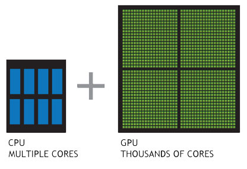

# 0701


## Function

```
def 함수이름(인자1, 인자2, ...):
		실행할 명령1
		실행할 명령2
		
		return 결과
```

```5, 
def add_mul(num1, num2):
		return num1+num2, num1*num2
		
add_mul(2,3)

(5, 6)
```

return 값을 2개로두니깐 tuple이 반환되네..


## Module

파이썬은 수많은 모듈을 가져다 쓸 수 있다.

```
>>> import random
>>> students = ['mango', 'h', 'lego', 'junwoo', 'go','uhuhuh']
>>> print(random.choice(students))
mango
>>> print(random.choice(students))
lego
>>> print(random.choice(students))
lego
>>> print(random.choice(students))
junwoo
>>> print(random.choice(students))
h
>>> print(random.choice(students))
uhuhuh
```


수많은 모듈을 가져다 

```
>>> import random
>>> students = ['mango', 'h', 'lego', 'junwoo', 'go','uhuhuh']
>>> print(random.choice(students))
mango
>>> print(random.choice(students))
lego
>>> print(random.choice(students))
lego
>>> print(random.choice(students))
junwoo
>>> print(random.choice(students))
h
>>> print(random.choice(students))
uhuhuh
```

random이라는 모듈을 Import한 뒤 사용해봤습니다.

import가 엄청 쉽게 되네요...

```
>>> random.sample(students, 2)
['mango', 'go']
```


로또번호 추출기를 만드려면..

```
random.sample(range(1, 46), 6)
```


---

생활코딩 gitn강의를 보며 나열해보는 단편적인 지식.

- 3 way merge
- checkout은 HEAD를 조종하는것.
- HEAD가 브랜치를 가리키지않고 commit을 가리켰을때, detached상태라고 한다.
- git pull = git fetch + git merge FETCH_HEAD

# 0702

## [How to overlay one div over another div](https://stackoverflow.com/questions/2941189/how-to-overlay-one-div-over-another-div)

- 부모 element에게 position:relative를 주고, 자식 element의 position:absolute로 지정해둔 다음에 작업했음.


---


# 0703

# git 되돌리기


## git reset

reset은 해당 시점으로 되돌아갑니다.
돌아가려는 커밋으로 레포지토리는 재설정되고, 해당 커밋 이후의 커밋 히스토리는 모두 삭제됩니다.

```
$ git reset --{옵션} {되돌아가려는 커밋 hash}
```

옵션으로는 대표적으로 hard, soft, mixed가 있습니다.
hard는 자주 써봐서 익숙하고..

### soft

soft는 hard와 마찬가지로 커밋 히스토리는 모두 삭제됩니다.

하지만 삭제되었던 내용들이 스테이징된 상태로 남아있습니다.

따라서 바로 commit을 하게되면 reset했던걸 취소(?)하는 효과를 볼 수 있습니다.

(단, commit message는 유지할 수 없고, 1개로 줄어드네요)

### mixed

옵션 default값입니다.

마찬가지로 커밋 히스토리는 모두 삭제됩니다.

하지만 아무것도 스테이징되어있지않습니다.


## git revert

revert는 해당 커밋만 삭제시킵니다.

그리고 commit history에 revert했다는 사실을 남깁니다.

보통, 원격 저장소에 push를 한 상태일때에는 reset을 사용하기보다는 revert를 사용한다고 합니다!

```
$ git revert {되돌릿 커밋 hash}
```

또한 범위를 주어서 여러개를 선택할 수 있습니다.

```
$ git revert {되돌릿 커밋 hash1.. 되돌릿 커밋 hash2}
```


# 0704

## 인프라

IT 인프라란, 애플리케이션을 가동시키기위해 필요한 하드웨어나 OS, 미들웨어, 네트워크 등의 시스템의 기반을 의미합니다.

예전에는 환경을 구축하는 부분은 인프라 엔지니어가 담당하고, 프로그래밍과 테스트등은 애플리케이션 엔지니어가 담당하는 식으로 나뉘어있었다고 합니다.

이런 데이터센터나 서버실에 서버를 두고 직접 관리하던 방식을 **온프레미스(On-premise)** 방식이라고 하는데요.

요즘에는 이런 온프레미스 방식에서 벗어나 가상의 서버를 여러대 띄우는 클라우드방식으로 옮겨왔다고 합니다.

애플리케이션 엔지니어들도 인프라 엔지니어의 업무였던 환경에대한 배포나, 테스트 등을 직접 할 수 있게 되어 인프라 관련 기초 지식이 필요하게 되었다네요!


## 1. 인프라의 구성 요소

- 하드웨어

  : 서버 장비 본체나 데이터를 저장하기위한 장치입니다.

  ex) 스토리지, 전원장치... 

- 네트워크

  : 사용자가 원격으로 접근할 수 있도록 서버를 연결하는 도구들입니다.

  ex) 라우터, 스위치, 방화벽등의 네트워크 장비, 케이블 배선 등

- 운영체제

  : 하드웨어와 네트워크 장비를 제어하기위한 기본적인 소프트웨어입니다.

  - 클라이언트 OS

    : 사용자가 사용하기 쉽도록하는데에 초점을 맞추고 있습니다.

    ex) Windows, macOS등..

  - 서버 OS

    : 시스템을 빠르고 안정적으로 하는데에 초점을 맞추고 있습니다.

    ex) Linux, Unix, WindowsServer 등..

- 미들웨어

  : 서버 상에서 서버가 특정 역할을 하도록 기능을 제공하는 소프트웨어입니다.


## 2. 온프레미스와 클라우드

###온프레미스

온프레미스는 앞에서 말했듯이, 데이터센터나 서버실에 서버를 두고 관리하는 방식입니다.

전통적인 방법이자, 지금도 여전히 많은 곳에서 사용되는 방법입니다.

처음 맥북을 산뒤 가입한 맥카페에서 NAS팝니다.... 이런 글들을 많이 봤었는데, 집에서 NAS로 작은 서버를 돌리는 방식도 온프레미스라고 볼 수 있겠네요.

위에서말한 인프라의 구성요소들을 직접 구매하고 설치하고 관리해야하기에, 수많은 장점들이 존재하겠지만 돈이 많이 들겠다라는 생각이 가장 먼저드네요....

사용량을 미리 예측한다고해도 가늠하기어려워 사용량이 엄청 적어도 유지비용은 그대로 나간다는 단점또한 존재합니다!


### 퍼블릭 클라우드

AWS, GCP, Microsoft Azure등 요즘 얼핏 느낌이 오고있고 회사에서도 사용하는 방식입니다!

옵션을 선택하고 사용한만큼 비용을 지불하는 방식입니다.

제공하는 서비스에따라 laaS, PaaS, Saas등으로 나눌 수 있습니다.


### 클라우드가 유리한 경우

대외 서비스의 경우에는 트래픽을 예상하기가 쉽지 않습니다.

트래픽 양에따라 서버 사양이나 네트워크 대역을 가늠하는 것을 사이징(sizing)이라고 하는데요. 굉장히 어려운 작업이라고 합니다.

크게 잡으면 돈낭비고, 적게 잡으면 서둘러서 증설하기 어렵기때문에 엄청 골치아프다네요.

하지만 클라우드 시스템에서는 트래픽에따라 자동으로 증설해주는 오토스케일링(Auto Scaling)이 있어서 유리합니다!

(TOAST서비스를 사용해보다가 오토스케일링을 이것저것 만져보던 기억이 있습니다.)


## 3. 하드웨어의 구성

인프라에서 가장 low-level에 있는 것이 하드웨어와 네트워크라고합니다.

온프레미스 시스템에서는 여러 대의 서버장비로 구성되고, 클라우드에서는 인스턴스의 하드웨어 성능을 필요에 따라 선택하게 된다고 합니다.

(TOAST로 인스턴스를 생성할때 그래픽카드같은 설정을 고르는 것이 이거였나봅니다.)


### CPU

CPU는 코어와 캐시에따라 성능이 달라진다고 합니다.

코어가 많을수록 동시에 처리하는 연산이 늘어나고, 메모리와의 처리속도를 완화하기위해 캐시는 크기가 클수록 성능이 좋다고합니다.

GPU는 그래픽을 처리하는데 특화된 프로세서입니다.

CPU가 직렬처리에 최적화된 몇 개의 코어로 구성된 반면, GPU는 병령 처리에 최적화된 작고 수많은 코어로 구성되어 있다고 합니다.




### 메모리

메모리는 주기억장치로, 데이터 용량이 크거나 전송 속도가 고속일수록 고성능입니다.

### 데이터 스토리지

데이터를 저장하는 디바이스입니다.

하드디스크나 SSD입니다!

보통 이러한 스토리지의 속도가 제일 느리기때문에 스토리지의 용량이나 읽기, 쓰기 속도가 시스템 전체의 속도에 영향을 주는경우가 많다고 하네요.

### 기타 하드웨어

이 외에도 전원 차단을 방지하는 무정전 전원공급장치나 여러대의 서버를 관리할 수 있는 KVM 스위치, 서버 장비 설치에 사용하는 서버 랙등이 있습니다.

(정말 많네여..)

### 방화벽

방화벽은 보안을위해 내부 네트워크와 외부 네트워크의 통신을 제어하고 불필요한 통신을 차단하는 것을 의미합니다.


공부자료

```
https://futurecreator.github.io/2018/11/09/it-infrastructure-basics/
```

