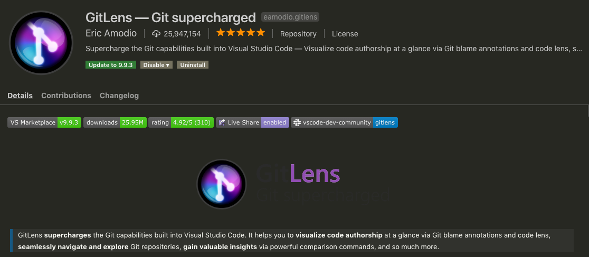

# 0805

## jest와 babel, webpack


import, export사용하고 싶어서.. 아래처럼 진행했음 ㅇㅇ

- webpack & webpack-cli
- @babel/core
- @babel/preset-env
- babel-loader
- jest
- babel-jest
- regenerator-runtime
- babel-plugin-transform-es2015-modules-commonjs

```
$ npm i webpack webpack-cli @babel/core @babel/preset-env babel-loader jest babel-jest regenerator-runtime babel-plugin-transform-es2015-modules-commonjs --save-dev
```

```
// .babelrc

{
  "env": {
    "test": {
      "plugins": ["transform-es2015-modules-commonjs"]
    }
  }
}
```

```
// webpack.config.js

module.exports = {
   ...,
   module: {
     rules: [
       {
         test: /\.js$/,
         exclude: /node_modules/,
         use: {
           loader: "babel-loader"
         }
       }
     ]
   }
 }
```

```
공부 출처:

https://oookawesome.github.io/babel-and-webpack
https://stackoverflow.com/questions/35756479/does-jest-support-es6-import-export
```


---

# MVC Pattern

- Model - Manages the data of an application.
- View - A visual representation of the model.
- Controller - Links the user and system.


# 0806

- 비즈니스 매너 교육

  ```
  오..! 느낀점이 많았다...!
  ```

- 파이참은 자동으로 less를 css로 컴파일 시켜줬는데.. VScode는 그러지않아서 항상 less는 파이참으로 작성했습니다 =_=

  왜 찾아볼 생각을 안했던건지....... 당연히 있을텐데;

  


# 0807

##event delegation

```
https://joshua1988.github.io/web-development/javascript/event-propagation-delegation/
```


## eslint

```
https://poiemaweb.com/eslint
https://www.zerocho.com/category/JavaScript/post/583231719a87ec001834a0f2
```


## includes VS indexOf

```
https://stackoverflow.com/questions/35370222/array-prototype-includes-vs-array-prototype-indexof
https://dev.to/adroitcoder/includes-vs-indexof-in-javascript
```


# 0808

오오..! 호호님이 엄청 신기한 VScode 익스텐션 알려주셨다.

**gitLens**!!

진짜 엄청 신기하고 엄청 편하다..!



## 

---

#Array.prototype.includes vs Array.prototype.indexOf

##Usual

###indexOf

```javascript
const arr = [1, 2, 3, 4, 5];

if(arr.indexOf(4) > -1) {
  console.log('in the array!');
}
```

###includes

```javascript
const arr = [1, 2, 3, 4, 5];

if(arr.includes(4)) {
  console.log('in the array!');
}
```


## NaN

###indexOf

```javascript
const arr = [NaN];
console.log(arr.indexOf(NaN));	//-1
```

### includes

```javascript
const arr = [NaN];
console.log(arr.includes(NaN));	//true
```


## undefined

### indexOf

```javascript
const arr = [ , , , ];
console.log(arr.indexOf(undefined));	//-1
```

### includes

```javascript
const arr = [ , , ,];
console.log(arr.includes(undefined));	//true
```


---

# event bubbling & event capturing

- bubbling : Bottom to Top
- capturing : Top to Bottom


# 0809

```
IE는 scrollY를 모르는구나....

pageYOffset으로 해결.
```

