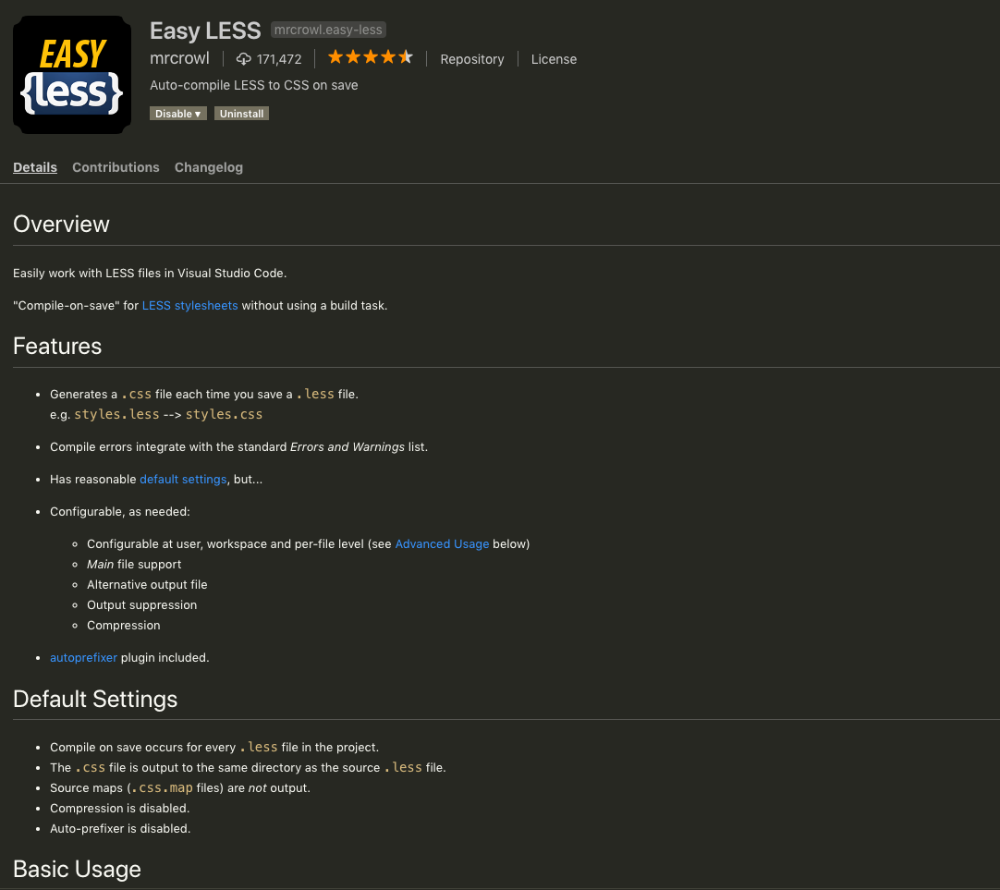

# 0805

## jest와 babel, webpack


import, export사용하고 싶어서.. 아래처럼 진행했음 ㅇㅇ

- webpack & webpack-cli
- @babel/core
- @babel/preset-env
- babel-loader
- jest
- babel-jest
- regenerator-runtime
- babel-plugin-transform-es2015-modules-commonjs

```
$ npm i webpack webpack-cli @babel/core @babel/preset-env babel-loader jest babel-jest regenerator-runtime babel-plugin-transform-es2015-modules-commonjs --save-dev
```

```
// .babelrc

{
  "env": {
    "test": {
      "plugins": ["transform-es2015-modules-commonjs"]
    }
  }
}
```

```
// webpack.config.js

module.exports = {
   ...,
   module: {
     rules: [
       {
         test: /\.js$/,
         exclude: /node_modules/,
         use: {
           loader: "babel-loader"
         }
       }
     ]
   }
 }
```

```
공부 출처:

https://oookawesome.github.io/babel-and-webpack
https://stackoverflow.com/questions/35756479/does-jest-support-es6-import-export
```


---

# MVC Pattern

- Model - Manages the data of an application.
- View - A visual representation of the model.
- Controller - Links the user and system.


# 0806

- 비즈니스 매너 교육

  ```
  오..! 느낀점이 많았다...!
  ```

- 파이참은 자동으로 less를 css로 컴파일 시켜줬는데.. VScode는 그러지않아서 항상 less는 파이참으로 작성했습니다 =_=

  왜 찾아볼 생각을 안했던건지....... 당연히 있을텐데;

  

