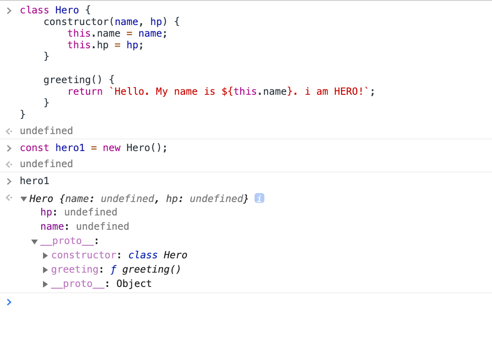
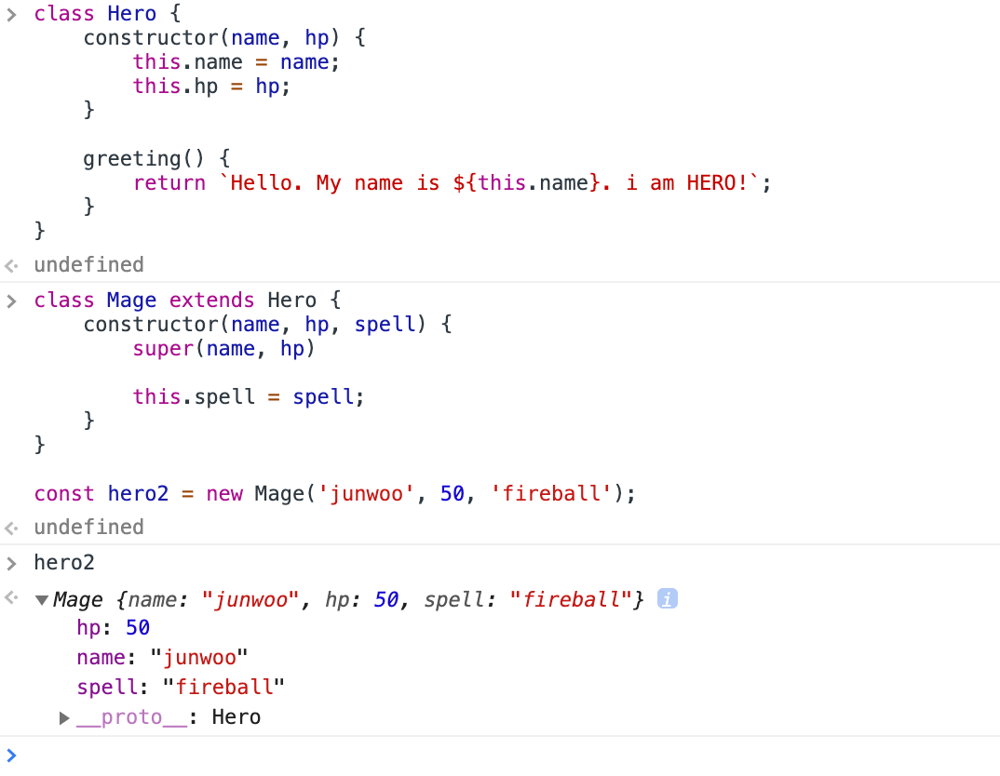

# 0812

정말 오랜만인 듯..

2일을 통째로 공부말고 오롯이 가온이와 여울이와 함께 보냈는데 좋은 아빠라고 칭찬받았다 ㅎㅎ

여울이랑 더 친해진 것 같아서 아주아주아주아주아주아주아주아주 행복했다!!

---

```
http://m.zdnet.co.kr/column_view.asp?artice_id=20170616090644&re=zdk#imadnews
```


> 필요할 때 필요한 기술을 익힐 수 있는 것이 능력이다. 그 능력을 키워라.

다른 주옥같은 말들이 참 많당..

---

## 사고싶은 책!

```
http://www.yes24.com/Product/Goods/71829578?scode=032&OzSrank=1
```


# 0813

자바스크립트의 class는 function의 일부 입니다.

```
const x = function() {}

const y = class {}
```

1.

```
function Hero(name, hp) {
	this.name = name;
	this.hp = hp;
}
```

2.

```
function Hero(name, hp) {
	this.name = name;
	this.hp = hp;
}

Hero.prototype.greeting = function() {
	return `Hello. My name is ${this.name}. i am HERO!`;
}
```

3.

```
function Mage(name, hp, spell) {
	Hero.call(this, name, hp);
	
	this.spell = spell;
}

const hero2 = new Mage('junwoo', 50, 'fireball');
```


1.

```
class Hero {
	constructor(name, hp) {
		this.name = name;
		this.hp = hp;
	}
}
```

2.

```
class Hero {
	constructor(name, hp) {
		this.name = name;
		this.hp = hp;
	}
	
	greeting() {
		return `Hello. My name is ${this.name}. i am HERO!`;
	}
}
```

3.

```
const hero1 = new Hero('junwoo', 100);

hero1.greeting();	// Hello. My name is junwoo. i am HERO!
```

4.



hero1을 찍어보면, greeing함수가 hero1 object의 메소드로 적용되지않고, hero1의 [[Prototype]] 혹은 \_\_proto\_\_ 에 들어있는 것이 보입니다.

5.

```
class Mage extends Hero {
	constructor(name, hp, spell) {
		super(name, hp)
		
		this.spell = spell;
	}
}

const hero2 = new Mage('junwoo', 50, 'fireball');
```



extends 로 연결해주었더니, [[Prototype]] (\_\_proto\_\_)가 부모와 연결되어 있습니다. (Hero)


# 0814

어제 퇴근 전까지만해도 잘 되던 gcloud app deploy가 왜 오늘 아침부터는 안된걸까요?

이것저것 찾아보다가 결국 해결한건 gcloud component update....


# 0816

파이썬 가상환경 설치

- pip 설치 및 버전 확인

```
$ sudo easy_install pip

$ pip -V
```


- virtualenv & virtualenvWrapper설치

```
pip install virtualenv virtualenvwrapper
```


- virtualenv 명렁어

```
$ virtualenv --python=파이썬버전 가상환경이름
```

```
$ virtualenv --python=python3.5 test_env
```


- The path ??? does not exist에러가 난다면...

```
$ which python3	// /usr/bin/python3

$ virtualenv --python = /usr/bin/python3 test_env
```


- 설치가 완료되었다면, 가상환경에 진입

```
$ source 가상환경이름/bin/activate

//test_env라면,
$ source test_env/bin/activate
```


- 가상환경 빠져나오기

```
$ deactivate
```

---

자료 출처 : https://beomi.github.io/2016/12/28/HowToSetup-Virtualenv-VirtualenvWrapper/