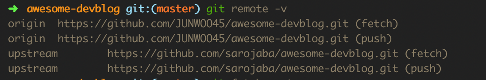

# 0827

coupon

1. sid

   ```
   $ uuidgen
   ```

2. name, description
   mode 1->public / 2->private


# 0829

# CSS Architecture


## - BEM

- Block Element Modifier
- ex) header__form--email


###Block(전체를 감싸고 있는 블럭요소)

- 독립적으로 의미가 있는 컴포넌트를 의미합니다.

```html
<div class="block">...</div>
```


- header, footer, nav, main등의 컨텐츠 영역을 block으로 간주할 수 있습니다.

  

  

- 더 구체적으로, header block은 logo block, search form block, authorization block을 포함할 수 있습니다.

  

- block은 클래스의 어근을 형성하고, 항상 맨 앞에 위치합니다.


### Element

- 독립적으로는 의미가 없으며 Block에 붙어서 사용되는 컴포넌트를 의미합니다.

```html
<div class="block">
  <span class="block__element">...</span>
</div>
```

- element는 block이 포함하고 있는 한 조각입니다.
- 예를 들어 위에서 보았던 block이미지에서, menu item은 menu block 바깥에서는 사용될 수 없습니다.
  따라서 각각의 메뉴아이템은 element입니다.


- 두개의 underscore로 연결하여 블럭 다음에 위치시킵니다.

```css
.block__element {
	display: none;
}
```

```css
.header__logo {
  property: value;
}

.header__tagline {
  property: value;
}

.header__navigation {
  property: value;
}
```


### Modifiers

- modifier는 block 또는 element의 속성입니다.

  이 속성은 block이나 element의 외관이나 상태를 변화시킵니다.

  기본적으로, class명은 반복하여 재사용할 수 있게 하기위해 존재합니다.

  특정 요소의 스타일을 수정해야할 필요가 있을때 modifier를 활용하게 됩니다.

  이때, element나 block다음에 두개의 하이픈'--'을 추가하여 modifier를 표시합니다.

```css
.block__element--modifier {
  display: none;
}
```

- 다음처럼 focused된 tab3를 modifiers라고 볼 수 있습니다.


### 사용 예

- 다음과 같은 버튼을 만든다고 하면,


```html
<button class="button">
  Normal button
</button>
<button class="button button--state-success">
  Success button
</button>
<button class="button button--state-danger">
  Danger button
</button>
```

```css
.button {
  display: inline-block;
	border-radius: 3px;
	padding: 7px 12px;
	border: 1px solid #D5D5D5;
	background-image: linear-gradient(#EEE, #DDD);
	font: 700 13px/18px Helvetica, arial;
}
.button--state-success {
  color: #FFF;
	background: #569E3D linear-gradient(#79D858, #569E3D) repeat-x;
}
.button--state-danger {
  color: #900;
}
```


공부, 그림 출처

- http://getbem.com/faq/
- https://blog.theodo.com/2015/10/how-i-stopped-worrying-and-learned-to-love-the-css-with-bem/
- https://en.bem.info/methodology/key-concepts/
- https://webclub.tistory.com/263
- https://blog.naver.com/PostView.nhn?blogId=dilrong&logNo=221496133579


# 0830

## zerofill

https://stackoverflow.com/questions/5256469/what-is-the-benefit-of-zerofill-in-mysql


# 0831

Jekyll로 블로그를 이전하다가… Vue.js 기초 포스트에서 mustache문법을 인식 못하는걸 알고…. 수정했습니다

https://stackoverflow.com/questions/38672182/error-trying-to-implement-amp-mustache


# 0901


1.우선 현재 저장소의 원격 주소를 확인합니다.

```
$ git remote -v

origin  https://github.com/USERNAME/FORK_REPO.git (fetch)
origin  https://github.com/USERNAME/FORK_REPO.git (push)
```


2.원본 저장소의 원격 주소를 추가합니다.

```
$ git remote add upstream https://github.com/ORIGINAL_OWNER/ORIGINAL_REPO.git
```


3.원본 저장소의 원격 주소가 잘 추가되었는지 확인합니다.

```
$ git remote -v

origin  https://github.com/USERNAME/FORK_REPO.git (fetch)
origin  https://github.com/USERNAME/FORK_REPO.git (push)
upstream  https://github.com/ORIGINAL_OWNER/ORIGINAL_REPO.git (fetch)
upstream  https://github.com/ORIGINAL_OWNER/ORIGINAL_REPO.git (push)
```




4.원본을 fetch합니다.

```
$ git fetch upstream

remote: Enumerating objects: 134, done.
remote: Counting objects: 100% (134/134), done.
remote: Compressing objects: 100% (23/23), done.
remote: Total 191 (delta 117), reused 123 (delta 111), pack-reused 57
Receiving objects: 100% (191/191), 88.60 KiB | 257.00 KiB/s, done.
Resolving deltas: 100% (117/117), completed with 4 local objects.
From https://github.com/ORIGINAL_OWNER/ORIGINAL_REPO
 * [new branch]      master     -> upstream/master
```


5.upstream/master를 나의 master에 합치기

```
$ git merge upstream/master

Updating 3b10450..0a9aada
Fast-forward
 README.md         | 858 +-------
 db.yml            | 240 ++++--
 db_community.yml  |  35 ++-
 db_opensource.yml |  22 ++
 4 files changed, 274 insertions(+), 881 deletions(-)
```


6.나의 원격저장소에 push합니다.

```
$ git push origin master

Total 0 (delta 0), reused 0 (delta 0)
To https://github.com/USERNAME/FORK_REPO.git
   3b10450..0a9aada  master -> master
```

