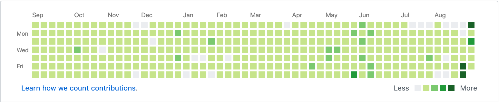
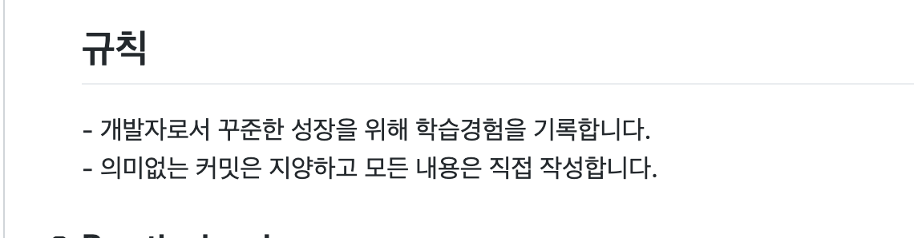
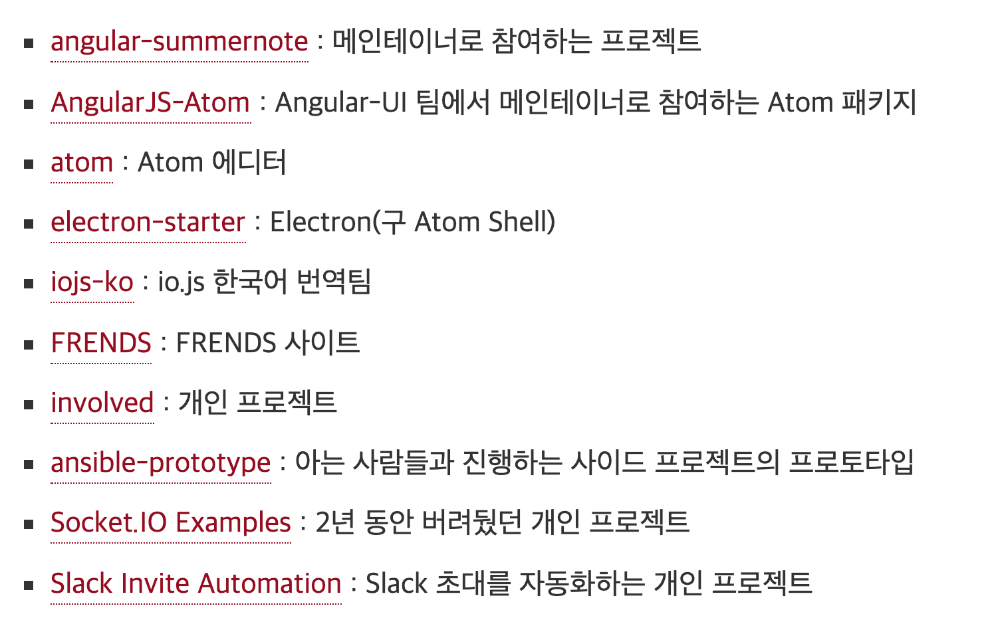
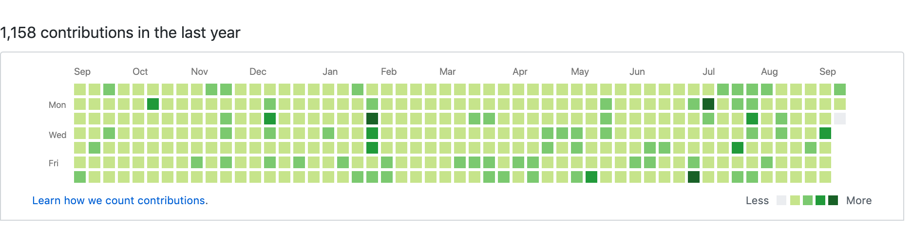

# 0902

https://www.youtube.com/watch?v=D0C_oYlgzYU


---

https://stackoverflow.com/questions/5128845/importerror-no-module-named-ssl

어제 백엔드 작업을 하면서 ssl을 import하여 사용했는데요.

```
ImportError: No module named _ssl
```

- https://stackoverflow.com/questions/5128845/importerror-no-module-named-ssl
- https://cloud.google.com/appengine/docs/standard/python/sockets/ssl_support


app.yaml에 libraries추가해줮서 해결.

#0903

webpack output의 path는 웹팩으로 번들링했을 때 그 결과물이 나오는 위치.

webpack output의 publicPath는 브라우저가 참고할 번들링 결과파일의 URL주소.


---

## 서비스(Services)

서비스는 Angular 어플리케이션에서 사용하는 데이터를 처리하는 객체입니다.

Angular에서 서비스는 어떤 클래스의 인스턴스이며, Angular가 제공하는 의존성 주입시스템을 사용해서 어플리케이션 어디에라도 자유롭게 사용할 수 있습니다.

서비스는 보통 어플리케이션 안에서 여러번 사용하는 데이터를 공유하는 용도로 사용합니다.


# 0904

Firebase Analytics(FA)에 관한 작업해야해서 조사해보고 공부를 해보려고합니다.

우선 기존의 많은 회사들은 Google Analytics(GA)를 사용하여 사용자의 데이터를 수집하고 분석하였습니다.

하지만 2019년 10월부터 이 GA는 지원이 중단된다고 합니다.

그래서 많은 회사들이 FA로 전환하고 있는데요.

GA와 FA에는 약간의 차이가 있습니다.

|                  GA                   |                       FA                       |
| :-----------------------------------: | :--------------------------------------------: |
|              웹 + 모바일              |                     모바일                     |
|            스크린 뷰 중심             |                  이벤트 중심                   |
| 화면 단위로 사용자 유입경로 확인 가능 | 설계된 이벤트로 사용자의 유입경로 정의(Funnel) |
|       샘플 데이터 수집 후 통계        |       모든 데이터 수집(상대적으로 느림)        |


FA에서는 `bundle` 을 생성하여 아이디, 아이템 등의 원하는 `매개변수`를 담고 원하는 `이벤트명`으로 전송합니다.

```
val bundle = Bundle()
bundle.putString('수업명', className)
bundle.putString('수업장소', classLocation)
firebaseAnalytics.logEvent('이벤트명', bundle)
```


FA의 이벤트에는 3가지 종류가 있습니다.

##1.자동으로 수집되는 이벤트

Firebase SDK를 사용하면 별도의 코드 작성 없이도 자동으로 수집되는 이벤트입니다.

#### screen_view

화면 전환이 발생할 때

#### app_remove

애플리케이션 패키지가 삭제되거나 Android 기기에서 '제거'될 때

#### ad_click

사용자가 광고를 클릭할 때

<small>자동으로 수집되는 이벤트들을 더 확인하려면 [여기](https://support.google.com/firebase/answer/6317485?hl=ko)로 가세요!</small>

## 2.기본으로 제공하는 이벤트

파이어베이스에서 정의해놓은 이벤트로, 필요에 따라 코드를 작성하여 사용할 수 있습니다.

```
val bundle = Bundle()
bundle.
```


# 0906

## TIL을 1년동안 진행하며


저는 개발자분들의 블로그나 NHN이나 네이버, 우아한형제들같은 회사 기술 블로그를 굉장히 좋아합니다.

개발 공부를 이제 막 시작한, 1년 전 어느날도 평소와 마찬가지로 여러 기술블로그들을 탐닉하는 와중.. 우연히 1일1커밋이라는 글을 봤습니다. 또 어디선가는 TIL이라는 글도 봤습니다.

이 TIL과 일일커밋에 관한 포스팅들이 웹에는 정말 많았습니다.

그래서!

저도 발가락을 담가봤습니다.



<small>짜잔! 매우 옅은 커밋의 흔적 하하하!</small>

이미 기존의 TIL이나 일일커밋에 관한 좋은 글들이 너무 많아서 `어떤 내용을 써봐야하나..`  생각하며 키보드에 손 올린 채 몇 분이나 생각해봤는데 딱히 `이거다!` 하는 게 없었습니다(...)

그래서 제가 TIL을 진행하면서 찾아봤던, 우연히 읽어봤던 좋은 글들과 함께 가보려고합니다. ~~얹혀가기~~

제가 도움을 받았던 TIL과 일일커밋에 관한 좋은 글들을 모아두고, 거기에 더해 제가 TIL을 진행하며 느낀점도 적어보려고합니다.

이 글이 이제 막 TIL이나 일일커밋을 시작하신 분들이나, 시작하시려는 분들에게도 조금이나마 도움이 되었으면 좋겠습니다.

---

## 자극받아 시작하기

저는 Jbee님의 [나는 어떻게 개발 공부를 했나, 2편](https://jbee.io/essay/how_do_i_study_2/) 을 보고 TIL을 시작했습니다.

> 틀리면 뭐 어떤가요? 틀려도 됩니다. 다만 잘못된 정보를 공유하지 않기 위해 많이 노력해야 합니다. 

틀려도 된다니..

무얼 어디서부터 시작해야할지 모르는 사람에게 자신감을 가지고 글을 써보게하는 참으로 마법같은 문장입니다.

저도 저 문장을 보고 자신감을 얻어서 저장소를 만들었습니다.


제가 다음으로 자극을 받았던 글은 초보몽키님의 [6개월간의 TIL 회고](https://wayhome25.github.io/til/2017/08/14/TIL-for-6-months/) 입니다.

초보몽키님은 구글에 `TIL` 을 검색하면 연관검색어로 뜰 정도로 유명하시죠.

초보몽키님은 정말 섬세하고 꾸준하게 TIL을 진행하며 기록을 남기셨는데요. TIL을 통해 면접기회를 얻고 덕분에 신입 개발자로서 일을 시작하게 되었다는 말에 `동기부여`를 받았습니다.


더불어, 초보몽키님과 더불어 TIL이라고 검색하면 연관검색어에 뜨는 진유림님 블로그.

[일일커밋- 100일 회고](https://milooy.wordpress.com/2015/10/08/daily-commit/) 와 [일일커밋 - 1년 회고](https://milooy.wordpress.com/2016/07/02/daily-commit-1-year/) 또한 `동기부여` 의 선봉장..

진유림님의 글을 보며 `나도 TIL에 원칙을 정해야겠구나.` 라고 생각을 하여 저장소에 규칙을 적어놓았습니다.




## 넌 아직 멀었어

Outsider's Dev Story는 정말 보물단지 블로그입니다. 글 하나하나에 깊은 내공이 느껴지는..

개인적으로 이 분의 생각, 철학을 많이 닮고 싶습니다. 

Outsider님도 [일일커밋에 관한 포스팅](https://blog.outsider.ne.kr/1141) 을 올리셨는데요. 

포스팅 한 줄 한 줄에 본인의 생각과 고민이 담겨있는 것이 굉장히 인상적입니다.

저도 앞으로 블로그에 저의 생각을 많이 담고 싶습니다.


사실.. Outsider님이 진행하신 일일커밋은 제가 진행했던 TIL과는 궤를 달리하는 수준인데요.



<small>outsider님은 mocha 메인테이너 이시기도 하다</small>.

outsider님의 일일커밋 포스팅을 보며 너무 지식의 습득에만 한정된 TIL이 아닌, 현장감있는 코딩 그 자체에 집중해야함을 느껴 반성하는 계기가 되었습니다.


joshua 님의 [2017년 회고](http://blog.devjoshua.me/2017/12/28/171228-2017년회고/) 에는 **1일 1커밋, 그리고 학습에 실패한 경험** 이라는 주제가 있는데요.

1년간 TIL을 진행한 지금 더더욱 공감이 많이 가는 글입니다.

`학습에 실패한 경험`은 우아한형제들 기술 블로그의 [남규진님이 쓰신 글](http://woowabros.github.io/experience/2017/12/11/how-to-study.html) 에서도 뼈를 맞아서 아팠던(~~...흙~~) 내용입니다.

저도 단순히 1일1커밋을 채우기위해, 컨트리뷰션에 잔디를 심기위해 TIL을 작성한 경험이 있습니다.

사실 부끄럽지만 많습니다 -_-;;

너무 편안한 학습 방법을 버리고 더 귀찮고 힘든 학습 방법을 취해야함을 느낍니다.


마지막으로, 이제 TIL을 시작했거나 시작하시려는 분들께 jojoldu님의 [일일커밋의 효용](https://jojoldu.tistory.com/402) 이라는 글을 추천합니다.

jojoldu님은 많은 분들이 알고계시는 [주니어 개발자 채용 정보](https://github.com/jojoldu/junior-recruit-scheduler) 저장소를 운영하고 계신데요.



<small>무려 2016년부터 지금까지 일일커밋을 진행중이신 jojoldu님. 정말 대단하시다.</small>

jojoldu님의 포스팅에 이런 내용이 있습니다.

>오늘 뭐라도 하나 했다는 것,
>
>조금씩이나마 진행되는게 있다는 것,
>
>어제보다 나아지고 있다는 것,
>
>경험치가 쌓이듯이 차곡차곡 쌓이는게 있다는 것


저도 이러한 심정으로 TIL을 진행한 것 같습니다.

어제보다 조금, 아주 조금씩이라도 나아지고 있다는게 눈에 보인다는 것.

성취가 눈에 보인다는 것은 훌륭한 기폭제이자 꾸준히 걷게 해주는 원동력같습니다.


## 그래서 앞으론?


계속 해보려합니다.

사실 처음엔 100일만 해보려했습니다.

그러다 저도 모르게 100일이 지나서, `깔끔하게 200일까지 해보자.` 라고 하다보니 1년이 되었네요.

군데군데 커밋을 하나도 하지 않은 날도 많고 커밋양 자체도 많지 않지만.. 반성할 건 반성하고 앞으로 나아지면 되니깐요.

그래서 반성의 일환으로 TIL에서 일일커밋으로 방향을 조금 전환해보려합니다.

TIL은 `지식정리`의 느낌이 강한 반면, 일일커밋은 왠지 모르게 `코드 위의 전투적인 느낌`이 강해서요. ~~저는 강해지고 싶습니다.~~


매일 컨트리뷰션에 잔디를 심으며 `내가 잔디를 심으려고 TIL을 하는걸까? 아니면 TIL을 하다보니 잔디가 심어진걸까?` 라는 의문이 들기도 했습니다.

분명, 잔디를 심으려고 TIL을 억지로 진행한 날도 많았는데요.

스스로 혼란스러워 `이걸 이렇게라도 하는게 맞는건가.. 1년을 허송세월로 보낸건 아닐까?`라는 걱정이 들기도 했습니다.

그래도. 그럼에도 이걸 계속 해보려는 이유는, `이렇게라도 꾸준히 무언가를 해보고 싶기 때문`입니다.

저 잔디 어딘가에서 배틀그라운드를 해보기도, 클래시오브클랜을 시작하기도 했는데요.

결국은 TIL이 게임을 이긴게 너무 기쁘고 심지어 자랑하고싶기도하네요;

저 잔디 어딘가에서 결혼을 하기도했고, 아주 귀여운 제 딸이 태어나기도 했습니다.

신혼여행에서 TIL을 할 수 있게 허락해준 와이프의 너그러운 마음도 저기 잔디 어딘가에 같이 심어져있기두 하구요. ~~지금은 새벽 3시.. 인간의 감성이 가장 풍부한 시간..~~

매일 저 작은 빈 칸을 채우기위해 무언가라도 공부하고, 공부했던 것을 다시 정리해본다는 것. 

그게 조금씩 습관이 되고 있다는게 뿌듯합니다.


---

글을 뭐 어떻게 마무리 지어야 할지 모르겠네요.

아, 문맥교정을 몇 번이나 거쳐야할 야생의 거친 글이어서 `어?이런 내용이 있었던거같은데 어디갔지??` 하실 수 있습니다.

