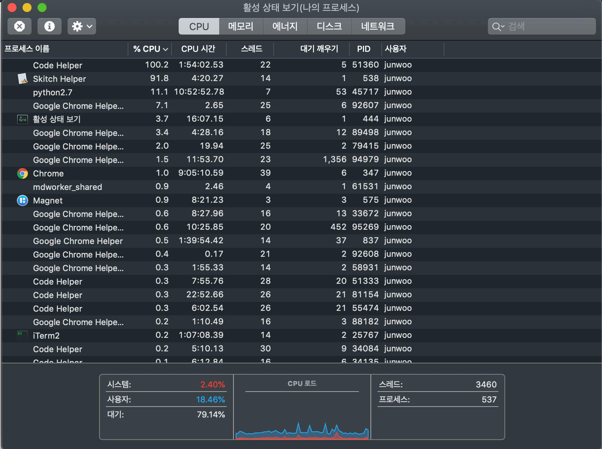
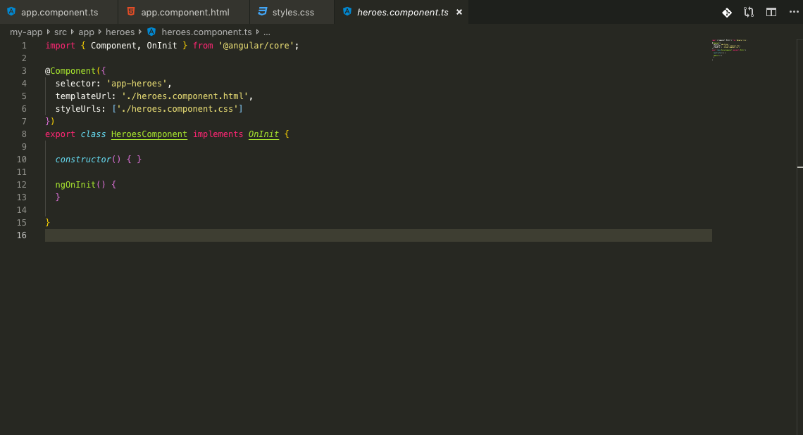
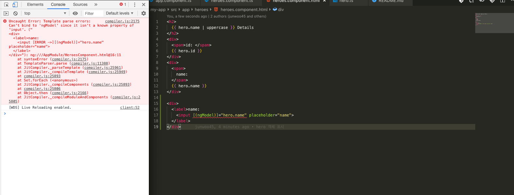

# 0916




나쁜 주인을 만난 불쌍한 맥북..

vscode에서 무언가 심상치않은 일이 일어나고 있나봅니다. 어쩐지 배터리가 버터처럼 녹는다했다..

귀차니즘을 이겨내고 얼른 찾아봐야할듯 ㅡㅡ;;


## angular 로컬 개발환경 설정하기

1.Angular CLI를 설치해줍시다.

```
$ npm install -g @angular/cli
```

2.워크스페이스 생성하고 앱 기본틀 구성하기

```
$ ng new my-app
```

3.어플리케이션 실행하기

저같은 경우 my-app이라는 폴더 이름으로 생성하였으므로, 다음과 같이 서버를 띄워봅니다.

```
$ cd my-app
$ ng serve --open
```

4.컴포넌트 생성하기

```
$ ng generate component heroes
```

CLI가 src/app/heroes/ 폴더를 생성하고, HeroesComponent를 구성하는 css,html,spec.ts, ts파일을 자동으로 생성합니다.


heores.component.ts파일은 다음과 같은데요.



컴포넌트를 선언하려면 `반드시` Angular core 라이브러리에서 Component 심볼을 로드하고 컴포넌트 클래스에 `@Component`라고 지정해주어야 합니다.

이러한 `@Component` 를 `데코레이터` 라고 합니다.

데코레이터는 클래스 선언부 앞에 붙여서 사용합니다.

데코레이터를 사용하여 꾸며진 클래스(decorated class)는 Angular가 읽을 수 있는 양식의 메타데이터를 보관하게 됩니다.


### 양방향 데이터 바인딩




[(ngModel)] 은 Angular 양방향 바인딩 문법입니다.

```
<input [(ngModel)]="hero.name">
```

을 사용하여 hero.name 프로퍼티값이 텍스트 박스로, 텍스트박스의 값이 다시 hero.name 프로퍼티로 전달되게 하려고 작성했지만 위와같은 에러가 발생했습니다.

> ngModel은 Angular에서 제공하는 디렉티브이지만, 아무것도 설정하지 않은 상태에서 이 디렉티브를 바로 사용할 수는 없습니다.
>
> 이 디렉티브는 FormsModule에서 제공하는 디렉티브이기때문에, 이 디렉티브를 사용하려면 명시적으로 FormsModule을 로드해야합니다.


Angular 가이드에서는 다음과같이 써있습니다.

> 개발자가 만든 앵귤러 구성요소나 서드파티 파일, 라이브러리를 앵귤러가 조합할 땐, 이 구성요소들에 대한 정보가 필요합니다.
>
> 이렇나 정보를 메타데이터라고 합니다.
>
> 컴포넌트 클래스에 지정해야하는 메타데이터는 @Component 데코레이터에 지정합니다.
>
> 그리고 어플리케이션 동작에 필요한 메타데이터는 보통 @NgModule 데코레이터에 지정합니다.
>
> 이 중에서 가장 중요한 데코레이터는 어플리케이션의 최상위 모듈인 AppModule 클래스에 지정하는 @NgModule 데코레이터입니다.


# 0917

## Angular CLI로 컴포넌트를 생성했을때 일어나는일

Angular CLI로 컴포넌트를 생성합니다.

```
$ ng generate component item-detail
```

이 명령을 실행하면 다음과같은 일들이 발생(!?)합니다.

- src/app/item-detail 폴더를 생성합니다.
- 이 폴더 안에 4개의 파일을 생성합니다.
  - 컴포넌트의 스타일을 지정하는 CSS파일
  - 컴포넌트의 템플릿을 정의하는 HTML파일
  - 컴포넌트 클래스 ItemDetailComponent가 정의된 TypeScript파일
  - ItemDetailComponent 클래스 파일을 테스트하는 파일
- 그리고 마지막으로 ItemDetailComponent가 자동으로 src/app/app.module.ts 파일에 있는 @NgModule에 등록됩니다.


## 왜 서비스를 사용할까요?

컴포넌트는 데이터를 직접 가져오거나 직접 저장하도록 요청하지 않는 것이 좋습니다.

사용하는 데이터가 실제 데이터인지, 가짜 데이터인지 알 필요도 없습니다.

컴포넌트는 데이터를 표시하는 것에만 집중하는 것이 좋으며, 데이터를 처리하는 로직은 `서비스`에게 맡겨두는 것이 좋습니다.

서비스는 Angular의 의존성주입 메커니즘에 따라 생성자로 주입됩니다.

여러 클래스에서 사용되는 정보를 공유하려면 서비스를 사용하는 방법이 가장 좋습니다.

Angular CLI로 다음 명령을 실행하여 item서비스를 생성합니다.

```
$ ng generate service hero
```


## @Injectable() 서비스

Angular CLI로 만든 서비스 클래스에는 Injectable 심볼이 로드되어 @Injectable() 데코레이터로 사용되었습니다.

@Injectable() 데코레이터는 이 클래스가 `의존성 주입 시스템` 에 포함되는 클래스라고 선언하는 구문입니다.


---

rxjs의 옵저버블을 처음 사용해봤는데 많이 헷갈립니다;

사실 90%이해못했습니다.

subscribe를 사용하여 비동기처리를 해준다는 느낌 말고는 실제 현업에서 지금의 지식만으로는 써먹을 자신이 없습니다.

무조건 반복반복반복할 생각입니다.


### 정리

- 컴포넌트가 데이터를 직접 가져오는 방식에서 HeroService클래스가 제공하는 방식으로 변경
- 프로바이더를 사용하여 HeroService를 최상위 인젝터에 등록(응? 내가???....)
- HeroService를 컴포넌트에 의존성으로 주입하기위하여 `Angular의 의존성 주입` 시스템을 사용
- HeroService에서 비동기방식으로 데이터를 가져오는 메소드 구현
- RxJS가 제공하는 Observable 맛보기
- 히어로 mock data를 반환할 때 RxJS가 제공하는 of()함수 사용(하나도 이해 못함;)
- 컴포넌트가 HeroService를 활용하는 로직은 컴포넌트 생성자에서가 아니라, ngOnInit 라이플사이클 후킹 함수에 구현
- HeroService는 컴포넌트에 의존성으로 주입되지만, 또 다른 서비스인 MessageService를 의존성으로 주입받기도 한다.

# 0918

비개발자분이 슬랙봇을 만드신 글을 쓰셨는데, 누구나 따라할 수 있을만큼 쉽고 명확하게 정리해주셨다!!

게다가 heroku를 이용해서 배포하는 방법까지 물흐르듯이 작성해주셨음

https://story.pxd.co.kr/1262

아주아주 강력추천!


# 0919

엄청엄청 좋은 글을 봤습니다!!

[좋은 git commit 메시지를 위한 영어 사전](https://blog.ull.im/engineering/2019/03/10/logs-on-git.html)

영어를 못하는것도아닌데 왜 커밋메시지는 항상 어려울까요-_-;

비록 회사에서 커밋메시지를 영어로 작성하지는 않지만, 영어로 커밋메시지를 잘 작성하고 싶은 마음이 커서 자주 읽어보고 연습해야할듯합니다.

사실 아티클을 쭈욱 보고 느낀건, 정말 중학교수준의 쉬운 영어임에도 왜 이런 단어선택조차 난 못한걸까?라는 생각이 먼저 들었습니다.

제가 다른 개발자들의 커밋을 잘 안본다는게 원인 중 하나라고 생각합니다.

맨날 깃헙만 들어가지 내실이 없었어요ㅠㅠ


## FIX

보통 올바르지 않은 동작을 고친 경우

### Fix A : A를 수정합니다.

```
Fix typo
```


## Add

코드나 테스트, 예제, 문서등의 추가가 있을때 사용합니다.

### Add A to B: B에 A를 추가합니다.

```
Add displayName to indicator
Add class to div element
```


## Remove

코드의 삭제가 있을 때 사용합니다.

Clean이나 Eliminate를 사용하기도 합니다.

보통 A 앞에 unnecessary, useless, unneeded, unused, duplicated가 붙는 경우가 많습니다.

### Remove A

```
Remove unnecessary italics from child_process.md
Remove unused variable
Remove duplicated buffer negative allocation test
```

> 많이 사용할 것 같아요.
>
> 저는 비효율적인 코드를 많이 쓰니깐요;


## Use

특별히 무언가를 사용해 구현을 하는 경우에 씁니다.

### Use A to B : B가 되도록 A를 사용합니다.

```
user triggerReport() to handle signals
```


## Refactor

전면 수정이 있을 경우 사용합니다.

### Refactor A

```
Refactor argument validation
Refactor life cycle management
```


## Simplify

복잡한 코드를 단순화할 때 사용합니다.

Refactor보다는 약한 수정의 느낌이 납니다.

### Simplify A : A를 단순화 합니다.

```
Simplify code and remove obsolete checks
Simplify loop arithmetic in calculate.py
```


## Update

개정 혹은 버전 업데이트가 있을 때 사용합니다.

Fix가 잘못된 것을 바로잡는 개념이라면, Update는 정상적으로 동작하고 있었지만 수정, 추가, 보완을 한다는 개념입니다.

코드다는 주로 문서나 리소스, 라이브러리 등에 사용됩니다.

### Update A to B : A를 B로 업데이트 합니다, A를 B하기위해 업데이트합니다.

```
Update version 1.1 to 1.2
Update repo docs to use HTTPS
```


## Improve

향상이 있을 때 사용합니다.

### Improve A : A를 향상시킵니다.

```
Improve color detection
Improve ios's accessibility perfomance up to 20%
```


## Make

주로 기존 동작의 변경을 의미합니다.

### Make A B : A를 B하게 만듭니다.

```
Make config object read-only
Make IsolateData store ArrayBufferAllocator
```


## Correct

주로 문법오류나 타입의 변경, 이름 변경 등에 사용합니다.

### Correct A : A를 고칩니다.

```
Correct grammatical error in README.md
```


## Prevent

특정한 처리를 못하게 막습니다.

### Prevent A : A하지 못하게 막습니다.

```
Prevent multiple connection errors
Prevent event loop blocking
```


## Avoid

prevent는 막는 것, Avoid는 회피하는 것

### Avoid A when B : B인 상황에서 A를 회피합니다.

```
Avoid multiple reload event when reloading JS
```


## Rename

이름변경에 사용합니다.

### Rename A to B : A를 B로 이름을 변경합니다.

```
Rename location to trigger
```


## Pass

파라터를 넘기는 처리에 주로 사용합니다.

### Pass A to B

```
Pass account_sid to the calculation function.
```


---

> 결국 커밋 로그 메시지의 작성은 작문이 아니라 패턴으로 접근해야 합니다.
>
> 자신의 커밋이 가진 특징을 패턴에 대입시켜 단어들을 뽑아내는 것이죠.
>
> 여러 사람들에게 쉽게 읽히고 쉽게 이해되도록 하기에는 패턴화된 단순한 문장이 훨씬 낫습니다.


앞으로 저도 패턴화 시켜서 커밋해보려고합니다.

한국어로 회사에서 커밋할 때, 그리고 영어로 깃헙에 커밋할 때 모두 적용해볼 생각입니다.

| 한국어       | 영어                     | 비고                                                         |
| ------------ | ------------------------ | ------------------------------------------------------------ |
| 수정하다     | Fix, Correct             |                                                              |
| 추가하다     | Add, Make                |                                                              |
| 삭제하다     | Remove, Clean, Eliminate | unnecessary, useless, unused, duplicated                     |
| 사용하다     | Use                      |                                                              |
| 전면수정하다 | Refactor                 |                                                              |
| 단순화하다   | Simplify                 |                                                              |
| 업데이트하다 | Update                   | fix는 잘못된 것을 바로잡는 개념. update는 수정, 추가, 보완의 의미 |
| 향상시키다   | Improve                  |                                                              |
| 처리를 막다  | Prevent                  |                                                              |

| 한국어             | 영어   | 비고 |
| ------------------ | ------ | ---- |
| 회피하다           | Avoid  |      |
| 이름을 변경하다    | Rename |      |
| (파라미터)넘겨주다 | Pass   |      |


# 0920

로컬에서 메시지 서비스 돌릴때.

app.yaml을 수정해줘야하네 마찬가지루.


## RxJS

## 하나의 방식으로 처리하자.

### 인터페이스의 단일화

Observable이라는 객체로 표현된다.

옵저버블은 시간을 인덱스로 둔 컬렉션으로 볼 수 있다.

RxJS는 모~두 Observable로 처리한다!

동기든 비동기든 함수호출이든 이벤트든 콜백이든 프로미스든.

이러면, 생각이 단순해지고 더욱 더 비즈니스 로직에 집중할 수 있어진다.