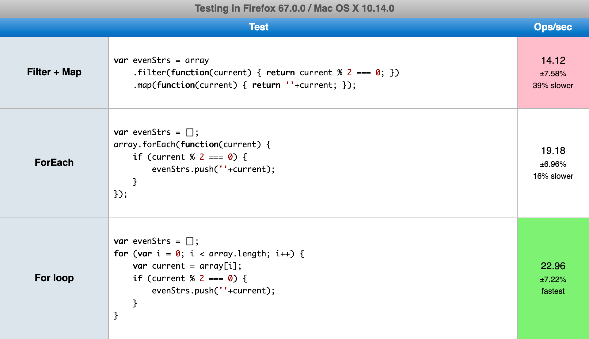
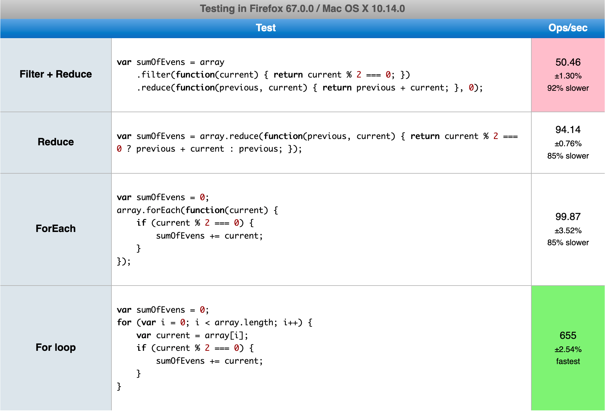
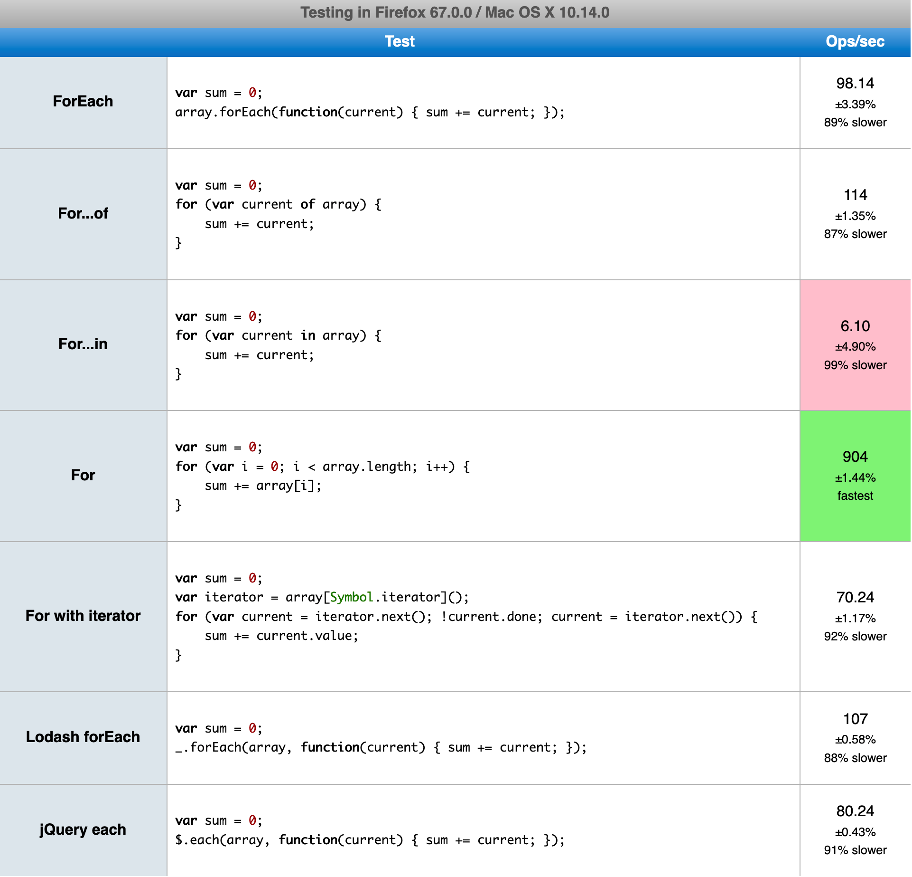
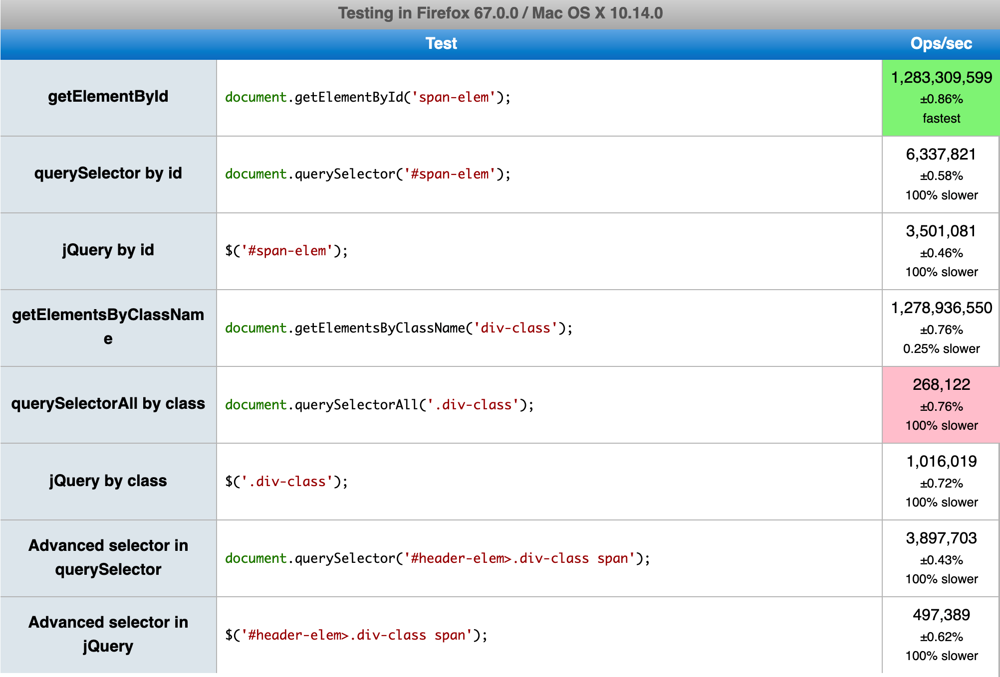

# 0930

오늘 배포했다가 30분만에 버그터져서 롤백함....

항상 코드를 짤 때 엣지케이스를 잘 생각해야함을 배웠다.


서비스가 안된다고할 때에는 진짜 덥고 땀났는데;

고작 8시간 지난 지금 돌이켜보면 되게 흥분되고 재밌었다ㅎㅎ

더 생각을 많이하면서 코드를 작성해야겠다.

아, 그리고 GCP는 정말정말 강력하다.

특히 오류로그;

AWS를 안써봐서 모르는거겠지만..... 이쪽도 많이 배우고 공부해야겠다.

---


`$ ng add @angular/material` 하니깐 번거로운것없이 앵귤러 머테리얼쓸때 필요한 모든 패키지가 다 설치되넹

굳굳.

app.module.ts에 `BrowserAnimationsModule` 까지 import됨 굳

=======
Material 컴포넌트는 vuetify만 사용해봤었고, 이번에 앵귤러를 공부하며 Angular Material을 사용해보고있는데.. vuetify가 훨씬 다양하고 이쁘고 직관적이고 쉬운 것 같다.

angular는 뭔가.... 뭔가..... 흠...

개인적으로 자란다 관리자콘솔을 개선한다면, 꼭 Material 을 도입해보고싶다.

단순히 디자인만 바뀌는거는 의미가 없고, 어떤부분을 개선하고 새로만들어야하는지 시간날때마다 고민해봐야할듯.


# 1001

10월이다.

2019년도 벌써 끝나가네.. 공부 열심히 해야할듯-_-;;

---

## package-lock.json이란?


package-lock.json을 자주 봤지만 어떤 역할을 하는지 모르고 있었습니다.

오늘은 package-lock.json에 대해서 정리해보려고 합니다.

<br>

### package-lock.json은 왜 생성될까?

우리가 기존에 사용하는 `package.json` 만으로는 정보가 부족하기 때문입니다.

`package.json` 에서는 버전정보를 저장할 때 `version range` 를 사용합니다.

"내가 사용할 패키지의 버전은 1.2.7버전이다." 라고 말하는 대신 "나는 1.2.7버전 이상의 패키지를 사용할거다."처럼 말하는 방식인데요.

(전자처럼 버전정보를 명시하는 것도 가능합니다.)

하지만 몇가지 조건이 들어맞어버리는 불행한 상황이 오게되면, 같은 `package.json` 을 사용해서 `npm install` 을 진행하더라도 서로 다른 `node_modules`를 생성하는 경우가 발생합니다.

-  npm의 버전이 다른 경우, npm의 알고리즘이 조금씩 다르기 때문에 다른 `node_modules` 트리가 생성될 수 있습니다.

- 콕찝어서 버전명을 명시하지않고 `version range` 를 사용하기 때문에, 새로운 버전의 패키지가 배포된 이후 설치를 진행할 경우 최신 버전으로 설치될 수 있습니다.

- 내가 사용하고 있는 패키지가 의존하고 있는 패키지가 새로운 버전으로 배포되었을 경우, 다른 `node_modules` 트리가 생성될 수 있습니다.


첫번째 상황 같은 경우에는 협업하는 멤버들이 `npm --version` 으로 버전을 확인한 뒤, npm 버전을 일치시킨 후 작업하면 예방할 수 있는 상황입니다.

하지만 다른 상황들에서는 다음과같은 일들이 발생할 수 있습니다.

> 개발자1: 테스트가 계속 실패해.
>
> 개발자2: 어제 내가 테스트할 땐 잘 됐는데??
>
> 개발자1: 왜이러지..
>
> .. 몇 시간 후
>
> 개발자1: 아직도 안돼..
>
> 개발자2: 뭐가 문제인 것 같아?
>
> 개발자1: range-parser문제인 것 같아.
>
> 개발자2: range-parser 버전 몇이야?
>
> 개발자1: 2.0.1
>
> 개발자2: 나랑 버전이 다르네; 오늘 아침에 새로운 버전으로 릴리즈되었나본데?

<br>

난감하죠.

이럴때 필요한 것이 `package-lock.json` 입니다.


<center>
  <small>
  	package.json 에는 "~3.3.8" 으로 적혀있지만, package-lock.json 에는 "3.3.16"으로 정확한 버전명이 적혀있습니다.
  </small>
</center>


`package-lock.json` 은 `node_modules` 구조나 `package.json` 이 수정되고 생성될 때 당시 의존성에 대한 정확하고 구체적인 정보를 품고 자동으로 생성됩니다.

 `npm install` 명령어를 입력하면 태어난다고 생각하면 되겠네요.

또한 `package-lock.json` 이 존재할 때에는 `npm install` 의 동작방식이 조금 변하는데요.

 `package.json` 을 사용하여 `node_modules` 를 생성하지않고 `package-lock.json` 을 사용하여 `node-modules` 를 생성합니다.

정리를 해보자면, `package-lock.json` 은 개발자들이 동일한 `node_module` 트리를 생성해서 같은 의존성을 설치할 수 있도록 보장해주는 고마운 녀석이라고 할 수 있겠습니다.

<br>

### 끝!

<br>

..을 내려고했지만 궁금했던점.

왜 `package.json` 과 `package-lock.json` 으로 나눠둔 걸까요?

애초에 `package.json` 에 정확한 버전명을 적어놓으면 해결되는 문제 아닐까? 라는 의문점이 들었습니다.

앞서 `package.json` 에서는 `version range` 를 사용한다고 했습니다.

`version range` 는 다음과같이 사용하는데요.

- `1.4.0` : 정확하게 1.4.0버전
- \>1.4.0 : 넘버링이 1.4.0보다 큰 버전
- <1.4.0 : 넘버링이 1.4.0보다 작은 버전
- \>=1.4.0 : 넘버링이 1.4.0보다 크거나 같은 버전
- <=1.4.0 : 넘버링이 1.4.0보다 작거나 같은 버전
- 1.4.0 || >= 2.4.0 : 정확하게 1.4.0버전이거나, 넘버링이 2.4.0보다 같거나 큰 모든 버전


만약 버전을 콕 찝어 정해놓는다면, 내 프로젝트에서 사용하고 있는 패키지의 중요한 버그 수정이 이루어질 때 마다 내 프로젝트의 `package.json` 에 적혀있는 버전도 수정해주어야하기 때문입니다.

모든 크고 작은 릴리즈에대해 항상 추적하고 수정해야하는 엄청난 귀찮음과 수고스러움을 `version range` 가 해결해주기 때문이었습니다.


---

Flex

그동안 마냥 사용해왔는데, 오늘 한가지 중요한점을 배웠다.

```css
.container {
  display: flex;
  justify-content: flex-start;
  align-itmes: flex-end;
}
```

현재 main axis는 가로. 왼쪽에서 오른쪽이다.

`justify-content` 는 항상 main axis를 의미하고, `align-items`는 항상 cross axis를 의미한다.

지금같은 상황에서는, 왼쪽하단으로 치우쳐진 CSS를 볼 수 있을 것이다.

```css
.container {
  display: flex;
  flex-direction: column;
  justify-content: flex-end;
  align-items: center;
}
```

지금은 main axis가 위에서 아래, 세로축이다.

`justify-content` 는 main axis를 따라가니깐 하단으로 쏠릴 것이고,

`align-items` 는 cross axis를 의미하니깐, 좌우폭의 중앙에 위치하겠넹.


이해하니깐 정말 쉽고 재밌다. ㅎㅎㅎㅎ

그동안 이해를 못하고 사용했었구나.


# 1002

부끄럽게도 내가 만드는 서비스를 처음부터 끝까지 라이브환경에서 이용해본적이 없었다.

우리 서비스는 선생님앱과 부모님앱, 그리고 관리자콘솔 이렇게 세 줄기로 구성되어있다.

1)부모님이 수업을 요청하면 2)선생님들이 수업에 지원하고 3)둘 사이 조정, 갈등 사항이 있으면 관리자콘솔에서 개입

정도의 플로우를 따른다.

오늘 약 2시간 정도 개발팀 다같이 서비스를 처음부터 끝까지 이용해보며 어떤 문제점이 있는지, 어떤 불편한 점이 있는지 경험해봤는데 그동안 느껴보지못했던 점들을 많이 느꼈다.

개발을 하며 이 전체 플로우의 단편적인 부분들을 반복해서 진행하고 구현하는것과는 전혀 다른 느낌이었다.

어느 회사를 가서도 항상 서비스를 이용해보는, 충분히 아주 충분히 단골고객처럼 이용해보는 마음가짐을 가져야겠다.


---


# GIT

### - git shortlog

커밋을 하고 1이상뜨는지 확인


### - add한 걸 취소 : git reset


### - git commit --amend

commit을 하긴하는데, 가장 최근의 커밋에 흡수시키겠다.

6개의 커밋을 했을때, 수정을해서 커밋을하면 7번째 커밋이 생기는데.

`--amend` 를 하면 흡수시켜버림.


### - push까지 해버린 commit삭제하기

```
gst
git add *
git commit -m "test"
git push origin master // 여기까지 진행했는데 삭제하고싶다면..

git reset HEAD~1	//가장 최근 커밋 삭제
git push origin master --force	//깃헙에 강제로 밀어넣기
```


### - git commit -sm "" 이란?

Author정보에 있는데 왜 또 이름이 들어갈까?

근데 요즘은 이거 잘 안씀. 구닥다리취급함.

요즘은 CLA(contributor license agreement)로 함.

ex) facebook CLA 검색 ㄱㄱ


### - pull request

`땡겨가줘..`

뭔가 새삼 귀여운 이름이네;;


### - git rebase -i --root

되돌리는거임. rebase -i를 rewind로 바꾸는게 더 이해하기좋을듯

edit을 3개했으면, `git rebase --continue` 를 3번해서 풀어줘야함.

`rebase ` : 감기

`--continue` : 풀기


### - git fetch upstream master

upstream의 master를 가져온다.

이때 origin의 `master`와 구별하기위해 `upstream/master`으로 표시


### - git checkout -- [수정한 파일]

이거 뭔 의미여. 해보자.


### -fetch

fetch를 하면 `.git` 에다가 가져와서 임시로 저장해놓음.


# 1004

번역 : https://www.synergycodes.com/blog/how-to-increase-your-frontend-apps-performance

나도 좋은컨텐츠를 블로그에 번역해보고싶어서 하나골랐다ㅎㅎ

원작자에게 허락먼저 구해야겠다.

---


# 앱의 성능을 향상시키는 방법 - 5가지 코딩 팁

------

> 이 글은 Tomasz Świstak의 How to increase your frontend app's performance - 5 coding tips를 번역한 글입니다.
>
> 원문 주소는 [https://www.synergycodes.com/blog/how-to-increase-your-frontend-apps-performance](https://www.synergycodes.com/blog/how-to-increase-your-frontend-apps-performance) 입니다.

------

많은 프론트엔드 프로젝트들이, 어느 시점에서부터는 성능 저하 문제가 발생하기 시작합니다.

솔루션의 복잡성이 증가하는 것은 정상적인 일입니다.

하지만 개발자들은 이러한 문제를 해결해야하죠.

이 포스팅에서 앱을 최적화하는데 도움이되는 5가지 팁을 정리해보고자 합니다.

일부는 당연해보이고, 또 일부는 프로그래밍의 기초라고 생각될테지만, 그래도 이러한 기초지식들을 되새김질하는 것은 중요합니다.

각각의 팁은 자체적으로 실행하고 성능을 직접 확인한 벤치마크를 근거로 작성되었습니다.

<br>

## 이 팁을 읽기 전에

------

매우 중요한 점은, 최적화가 필요하지않은 코드를 갈아엎지는 마세요.

여러분이 작성하는 코드는 코드 자체적으로도 빨라야하지만, 더더욱 중요한 점은 다른 개발자들이 읽기 쉬워야한다는 점입니다.

Donald Knuth는 코드 최적화에대해 공부할 때 가장 중요한 책 중 하나로 평가받는 'Computer Programming as an Art' 에 다음과 같이 썼습니다.

> "가장 큰 문제는 개발자들이 잘못된 시점에, 너무 효율적인 코드를 고민하며 시간을 낭비하고 있다는 겁니다."
>
> "**조기 최적화**는 프로그래밍에서 **악의 근원**입니다."

<br>

## 1. 배열 대신 객체/맵을 사용하여 조회하세요.

------

우리는 데이터를 다룰 때, "객체 검색, 객체 다루기, 또 다른 객체 검색" 같은 상황이 자주 발생합니다.

가장 일반적은 자바스크립트 데이터 구조는 배열이므로, 배열 안에 데이터가 저장되는 것은 지극히 정상적인 현상입니다.

배열에서 무언가를 찾으려면 `find`, `indexOf`, `filter` 같은 메소드를 사용하여 배열의 처음부터 끝을 모두 훑어야합니다.

그래서 우리는 O(n)의 복잡성을 지닌 선형 검색을 사용하게 됩니다.

이는 최악의 경우, 배열의 요소 갯수만큼의 많은 비교를 수행해야함을 의미합니다.

작은 배열에서는 이것이 눈에 띄지 않지만, 배열의 크기가 크다면 성능에 엄청난 영향을 끼치게됩니다.

이러한 시나리오에서는 배열을 객체나 맵으로 변환하고 `key` 로 검색을 하는 것이 좋습니다.

이러한 데이터 구조에서는 O(1)의 복잡성을 가지며 요소에 접근할 수 있으므로, 자료의 크기에 관계없이 항상 메모리를 한 번만 호출하게 됩니다.

객체와 맵은 `해시 테이블` 이라는 자료구조를 사용하기 때문이죠.


차이가 매우 큽니다. 

맵과 객체는 초당 수백만 개의 작업을 수행하지만, 배열은 최상의 결과에서조차 고작 100여개의 작업만 수행할 수 있습니다.

물론 지금은 데이터 변환을 고려하지않았지만, 데이터 변환을 고려한다고 해도 여전히 맵과 객체가 빠릅니다.

<br>

## 2. 예외를 먼저 처리하는 대신, IF문을 사용하세요.

---

때때로 사람들은 무언가가 존재하지않을 때 `null` 을 체크하는 것을 생략하고, 예외를 포착하는 것이 더 쉽다는 것을 느끼게됩니다.

그러나, 이것은 나쁜 습관입니다.

따라서 당신의 코드에 이렇게 사용한 코드가 있다면 수정하세요.

벤치 마크에서는 세가지 방법, `if문`, `try-catch`, `short-circuit 평가` 를 검사했습니다.

벤치마크 주소는 다음과 같습니다 : [https://jsperf.com/try-catch-vs-conditions/1](https://jsperf.com/try-catch-vs-conditions/1)


`null` 을 체크하는 것이 항상 더 낫다는 것은 굉장히 중요한 사실입니다.

또한 벤치마크를 보면 알겠지만, `if문`과 `short-circuit 평가` 는 성능 차이가 거의 없기때문에 더 마음에 드는 것을 사용하면 된다.

<br>

## 3. 가능한 한 반복문을 적게 사용하세요.

---

반복문을 적게 사용하는 것 또한 당연하게 여겨지지만, 논쟁의 여지가 있는 주제입니다.

`map`, `filter`, `reduce` 는 너무나 훌륭한 기능을 가지고 있어서 누구나 사용하고 싶어합니다.

이러한 메소드들은 코드를 깔끔하게 만들어주고 동료개발자들이 내 코드를 읽기 쉽게 만들어줍니다.

그러나, 성능을 저하시키는 요소가 될 수 있습니다.

저는 두가지 케이스를 만들어보기로 하였습니다 : `filter` 메소드 사용 후 `map` 메소드를 사용하는 것과 `filter` 메소드 사용 후 `reduce` 메소드를 사용하는 것.

각각의 케이스를 `메소드 체이닝`, `forEach`, `기본 반복문` 을 사용하여 테스트해보았습니다.

벤치마크 주소는 다음과 같습니다 : [https://jsperf.com/array-function-chains-vs-single-loop-filter-map/1](https://jsperf.com/array-function-chains-vs-single-loop-filter-map/1)



`기본 반복문` 이 가장 빠르긴 하지만 차이가 커보이지는 않습니다.

차이가 크지않은 이유는, `map` 에서는 `push` 를 하는 과정이 없기때문입니다.

이제, `filter`와 `reduce` 를 검사해보겠습니다 : [https://jsperf.com/array-function-chains-vs-single-loop-filter-reduce/1](https://jsperf.com/array-function-chains-vs-single-loop-filter-reduce/1)



이번에는 차이가 더 큽니다.

두 함수를 하나로 합쳤을 때(`Reduce`와 `ForEach`), 거의 100%의 성능향상을 보여줍니다.

하지만, `기본 반복문` 으로 변경했을 때, 속도는 비교할 수 없을 정도로 향상되었습니다.

<br>

## 4. 기본 반복문을 사용하세요.

---

개발자들의 선호도가 다르기때문에, 이번에도 논란의 여지가 있을 수 있는 부분입니다.

`반복문`에는 `forEach`, `for...of`, `for...in` 등이 있습니다.

이러한 반복문은 굉장히 나이스해보이고 훌륭한 워크플로우를 제공합니다.

그러 이러한 반복문은 전통적으로 사용되던 `기본 반복문` 과 비교하면 성능이 떨어집니다.

이미 반복문의 성능을 알 수 있는 벤치마크들을 살펴보았지만, 새로운 벤치마크를 만들어보겠습니다 : [https://jsperf.com/for-loops-in-few-different-ways/](https://jsperf.com/for-loops-in-few-different-ways/)

자바스크립트 내장 함수 이외에, Lodash의 `forEach`와 jQuery의 `each` 도 테스트했습니다.



역시나 `기본 반복문` 이 다른 방법보다 훨씬 빠른 것을 볼 수 있습니다.

하지만 이 결과는 배열에 한정된 결과입니다.

다른 상황에서는 `forEach` 나 `for...of` 를 사용하는 것이 좋을 수 있습니다.

그렇다하더라도 `for...in`  반복문은.. 음.. 글쎄요. 
다른 방법이 정녕 없는 경우를 제외하고는 사용하지 않는 것이 좋겠네요.

게다가 `for...in` 반복문은 모든 객체의 프로퍼티(배열의 경우 인덱스)에 접근하기때문에, 예상치못한 결과가 발생할 수 있습니다.

놀랍게도, Lodash와 jQuery의 메소드는 빌트인 메소드인 `forEach`에 비해 성능이 그리 나쁘지않습니다.심지어 Lodash의 메소드는 벤치마크에서 더 빠른 속도를 보여주기도 했습니다.

<br>

## 5. 내장 DOM 메소드를 사용하세요.

---

다른 사람의 코드에서, DOM을 조작하기위해 jQuery를 사용하는 것을 본 적이 있습니까?

jQuery는 가장 유명한 자바스크립트 라이브러리 중 하나이기때문에, 당신의 동료가 jQuery를 사용하는 것을 봤을 것이라고 확신합니다.

물론 DOM을 다룰 때 라이브러리를 사용하는 것은 나쁜 방법이 아닙니다 - 요즘엔 React나 Angular를 사용하여 동일한 작업을 수행합니다.

그러나, 몇몇 사람들은 DOM에서 엘리먼트를 가져와서 약간 수정하는 등의 간단한 작업을 위해서도 jQuery를 반드시 사용해야한다는 착각을 하곤 합니다.

이번에는 jQuery와 내장 DOM 메소드를 비교해보는 벤치마크를 준비해보았습니다 : https://jsperf.com/native-dom-functions-vs-jquery/1



당연하게도, 가장 기본적인 메소드인 `getElementById`와 `getElementsByClassName` 이 DOM을 순회할 때 가장 뛰어난 성능을 보여주었습니다.

`querySelector by id` 와 `Advanced selector in querySelector` 또한 jQuery보다 빠른 성능을 보여주었습니다.

오직 클래스 명으로 엘리먼트 여러개를 가져올 때 사용하는 `querySelectorAll` 의 경우에만 jQuery보다 느렸습니다.

jQuery를 어떻게 교체해야할 지에 대한 더 많은 정보를 얻고 싶으면, [http://youmightnotneedjquery.com](http://youmightnotneedjquery.com/) 를 읽어보세요.

물론, DOM을 다룰 때 라이브러리를 사용하는 것이 나쁜 방법은 아닙니다.

하지만 간단한 DOM조작의 경우에도 라이브러리가 필요하다는 의미는 절대 아니라는 것이 중요합니다.

<br>

## 이 외의 방법

---

앞에서 살펴본 다섯가지 팁들은 자바스크립트로 더 빠른 코드를 작성하는데 도움이 되는 방법들이었습니다.

이 다섯가지 이외의 다른 방법들로도 성능을 향상시키고 싶은 사람들을 위해, 몇가지 케이스들을 준비해보았습니다.

1. Webpack으로 진행하는 자바스크립트 번들링을 최적화하는 방법에대해 알아보세요.
   이는 매우 광범위한 주제이지만, 제대로 수행한다면 당신의 어플리케이션의 로딩 시간이 매우 크게 향상될 수 있습니다.
2. 자료구조, 기본적인 알고리즘과 그 알고리즘의 복잡성에대해 공부해보세요.
   사람들은 이것들이 단지 이론적인 지식에 불과하다고 생각하지만, 우리는 이미 첫번째 팁에서 이 지식들이 실제로 어떤 영향을 끼치는지 확인해봤습니다.
3. [jsPerf](https://jsperf.com/popular) 에서 테스트 케이스들을 찾아보세요.
   자바스크립트에서 동일한 결과를 달성하는 여러가지 다른 방법들을 비교할 수 있습니다.

<br>

---

## 번역 후기

약간의 성능 향상을 포기하는대신, 다른 개발자들이 읽기 쉬운 코드를 작성하는게 더 중요하다고 생각하는 개발자분들 또한 많으실 거라 생각됩니다.

사실 저도 그렇게 생각하는 편입니다.

그러한 부분을 의식했는지 원문에도 논란이 있을 수 있다는 언급이 많이 있네요.ㅎㅎ

뭐, 정답이 있는 문제는 아니라고 생각합니다!

여담으로, 기술포스팅을 번역해서 포스팅을 해보는 것은 처음인데요.

한줄한줄 읽고 넘어가는 것과 한줄한줄 번역을 해보는 것은 시간은 물론 노력에서도 정말 어마어마한 차이가 있네요..;

기술포스팅들을 번역해주시는 많은 능력자분들에게 존경을 표합니다.. 

앞으로는 단어 하나하나 허투로 읽지않고 더 감사한 마음으로 읽겠읍니다...

글이 술술, 원활하게 읽히길바라는 마음에 의역을 많이 했습니다.

오타와 오역에 대한 지적. 
댓글이나 메일로 감사하게 받겠습니다!

읽어주셔서 감사합니다.

