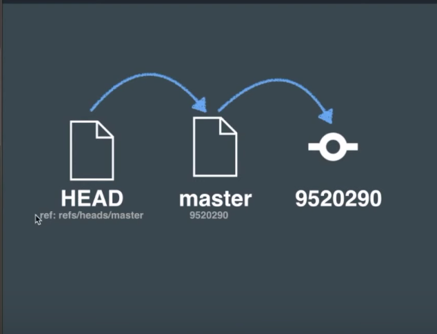

# 1014

- [https://engineering.huiseoul.com/%EC%9E%90%EB%B0%94%EC%8A%A4%ED%81%AC%EB%A6%BD%ED%8A%B8%EB%8A%94-%EC%96%B4%EB%96%BB%EA%B2%8C-%EC%9E%91%EB%8F%99%ED%95%98%EB%8A%94%EA%B0%80-v8-%EC%97%94%EC%A7%84%EC%9D%98-%EB%82%B4%EB%B6%80-%EC%B5%9C%EC%A0%81%ED%99%94%EB%90%9C-%EC%BD%94%EB%93%9C%EB%A5%BC-%EC%9E%91%EC%84%B1%EC%9D%84-%EC%9C%84%ED%95%9C-%EB%8B%A4%EC%84%AF-%EA%B0%80%EC%A7%80-%ED%8C%81-6c6f9832c1d9](https://engineering.huiseoul.com/자바스크립트는-어떻게-작동하는가-v8-엔진의-내부-최적화된-코드를-작성을-위한-다섯-가지-팁-6c6f9832c1d9)
- https://blog.sessionstack.com/how-javascript-works-inside-the-v8-engine-5-tips-on-how-to-write-optimized-code-ac089e62b12e
- https://www.html5rocks.com/ko/tutorials/speed/v8/
- https://alligator.io/js/v8-engine/

---

```
@ViewChild(MatSort) sort: MatSort;
Expected 2 arguments, but got 1
```

- https://stackoverflow.com/questions/56473899/error-ts2554-expected-2-arguments-but-got-1-with-viewchild

> After migration to Angular 8 you should declare manually if it's static or not
>
> ```js
> @ViewChild(QuilldEditorComponent, {static: true}) quillEditorComponentInstance;
> ```
>
> If you have further questions ask them or for more details please read this issue https://github.com/angular/angular-cli/issues/14553 or take a look at offical documentation https://angular.io/guide/static-query-migration
>
> ```js
> // query results available in ngOnInit
> @ViewChild('foo', {static: true}) foo: ElementRef; 
> 
> OR
> 
> // query results available in ngAfterViewInit
> @ViewChild('foo', {static: false}) foo: ElementRef;
> ```


---

# 1015

시간을 많이 뺏긴 것은 아니지만.. hitcounter를 고치려고 몇번이나 테스트했다 ㅡㅡ;

마크다운에서 확인할때는 잘 동작했는데, 원격저장소에서 확인할때는 동작을 안한다.

결국 커밋로그를 뒤져서 언제부터, 어떤 차이점이 있어서 동작을 하지않았는지 추적해봤는데 결론은 줄바꿈 하나 차이..

h1태그는 잘 닫혀있었고, 단지 줄바꿈차이로 이게 동작하냐 안하냐의 문제가 있었음...

---

- [https://devnews.kr/newest/](https://devnews.kr/newest/) 라는 곳을 알았다. 엄청 멋진 프로젝트고, 만드신분 블로그도 좋은글 가득
  - 프로젝트사이트에서 처음으로 본 글
  - [https://blog.naver.com/wodory/221676841351](https://blog.naver.com/wodory/221676841351)


---

git branch는 reference의 하나임.

git branch는 `파일 이름을 Key로 하고 commit object의 해시값을 value로 하는 key-value저장소의 reference이다.`


`git branch`로 브랜치 확인

`cat .git/HEAD`로 HEAD확인

`git checkout decelop` 브랜치 변경

`git branch` 브랜치 변경 확인

`cat ./git/HEAD` HEAD확인 -> 변해있네!


> 가장 중요한건 이거에요.
>
> "어떤 reference든, 최종적으로 가리키고있는 것은 commit object입니다."




HEAD 레퍼런스는 `refs/heads/master` .  즉, master라는 파일을 참조하고있다.

master라는 파일은 9520290이라는 내용을 담고있네.

얘는 9520290이라는 commit object를 찾아가면 되겠구나.

`.git/objects` 디렉토리 안에서 찾으면 되겠구나.

`9520290` 이라는 숫자 중, 앞 두자리 `95`를 `디렉토리명` 으로하고, 나머지 38자를 `파일명` 으로하는 objects를 찾아서 그 내용을 읽으면 된다.

`commit objects` 이기에 당연히 root tree에 대한 해시값을 가지고 있다.

root tree부터 시작해서 이것저것의 파일 디렉토리를 조합해서 `working directory` 를 만들어낸다.

이 것이 브랜치.

`HEAD ` 레퍼런스는 분명 파일을 가리키고, 이 파일은 `브랜치`이고, 이 브랜치는 `commit` 을 가리키고 있다.

즉, `HEAD` 는 `최종 commit`을 가리키고 있다는 말과도 같다.

그래서 `HEAD` 는 `마지막 커밋의 스냅샷`이라고 할 수 있는 거구나..


---

# 1017

- jekyll archive
  - [http://webcache.googleusercontent.com/search?q=cache:ypxoCoWyo74J:chris.house/blog/building-a-simple-archive-page-with-jekyll/+&cd=3&hl=ko&ct=clnk&gl=us](http://webcache.googleusercontent.com/search?q=cache:ypxoCoWyo74J:chris.house/blog/building-a-simple-archive-page-with-jekyll/+&cd=3&hl=ko&ct=clnk&gl=us)


# 1018

[Promise, 그리고 Async&Await 튜토리얼](https://medium.com/better-programming/improve-your-asynchronous-javascript-code-with-async-and-await-c02fc3813eda)

[https://medium.com/free-code-camp/how-to-conditionally-build-an-object-in-javascript-with-es6-e2c49022c448](https://medium.com/free-code-camp/how-to-conditionally-build-an-object-in-javascript-with-es6-e2c49022c448)

블로그에 잘 쓴 글을 올리려고하니 글을 못쓰겠다 ㅡㅡ;

못하고 못하고 못해도 2주에 1포스팅은 해야하는데.. 지난 2주 동안 너무 많은 사람들이 블로그에 와서 글쓰는게 어려워졌음..

신경쓰지말고 그냥 써야하는데 글을 썼다 지웠다, 다른 주제를 썼다 지웠다, 누군가 글을 보는것을 의식하다보니 2주동안 못썻음.....

신경을 꺼야겠다;;

---

선생님앱 로직보강하면서 도움받은 문서들

- 좀 더 이쁘게 조건문의 조건설정
  [https://stackoverflow.com/questions/8710442/how-to-specify-multiple-conditions-in-an-if-statement-in-javascript](https://stackoverflow.com/questions/8710442/how-to-specify-multiple-conditions-in-an-if-statement-in-javascript)
- Object.entries()
  [https://www.samanthaming.com/tidbits/33-how-to-compare-2-objects](https://www.samanthaming.com/tidbits/33-how-to-compare-2-objects)
  [https://developer.mozilla.org/ko/docs/Web/JavaScript/Reference/Global_Objects/Object/entries](https://developer.mozilla.org/ko/docs/Web/JavaScript/Reference/Global_Objects/Object/entries)