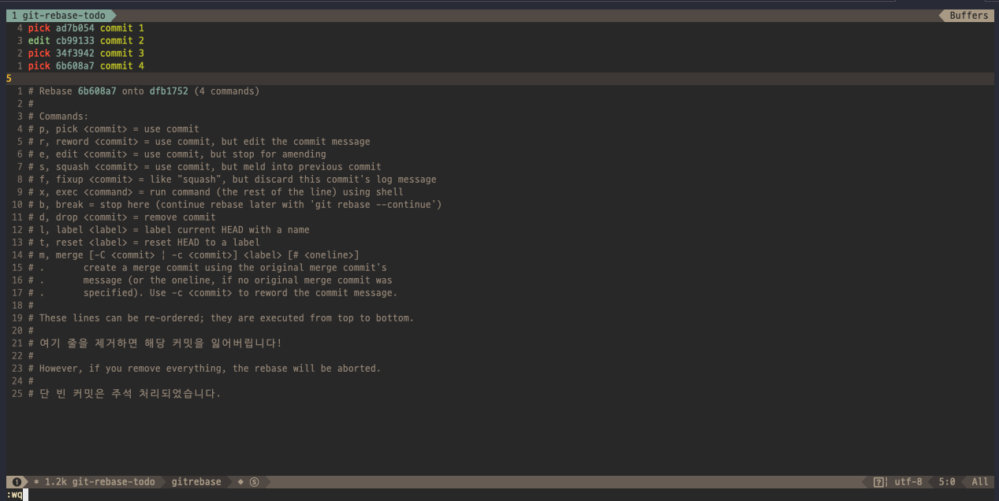

# 1021

7000분 정도의 DB테이블 마이그레이션 작업을 했다.

ㄷㄷ..... 무쟈게 긴장됐ㄷㅏ;

이런 작업을 할 때마다 안전하게, 복구할 수 있는 방법으로 진행해야할듯.

1. 로컬에서 테스트
   1. 로컬도 마이그레이션 진행하는 테이블을 CSV파일 export해놓고 작업.
   2. 전후를 확인해볼 수 있게 account_sid를 몇 개 적어두고 마이그레이션 이후 잘 바뀌었는지 DB상으로 확인
   3. 관리자콘솔에서도 바뀌었는지 전후 비교
2. 라이브
   1. 라이브도 CSV파일 export해서 혹시모를 사태 대비
   2. 전후를 확인해볼 수 있게 account_sid를 몇 개 적어두고 마이그레이션 이후 잘 바뀌었는지 DB상으로 확인
   3. 관리자콘솔에서도 바뀌었는지 전후 비교


---

리얼 리눅스

## 적당한 커밋의 사이즈?

- 기능 한 개?
- 메인테이너마다 달라?
- 단위테스트를 할 수 있는 크기?
- Function?

"기준 중 하나일테지만, review나 discussion이 가능한 양이 적당하다고 생각"


---

## 1.버그를 수정했을때 commit message어떻게 작성할 것인가?

(예시, B라는 문제가 발생했는데 , if문에 A라는 조건이 없어서였다.)

미천한 내 예시 : Fix B that caused by no condition A in conditional statement.

> fs/ext4: Fix the B problem
>
> When ~~~~, the B error can occur.
>
> the reason is that ~~~~.

```
fx/ext4 : prefix적어주는거. 어느 파트 인지.

Why: 70~80% 정도. How: 20~30% 정도.
커밋에있는 코드 수정분만 봐도 '어떻게'는 알 수 있음.
```


## 링크 134페이지는 왜 발생할까?

왜?

베이스가 달라서.


---

# 1022


# git rebase


[fork한 저장소를 최신 원본과 동기화 시키기](https://junwoo45.github.io/2019-09-01-git_upstream/) 라는 포스팅을 작성한 적이 있습니다.

 `git merge` 를 사용해서 `upstream` 에서 받아온 `master`를 내 로컬의 `master` 에 합치고 나의 `origin repository` 에 `git push` 하는 방법으로 내 저장소를 최신화시키는 방법을 정리한 글입니다.

이번에 리베이스를 공부하면서, 리베이스가 머지를 이용한 방식보다 더 이러한 상황을 위해 태어난 녀석같다는 생각이 들어서 새로 정리를 해보려고 합니다.


이론적인 얘기는 지루합니다.

바로 사용해보도록 하겠습니다.

마찬가지로, 포크한 저장소를 최신 원본과 동기화시키는 상황을 진행할건데요.

사실 `merge` 를 사용한 방법과 다를 것이 없습니다.

---

1.우선 현재 저장소의 원격 주소를 확인합니다.

```
$ git remote -v

origin  https://github.com/USERNAME/FORK_REPO.git (fetch)
origin  https://github.com/USERNAME/FORK_REPO.git (push)
```


<br>

2.원본 저장소의 원격 주소를 추가합니다.

```
$ git remote add upstream https://github.com/ORIGINAL_OWNER/ORIGINAL_REPO.git
```


<br>

3.원본 저장소의 원격 주소가 잘 추가되었는지 확인합니다.

```
$ git remote -v

origin  https://github.com/USERNAME/FORK_REPO.git (fetch)
origin  https://github.com/USERNAME/FORK_REPO.git (push)
upstream  https://github.com/ORIGINAL_OWNER/ORIGINAL_REPO.git (fetch)
upstream  https://github.com/ORIGINAL_OWNER/ORIGINAL_REPO.git (push)
```


<br>

4.원본을 fetch합니다.

```
$ git fetch upstream master

remote: Enumerating objects: 253, done.
remote: Counting objects: 100% (253/253), done.
remote: Compressing objects: 100% (4/4), done.
remote: Total 479 (delta 249), reused 252 (delta 249), pack-reused 226
오브젝트를 받는 중: 100% (479/479), 259.99 KiB | 463.00 KiB/s, 완료.
델타를 알아내는 중: 100% (296/296), 로컬 오브젝트 9개 마침.
https://github.com/sarojaba/awesome-devblog URL에서
 * branch            master     -> FETCH_HEAD
 * [새로운 브랜치]   master     -> upstream/master
```


<br>

5.`rebase` 로 base를 교체하기.

```
$ git rebase upstream/master

First, rewinding head to replay your work on top of it...
Fast-forwarded master to upstream/master.
```


<br>

6.나의 원격저장소에 push합니다.

```
$ git push origin master

Total 0 (delta 0), reused 0 (delta 0)
To https://github.com/USERNAME/FORK_REPO.git
   83e93ee..f393fa9  master -> master
```


끝.

<br>


---


## rebase -interactive

`rebase` 에는 interactive라는 옵션이 있는데, 이 옵션이 `rebase` 를 이해하는데 많은 도움이 되었습니다.

 `rebase` 의 동작방식을 잘게 쪼개놓았다고 이해하면 됩니다.

원격 저장소까지 `push` 한 커밋메세지를 수정해보는 시나리오를 준비해봤습니다.


commit을 4개 준비했습니다.

저는 `commit 2` 의 커밋메세지가 마음에 들지않아 메세지를 수정하고 싶습니다.


이미 `push` 를 해서 저의 원격저장소에도 올라가있는 상황입니다.

<br>

이러한 상황에서 `git rebase -i` 를 사용하면 쉽게 중간에 낀 커밋메세지를 수정할 수 있습니다.

저는 시간을 되돌리고 싶습니다.

`commit 2` 의 시점으로 되돌아가 메세지를 수정하고 싶은건데요.

<br>

1.`git rebase -i` 명령어를 사용하여 되돌아갈 시점을 선택할 수 있습니다.

```
$ git rebase -i --root
```


2.자동으로 vi 에디터가 열립니다. 

수정하려는 커밋 앞에 `pick` 대신 `edit` 을 적어주고 저장해줍니다.



<br>

3.에디터가 종료되면 `git log` 메세지로 현재 상태를 확인해줍니다.

분명 `commit 4` 까지 존재했었지만, 지금은 `commit 2` 가 최신 커밋인 상태입니다.

저는 `commit 2` 가 막 작성된 상태로 시간여행을 온 상태입니다.


<br>

4.커밋메세지를 수정해줍니다.

`git commit --amend` 옵션은 커밋 메세지를 수정할 때 사용됩니다.

```
$ git commit --amend -m "커밋메세지가 이렇게 바뀌면 좋겠다!"
```


<br>

5.`git log` 로 커밋 메세지가 잘 바뀌었는지 확인해봅니다.

```
$ git log
```


잘 바뀌었습니다.

<br>

6.`git rebase --continue` 명령어를 입력해 다시 되돌렸던 시간을 복구해줍니다.

```
$ git rebase --continue
```


`git rebase -i` 를 했다면, `git rebase --continue` 도 항상 따라와야합니다.

시간을 되돌리고, 다시 풀어주고..

타임스톤은 마구 사용하면 질서를 어지럽히지만, `rebase` 는 `continue`로 다시 돌려주기만 한다면 괜찮습니다.

<br>

7.`git log` 명령어로 현재 상태를 확인해봅니다.

```
$ git log
```


제가 원하던 상태가 되었습니다!

`commit 2` 라고 적혀있던 커밋메세지가 `Rebase -interactive` 라고 잘 바뀌어 있습니다.

<br>

8.이제 저의 원격저장소에 `push` 합니다.

```
$ git push origin master
```


하지만, 실패합니다.

저는 이 문제를 자주 접했는데요.

저는 이 문제를 자주 접하는데요.

[git pull 이후 non-fast-forward문제](https://junwoo45til.netlify.com/#/git/git_pull_non-fast-forward) 로 정리했던 저의 troubleshooting페이지도 있습니다.

이 문제에 대한 설명은 잠시 미뤄두겠습니다.

<br>

9.강제로 밀어넣기!

```
$ git push origin master -f
```


<center><small>신에게는 아직  `-force`라는 배 한척이 남아있습니다..</small></center>
<br>

10.원격저장소 확인


잘 저장이 되었네요!

<br>

---

## 그런데 말입니다


<br>

왜 이름이 `rebase` 일까요? ~~그런걸 왜 궁금해해..~~

저는 지금까지 `rebase` 가 헷갈리고, 낯설고, 별로 친해지고 싶지 않았었는데요.

바로 이름때문이었습니다.


'시간을 되돌리는거면 `rewind` 라는 이름이 더 직관적이지 않나? 왜 이렇게 만든거야?'

`git rewind` .. 누가봐도 시간을 되돌려서 작업을 하는 그런 멋진 명령어입니다.

이렇게 이름이 헷갈리는, 비슷한 녀석이 또 있는데요.

`Pull Request` 입니다.

처음엔 `Pull Request` 라는 이름이 정말 헷갈렸습니다.

`당김을 요청?`, `가져가주세요?` 음... 

PR을 하는 저의 입장이 아닌 메인테이너, upstream의 입장에서의 의미라 너무 와닿지가 않았습니다.

하다못해 `Send a Request` 정도의 단어였다면 ..

어쨌든... `Pull Request` 는 그렇다쳐도 이 `rebase` 라는 이름의 의미를 알고나면 뭐라그럴까..

세상의 이치를 찾아헤매던 마법사가 진실을 마주했을 때의 그것과 비슷한 느낌을 받을 수 있습니다.

<br>

---

## rebase 뜯어보기

<br>

일반적인 프로젝트의 구조는 다음과 같습니다.


원본 저장소에서 나의 원격 저장소로 `fork` 를 합니다.

<br>


그리고 로컬로 `clone` 을 합니다.

이 때, 원본저장소에서부터 가져온 커밋들을 `base` 라고 부릅니다.

git은 `base` 가 같은 저장소에만 `push` 를 할 수 있습니다.

 <br>


로컬에서 작업을 한 상태입니다.

나의 원격저장소로 `push` 를 하고 원본 저장소로 `Pull Request`를 하면.. 

이제 저도 오픈소스 컨트리뷰터가 되는겁니다..

<br>


<center>
  <small>
  	하지만 세상 일은 그렇게 호락호락하지 않습니다.
  </small>
</center>

제가 로컬에서 작업을 하고, `push` 를 하고, `Pull Request`를 한 상황이라고 가정하겠습니다.

`Pull Request`를 했지만, 아직 `merge` 가 되지 않은 상황이라고도 가정하겠습니다.

여기서 저의 PR이 머지된다면 이보다도 좋은 상황이 없겠지만..

다른 사람의 작업물이 먼저 리뷰를 받고 원본저장소에 `Merge`가 되어버린 상황입니다.

<br>


그때 제가 제출한 PR에 들어가보면 이렇게 `disabled` 상태가 되어있습니다.

 `base` 가 바뀌어버렸기 때문입니다.

`commit1`, `commit2`, `commit3`을 `base`로 한 나의 작업물들은 더이상 `commit1`, `commit2`, `commit3`, `commitX`, `commitY` 를 `base`로 한 저장소와 싱크가 맞지 않는 상태입니다.

<br>


이 때가 바로 `base의 갱신이 필요한 상황, 즉 rebase를 해야하는 상황` 입니다.

<br>


우선, `fetch` 명령어로 원본저장소의 `diff`를 가져와서 제 로컬에 존재하는 `.git`에 보관해야합니다.

포스팅의 처음에 `git fetch upstream master` 명령어를 실행했던 부분이 이 단계입니다.

<br>


그리고 이제 저를 그토록 헷갈리게 만들었던, 시간을 되돌려야 하는 단계입니다.

`git rebase -i --root` 명령어를 실행했던 부분이 이 단계입니다.

<br>


`.git` 에 저장해놨던, `diff` 를 쌓아올려줍니다.

이제 `base` 가 같아졌습니다.

<br>


그리고 되돌려놨던 저의 커밋들을 그 위에 차곡차곡 쌓아줍니다.

이 부분이 `git rebase --continue` 명령어를 실행했던 단계입니다.

<br>

그림으로 `rebase` 를 이해하니 훨씬 이해가 잘됩니다.

아까 원격저장소에 `push` 했었던 커밋메세지를 `git rebase -i` 를 이용해서 수정한 뒤, `push` 했을 때 오류가 났었던 걸 기억하시나요?


이 상황이었는데요.

바로 `base`가 바뀌어버렸기 때문에 발생했던 문제였습니다.

`rebase -i` 를 사용해서 과거로 돌아가서, 해당 시점의 커밋메세지를 수정해버리면 커밋의 해시값 또한 바뀌어버립니다.

내 로컬이 들고있는 해시값들과 내 원격저장소가 가지고있는 해시값이 일치하지않아, git은 push를 실패한 것이었습니다.

---

## 마무리


저는 그동안 `rebase` 를 단지 `rewind` 의 개념으로 오해했었는데요.

~~그래서 애꿎은 이름탓을 했었습니다~~

`rewind` 는 `rebase` 의 일부이고, 진정한 `rebase` 는 이름 그대로 `base를 갱신` 하는 것이었습니다.

`rebase` 는 굉장히 유용한 기능입니다.

하지만 유용한 만큼 주의해야할 사항도 있는데요.

[https://git-scm.com/book/ko/v1/Git-%EB%B8%8C%EB%9E%9C%EC%B9%98-Rebase%ED%95%98%EA%B8%B0](https://git-scm.com/book/ko/v1/Git-브랜치-Rebase하기) 에 그림과 함께 굉장히 잘 정리되어있으니 궁금하신 분들은 읽어보시면 좋을 것 같습니다.

읽어주셔서 감사합니다.


# 1024

좋은글

- [https://mobicon.tistory.com/492?category=632969](https://mobicon.tistory.com/492?category=632969)
- [https://mobicon.tistory.com/494?category=632969](https://mobicon.tistory.com/494?category=632969)

회사 프로젝트 구조를 바꾸려고하는데, 라우팅부터 막힌다.

시간이 날때마다 틈틈히 작업해야겠다.

---

우선순위를 잘 정해야겠다고 느낀다.

1주일동안 제대로된 공부를 하지않은것같다.

10월에는 책 한 권 읽지 않았구나.....

로버트 C.마틴의 클린코드를 이제서야 구매했다.

11월에는 반드시 완독할거다.

10월에는 앵귤러 토이프로젝트를 완성시키고 배포까지 진행하는게 목표다.

앵귤러를 공부함에 있어, 타입스크립트와 rxjs는 필수니깐, 이부분에 대해서도 계속 공부를 이어나가야겠다.

이제 왠만하면 블로그 포스팅도 자바스크립트 쪽으로 포스팅을 하고싶다.

git이 너무 재미있어서 git만 올리는것같다...

연말이 다가오고있는데, 긴장놓지않고 살아야겠다.