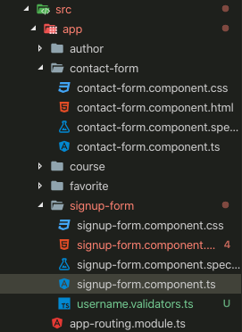
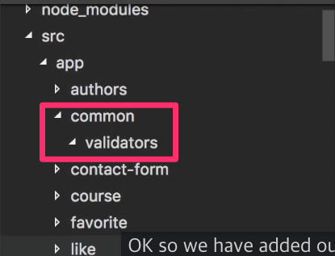

# 1111

오늘 까묵지말고 빼빼로사가야지..

---

trackBy를 생각보다 써먹어보질 못했다.

내일은 ngModel을 사용해서 Form validating하는 것을 회사 프로젝트에 적용해봐야겠다.

그러기위해서는 빠르게 이슈 쳐내야함..


# 1112

앵귤러에는 두가지 방식의 폼이 있다.

1. Reactive Form : 반응형 폼
2. Template driven Form : 템플릿 기반의 폼


템플릿 기반의 폼은 이름 그대로 템플릿에 디렉티브로 선언해가며 폼을 만드는 방식인데, 간단한 폼을 만들때 유용하다고 한다.

정말 간단하고 강력하다.

반응형 폼도 얼른 알아본 뒤에 프로젝트에 적용해봐야겠다.

```
https://angular.kr/guide/forms-overview
```


# 1113

```sql
CREATE algorithm=undefined definer=`root`@`%` sql security definer VIEW `recommendation_list` AS 
( 
         SELECT   `r`.`sid`                            AS `sid`, 
                  `r`.`visit_sid`                      AS `visit_sid`, 
                  `r`.`status`                         AS `status`, 
                  `a`.`type`                           AS `type`, 
                  `r`.`package_sid`                    AS `package_sid`, 
                  `pp`.`package_type`     AS `package_type`
         FROM     (`recommendation` `r` 
	 	 		 JOIN     `parent_package` `pp` 
         ON      (( 
                                    `r`.`package_sid` = `pp`.`sid`))
         JOIN     `account` `a` 
         ON      (( 
                                    `r`.`parent_account_sid` = `a`.`sid`)))
         WHERE r.package_sid != "" OR r.package_sid IS NULL
         GROUP BY `r`.`sid`);
```

음....`package_sid` 가 있는 수업들만 보여지게되네.

`package_sid` 가 없는 수업들도 모두 보여주고, 없을때 0이나 null을 넣어주고 싶은데....SQL알못은 웁니댜........


# 1114

음. 어제 sql은 `left join` 을 사용해서 해결했음.

---

카카오에는 정말 좋은사람들이 많은듯.

말도 잘하구..개발도잘하구.. 스티커두이쁘구..

특히나 카카오커머스에서 오신 분께서 발표한 앵귤러 발표는 최고였다.

제목부터 개발감성터지게 멋있는 "카카오커머스를 지탱하는 앵귤러"였음..

어떻게 앵귤러폼을 사용하는지, 앵귤러 메이저 업데이트 이후 2달안에 마이그레이션을 진행하는 것은 물론 프레임워크에대한 생각, 코드리뷰같은 발표를 들으면서 엄청 단단한 팀이구나라는 느낌을 받았다.

사용자가 십만, 백만, 천만까지 가는 서비스인데 내가 배포를 진행할때도 부담이되고 압박감이 있는데 큰회사는 어떨지 감도 안온다ㄷㄷ


---


# VSCode Shortcuts

확실히 익숙해지면 생산성이 많이 향상될 것이라 생각됩니다.

정리할 필요가 있음..

---


`한 줄 지우기` : shift + command + k

`한 줄 복사` : ctrl + c (드래그할 필요 없음)

`들여쓰기 정리` : ctrl + k + f

`드래그 한 블록 주석으로 만들기` : 드래그 -> shift + option + a

`위 아래로 텍스트 움직이기` : option + 방향키

`다중 커서 셀렉션(위/아래)` : option + command + 방향키(위/아래)

`셀렉션 위/아래로 복사` : option + shift + 방향키(위/아래)

---


## Validators



지금은 이렇게 `signup-form` 안에 username.validators.ts를 생성해서 사용하고 있지만,

공통으로 사용될 validators같은 경우에는 `app/common/validators` 처럼 디렉토리 구조를 만드는게 좋을듯.

