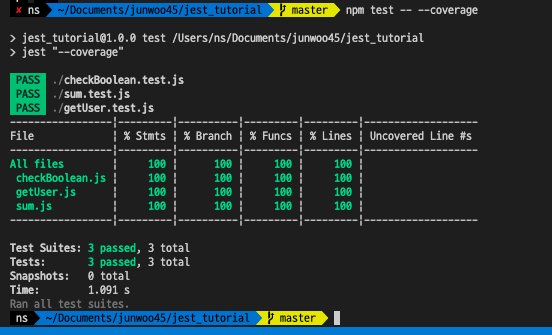
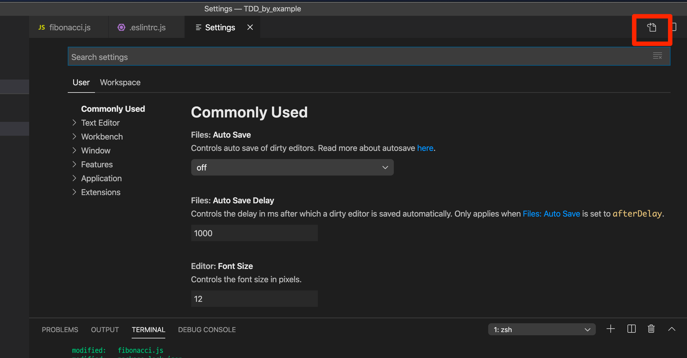

# 0622

출근하면서 본 글

https://www.facebook.com/baekjun.lim/posts/3253046061380427

넘나 멋있는 말아닌가

> 찐은 좋은 환경을 만나 좋은 개발자로 성장하는 사람이 아니야. 척박한 환경을 기름진 환경으로 바꿔버리는 사람이야. 동네 구멍가게 같은 소프트웨어 샵은 물론 사하라 사막에 던져놓아도 그곳을 개발천국으로 만들어 버리는 사람. 뭔가 시끌벅적하고, 지적호기심이 넘치고, 긍정적 기운 뿜뿜빰빰에, 말썽도 부리고, 코드를 쭉쭉 뽑아내고, 공부하고, 떠들고, 시도하는 사람.

---

# Jest란

---

정리하기에 앞서, 조사하면서 읽은 좋은 글들을 먼저 공유합니다.

[[8퍼센트 블로그] 코드 커버리지 80% 넘긴 썰](https://brunch.co.kr/@leehosung/43)

[TOAST UI 테스트](https://ui.toast.com/fe-guide/ko_TEST/#jest)

[Python 테스트 시작하기](https://www.slideshare.net/hosunglee948/python-52222334)


---


굉장히 많이 사용되는, 페이스북에서 만든 테스트 프레임워크입니다.

많은 장점과 유용한 기능들을 가지고 있습니다.

## 쉬운 설치 및 실행

Jest는 테스트 러너의 기능 뿐 아니라, 단언, 테스트 더블, 코드 커버리지 등 테스트에 필요한 많은 기능들을 지원하기 때문에 별도의 추가 설치가 필요 없습니다.

npm 명령어로 설치합니다.

```
$ npm i --save-dev jest
```

실행을 돕기위해 `package.json` 에 스크립트를 등록합니다.

```
{ 
	// ...
	"test": "jest"
}
```

테스트파일이 `*.test.js` 형식이라면, 추가 설정 없이 바로 실행할 수 있습니다.

```
$ npm test
```


<br>

## 쉬운 커버리지 측정

`--coverage` 옵션만 추가해서 커맨드 라인을 실행해주면 끝납니다.

```
$ npm test -- --coverage
//또는

$ jest --coverage
```




<br>

## jsdom 내장

노드js환경에서는 브라우저에서 제공하는 DOM이나 window객체를 사용할 수 없습니다.

이러한 API를 사용할 수 있는 가상환경을 구성해주어야하는데, jest는 jsdom을 내장하고 있습니다.

<br>

## 스냅샷 테스트

객체 내부의 상태를 그대로 파일로 저장해 놓고, 다음 테스트에서 객체의 현재 상태가 이전에 저장된 상태와 다른지를 비교하는 테스트입니다.


---

### afterEach()

```javascript
// 각 테스트를 실행 후, 저장되어 있는 데이터를 정리해주는 작업이 필요하다.
// afterEach가 유용하다.
afterEach(() => {
  data.users.splice(0);
})
```

<br>

### beforeEach()

```javascript
// 테스트마다 실행되는 중복되는 코드들을 빼낼 수 있다.
beforeEach(() => {
	data.users.push({
    id: 1,
    name: 'User1',
    email: 'User1@test.com'
  },
  {
    id: 2,
    name: 'User2',
    email: 'User2@test.com'
  },
  {
    id: 3,
    name: 'User3',
    email: 'User3@test.com'
  });
});

```

<br>

### beforeAll(), afterAll()

테스트 함수 각각의 전, 후에 호출되는 것이 아니라, 맨 처음과 맨 끝에 단 한 번만 호출된다.

DB에 접속하는 경우에 사용할 수 있을 것 같다.

연결하고, 연결을 끊고.

---

### only(), skip()

수 많은 테스트 함수 중, 하나만 실패했을 경우 해당 테스트만 실행해보고 싶을 때 사용한다.

```javascript
test.only('run only...', () => {
  // 이 테스트 함수만 실행된다.
})
```

반대로, 해당 함수를 스킵할 수도 있다.

```javascript
test.skip('이 함수는 스킵됩니다!', () => {
  // skip..
});
```


<br>

---

vimium을 설치했다..

반년전?에도 설치해본적있는데 결국 안쓰다가 지워버렸다.

근데 오늘 갑자기 급땡겨서...

익숙해져야겠다 ㅎㅎ

```
gu: 상위 경로 url로 이동한다

현재 url이 https://junwoo45.github.io/archive/2020-03-26-hoisting 이라면
https://junwoo45.github.io/archive 로 이동한다.

gU: 최상위 경로 url로 이동한다.
현재 url이 https://junwoo45.github.io/archive/2020-03-26-hoisting 이라면
https://junwoo45.github.io로 이동한다.


스크롤
gg: 페이지 최상단으로 스크롤
G: 페이지 최하단으로 스크롤
u: 반페이지 만큼 위로 스크롤
d: 반페이지 만큼 아래로 스크롤

r: 새로고침
H: 뒤로가기
L: 앞으로가기

탭
T: 열려있는 탭 검색
J: 탭 왼쪽으로 이동
K: 탭 오른쪽으로 이동
g0: 첫번째 탭으로 이동
g$: 마지막 탭으로 이동
x: 탭 닫기
```


<br>

# 0624

# TDD

단순한 두가지 법칙을 따른다.

- 어떤 코드건 작성하기 전에 실패하는 자동화된 테스트를 작성하라.
- 중복을 제거하라.

> 첫번째 법칙을 납득하기 쉽지 않지만, 따라보도록 하겠다.

<br>

TDD의 리듬이란 것이 있다.

1. 재빨리 테스트를 하나 추가한다.
2. 모든 테스트를 실행하고, 새로 추가한 것이 실패하는지 확인한다.
3. 코드를 조금 바꾼다.
4. 모든 테스트를 실행하고 전부 성공하는지 확인한다.
5. 리팩토링하여 중복을 제거한다.

<br>

> 프로그램에서는 중복을 제거해 주면 의존성도 제거된다. 이게 바로 TDD의 두번째 규칙이 존재하는 이유다. 다음 테스트로 진행하기 전에 중복을 제거함으로써, 오직 한 가지의 코드 수정을 통해 다음 테스트도 통과되게 만들 가능성을 최대화하는 것이다.


> 일단 '작동하는 깔끔한 코드'를 얻어야한다는 전체 문제 중에서 '작동하는'에 해당하는 부분을 먼저 해결하라. 그러고 나서 '깔끔한 코드' 부분을 해결하는 것이다.
> 이러한 접근 방식은 '깔끔한 코드' 부분을 먼저 해결한 후에, '작동하는' 부분을 해결해 가면서 배운 것들을 설계에 반영하느라 허둥거리는 아키텍처 주도 개발(architecture-driven development)과 정반대다.


> 다음은 최대한 빨리 초록색을 보기 위해 취할 수 있는 내가 아는 세 전략 중 두가지이다.
>
> - 가짜로 구현하기: 상수를 반환하게 만들고 진짜 코드를 얻을 때까지 단계적으로 상수를 변수로 바꾸어 간다.
> - 명백한 구현 사용하기: 실제 구현을 입력한다.


> 네 발 짜리 에어론 의자는 자빠진다. 주기의 다섯 번째 단계 없이는 앞의 네 단계도 제대로 되지 않는다. 
>
> 적절한 시기에 적절한 설계를. 돌아가게 만들고, 올바르게 만들어라.

좋은 설계를 무시할만큼의 빠른 싸이클을 강조하지만, 적절한 시점에서의 리팩토링의 중요성을 강조한다.


<br>

---

## 테스트 주도 개발 패턴

### 격리된 테스트

- 테스트가 충분히 빨라서 직접, 자주 실행할 수 있어야한다.
  - 테스트는 전체 어플리케이션을 대상으로 하는 것 보다 좀 더 작은 스케일로 하는 것이 좋다.
  - 다른 테스트와 완전히 독립적이어야 한다.
  - 실행 순서에 독립적이어야 한다.
  - 

### 테스트 목록

구현해야할 것들에 대한 테스트를 목록에 적어둔다.

- 구현할 필요가 있는 모든 메소드들
- 리팩토링 목록

### 테스트 우선

테스트 대상이 되는 코드를 작성하기 직전에 테스트를 작성하자.

코드를 작성한 후에는 테스트를 만들지 않을 것이다.

### 단언 우선

단언을 제일 먼저 쓰고 시작하라.

단언을 먼저 작성하면 작업을 단순하게 만드는 강력한 효과를 볼 수 있다.

구현에 대한 고려를 하지 않고, 테스트를 작성하기만 함에도 몇가지 문제들을 고민하고 해결해나갈 수 있다.

- 테스트하고자 하는 기능은 어디에 속하는 걸까?
  기존이 메소드? 아니면 기존 클래스의 새로운 메소드? 아니면 새로운 클래스?
- 메서드 이름은 뭘로하지?


### 명백한 데이터

데이터의 의도를 어떻게 표현할 것인가?

테스트를 작성할 땐, 컴퓨터 뿐 아니라 후에 코드를 읽을 다른 사람들도 고려해야한다.

될수 있는 한 많은 실마리를 코드에 남겨두자.

---

## 테스팅 패턴

### 자식 테스트

지나치게 큰 테스트 케이스의 깨지는 부분을 작은 테스트 케이스로 작성하고, 그 작은 테스트 케이스가 실행되도록 하라.

그 후에 원래 큰 테스트 케이스를 추가하라.                                                                                                                                                                                                                                                                                                                                                                                         

---

> '제대로 동작하는'을 푸는 동시에 '깨끗한 코드'를 해결하려는 것은 한번에 하기에는 너무 많은 일일 수 있다. 그렇게 되면 우선 '제대로 동작하는'으로 되돌아 가서 그걸 해결하고, 그 후에 '깨끗한 코드'를 느긋하게 해결하도록 하라.

<br

## 디자인 패턴

### 값 객체

두 객체가 제3의 다른 객체에 대한 참조를 공유하고 있는데, 한 객체가 공유되는 객체의 상태를 변화시키면 나머지 다른 객체는 공유 객체의 상태에 의존하지 않는 편이 차라리 나을 것이다.

몇가지 해결방법이 있다.

- 객체에대한 복사본을 제공하기
  - 시간이나 공간 측면에서 비싼 해결책일 수 있다.
  - 상태 변화를 공유하고 싶은 경우에는 사용할 수 없다.
- 옵저버 패턴
  - 의존하는 객체에 자기를 등록해놓고, 객체의 상태가 변하면 통지를 받는 방법.
  - 제어 흐름을 이해하기 어렵게 만들 수 있고, 의존성을 설정하고 제거하기 위한 로직이 지저분해질 수 있다.
- 객체를 변하지 않는 상태로 만들기
  - 문제가 발생하지 않을 것이라는 확신을 갖게되어 원하는 곳 어디로든 참조를 넘겨줄 수 있다.


## 리팩토링

### 메소드 옮기기

```java
//Shape
...
int width = bounds.right() - bounds.left();
int height = bounds.top() - bounds.bottom();
int area = width * height;
```

한 메서드에서 다른 객체에 하나 이상의 메시지를 보내고 있다.

위 코드의 경우 bounds(Rectangle의 인스턴스)로 4개의 메시지가 보내지고 있다.

이 부분을 수정해야한다.

```java
//Rectangle
public int area() {
  int width = this.right() - this.left();
  int height = this.top() - this.bottom();
  return width * height;
}
```

```java
//Shape
...
int area = bounds.area();
...
```

<br>

## TDD 마스터하기

### 테스트를 지워야할 때는 언제인가?

- 첫째, 자신감
  - 테스트를 삭제할 경우 자신감이 줄어든다면, 테스트를 지우지 말아야 한다.
- 둘째, 커뮤니케이션
  - 두개의 테스트가 동일한 코드를 실행하더라도, 이 둘이 서로 다른 시나리오를 말한다면 테스트를 지우지 말아야 한다.

  

---

# 0625

# ESLint와 Prettier

<br>

## ESLint

### Install

```
$ npm i eslint --save-dev
// or 

$ yarn add eslint --dev
```

### setup configuration file

```
$ npx eslint --init
```

### run

```
$ npx eslint yourfile.js
```

공식 문서에서는 eslint를 글로벌로 설치하는 것을 추천하진 않는다. 그냥 개별 프로젝트마다 설정하길 추천함.

### check configuration file

`eslint --init` 명령어를 실행 후, 설정을 고르면 `.eslintrc.js` 파일이 생성된다.

```
module.exports = {
    "env": {
        "browser": true,
        "commonjs": true,
        "es2020": true
    },
    "extends": "eslint:recommended",
    "parserOptions": {
        "ecmaVersion": 11
    },
    "rules": {
    }
};

```

<br>

ESLint는 주로 prettier와 함께 사용한다.

## Prettier 

### Install

```
$ npm install prettier --save-dev --save-exact
```

<br>

### 추가 모듈들

ESLint와 Prettier를 함께 사용하기 위해서는 추가로 모듈들을 설치해야합니다.

- eslint-config-prettier
  - eslint와 prettier의 충돌 설정들을 비활성화합니다.
- eslint-plugin-prettier
  - 코드 포매팅을 할 때 prettier를 사용하게하는 규칙을 추가합니다.

### 추가 모듈 설치

```
$ npm install eslint-plugin-prettier eslint-config-prettier --save-dev
```

<br>

### .eslintrc.js에 내용 추가

```
{
	...
	
  "plugins": ["prettier"],
  "extends": ["eslint:recommended", "plugin:prettier/recommended"],
  "rules": {
    "prettier/prettier": "error"
  },
  
  ...
}

```

<br>

### vscode extension

vscode에서 eslint와 prettier를 사용하기위해 extension을 설치합니다.


### vscode 설정

`cmd` + `,` 를 누르면 vscode 설정으로 들어갈 수 있다.



그리고 저 빨간 박스를 누르면 설정파일을 JSON으로 확인할 수 있다.

몇가지 설정들이 이미 저장되어있는데, 다음 설정들을 추가해줍니다.

```javascript
{
    // 기본 formatOnSave는 꺼두고
    "editor.formatOnSave": false,
    // 자바스크립트는 켜둔다.
    "[javascript]": {
        "editor.formatOnSave": true
    },
    "editor.codeActionsOnSave": {
        "source.fixAll.eslint": true
    }
}
```


<br>

### Prettier 설정

`.prettier.js` 파일을 만들고 [옵션](https://prettier.io/docs/en/options.html)을 설정해줍니다.

```
{
    "trailingComma": "es5",
    "tabWidth": 2,
    "semi": true,
    "singleQuote": true
}
```

<br>

이렇게 환경설정을 구성하고 사용해봤습니다.

개인적으로 저는 jest를 사용하고 있던 tdd프로젝트에서 환경설정을해서 jest 옵션을 추가했습니다.

환경설정은 [eslint-plugin-jest](https://www.npmjs.com/package/eslint-plugin-jest) 의 Usage를 보고 설정했습니다.

### 모듈 설치

```
$ npm i eslint-plugin-jest --save-dev
```

### 린트 설정 추가

```javascript
//.eslintrc.js

module.exports = {
  plugins: ["prettier", "jest"],
  
  ...
  ,
  extends: [
    "eslint:recommended",
    "plugin:prettier/recommended",
    "plugin:jest/recommended",
  ],
  
  ...
  
  rules: {
    "prettier/prettier": "error",
    "jest/no-disabled-tests": "warn",
    "jest/no-focused-tests": "error",
    "jest/no-identical-title": "error",
    "jest/prefer-to-have-length": "warn",
    "jest/valid-expect": "error",
  },
};

```


---

## Reference

[https://feynubrick.github.io/2019/05/20/eslint-prettier.html](https://feynubrick.github.io/2019/05/20/eslint-prettier.html)

