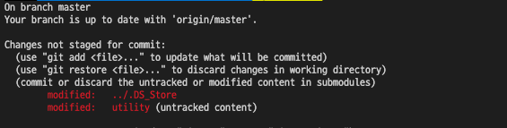

# 0629



git에 올라간 프로젝트 내부의 디렉토리에서 `git init` 명령어를 실행헸다가.. 서브모듈로 인식되는 에러를 만났다.

<br>

`.git` 파일을 찾고,

```
$ find . -name '.git'
```

지워주었다.

```
$ rm -rf ./.git
```

그리고 이미 push된 `utility` 폴더를 지우고 다시 올렸다.

```
$ git rm -rf --cached utility

$ git add .
```


