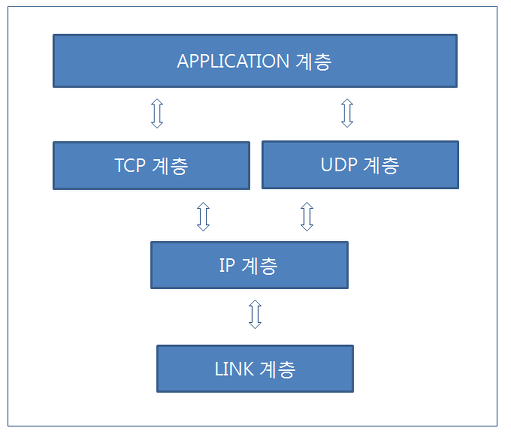
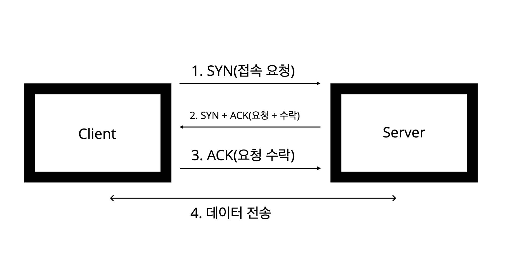
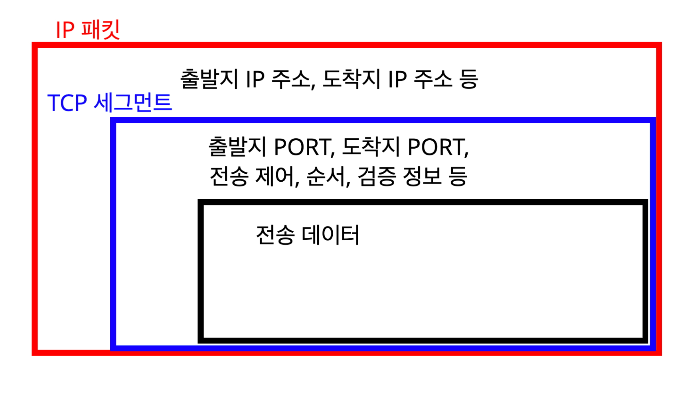

# 0104

와우 벌써 21년이구나!

# Rx

## 목차

### 1장 반응형으로 생각하기

#### 1.1 동기 연산 vs 비동기 연산

- RxJS는 동기, 비동기가 섞여있는 구조적 문제를 개선하고자 하였다.
- 단 하나의 방식을 사용하여 개발을 단순화 시키려고 했다.
  - 이러한 구조의 일원화는 오류 발생 빈도를 낮추고, 생산성 향상에 도움을 준다.

#### p28

콜백예시

```
step1(function (err, v1) {
		// 에러 처리 추가...
		if(err) {
        console.log(err);
    }
    step2(function(v2) {
        step3(function(v3) {
            step4(function(v4) {
                return 'asf';
            });
        });
    });
});
```


#### 1.2 Promise로 더 나아진 콜백

#### 1.3 다른 패러다임의 필요성

#### 1.4 RxJS 이해하기

#### p44

https://blog.naver.com/crazymonlong/221580093195 의 RxJS는 어떻게 개선하였나? 이미지 넣기.

> 결국 동기와 비동기는 시간의 축으로 봤을때는 같은 형태인 것이다.
>
> 또한, 이런 형태는 시간을 인덱스로 둔 컬렉션으로 생각할 수도 있다. RxJS에서는 이를 스트림(Stream)이라 표현한다.

#### 1.5 반응형 프로그래밍과 다른 프로그래밍 패러다임


## Reference

https://www.youtube.com/watch?v=3FKlYO4okts

### Rx는 어디에서 왔을까?

- 2007년: Volta 공개. MS의 R&D조직 발표한 프로젝트
- 2009년: Rx.NET 릴리즈
- 2010년: RxJS 릴리즈
  - Promise 제안은 2012년이라고 함.. 더빠르네 와우!
- 2013년: RxJava 릴리즈 from 넷플릭스


### 요즘 왜 이렇게 핫할까?


---

### Reference

https://blog.naver.com/crazymonlong/221580093195

https://www.slideshare.net/jeokrang/rx-70197043

https://huns.me/development/2051


# 0105

https://css-tricks.com/understanding-event-emitters/


---

# Rx

## 목차

### 1장 반응형으로 생각하기

#### 1.1 동기 연산 vs 비동기 연산

- RxJS는 동기, 비동기가 섞여있는 구조적 문제를 개선하고자 하였다.
- 단 하나의 방식을 사용하여 개발을 단순화 시키려고 했다.
  - 이러한 구조의 일원화는 오류 발생 빈도를 낮추고, 생산성 향상에 도움을 준다.

#### p28

콜백예시

```
step1(function (value1) {
    step2(function(value2) {
        ...
    });
});
```

```
step1(function (err, value1) {
		if(err) {
			console.log(err);
		}
    step2(function(value2) {
        ...
    });
});
```

<br>

#### p30

이벤트 이미터 예시

DOM의 경우

```javascript
const button = document.querySelector('button');

button.addEventListener('click', event => ....do something..);

// 버튼을 누를때마다, 이벤트가 방출되고 콜백이 호출된다.
```

만들어보는 이벤트 이미터 

tdd방식을 조금 따라서 해보자..

어떻게 사용할까?

```javascript
let num = 10;

const e1 = new EventEmitter();

e1.subscribe('test', value => num += value);

e1.emit('test', 5);	// 15
e1.emit('test', 10);	// 25
```

구현해보자

```javascript
class EventEmitter {
    constructor() {
        this.events = {};
    }

    subscribe(name, cb) {
        if(this.events[name]) {
            this.events[name].push(cb);
        } else {
            (this.events[name] = []).push(cb);
        }
        
        // (this.events[name] || (this.events[name] = [])).push(cb);
      
      	// return {
        //    unsubscribe: () => {
        //        const idx = this.events[name].indexOf(cb);
        //        this.events[name].splice(idx, 1);
        //    }
        //}
    }

    emit(name, args) {
        this.events[name].forEach(fn => fn(args));
    }
}
```


#### 1.2 Promise로 더 나아진 콜백

### p34

https://www.youtube.com/watch?v=oHF8PEkteq0

5:00 

> 프로미스는 단일 값을 다루고, 취소를 할 수 없다는 단점이 있다.
>
> 검색어 자동완성의 경우, angular를 입력하다가 리스폰스가 도착하기 전에 react라는 리퀘스트를 보내고 리스폰스가 도착하고, angular에 대한 리스폰스가 뒤늦게 도착하면 사용자는 이상한 결과를 받게되겠다. 취소가 안된다는 점은 매우 불편할 수 있다.
>
> DOM이벤트나 여러 시퀀스에 따른 애니메이션은 보통 단일값을 받지 않아.
>
> 콜백은 여러값을 다룰 수 있지만, 로직이 복잡해지면 코드가 더러워진다.

#### 1.3 다른 패러다임의 필요성

#### 1.4 RxJS 이해하기

#### P38

`명령형 vs 선언형` 검색 -> https://boxfoxs.tistory.com/430


#### p41

> 값을 가진 모든 데이터 요소에 적용할 수 있습니다.

https://junwoo45.gitbook.io/learn-rxjs-korean/learn-rxjs/recipes-1/creation/ajax

Ajax, fromEvent, create, interval


#### p42

`옵저버 패턴`

구글`observer pattern`  `simple observer pattern example` 검색


tdd처럼 해보자..

```javascript
const n = new NewsPaper();

n.add(new Reader());

n.setNews('코로나 유행');
n.setNews('2021년');
```

```javascript
class NewsPaper {
	constructor() {
		this._observers = [];
	}
	
	setNews(news) {
		this._observers.forEach(v => {
			v.update(news);
		})
	}
  
  add(observer) {
    this._observers.push(observer);
  }
  
  remove(observer) {
		const idx = this._observers.indexOf(observer);
    this._observers.splice(idx, 1);
  }
}
```

```javascript
class Reader {
  // this.id = Math.floor(Math.random * 40);
	update(news) {
		console.log('뉴스 : ', id, news);
	}
}
```

### Reference

https://blog.naver.com/PostView.nhn?blogId=crazymonlong&logNo=221580093214&categoryNo=0&parentCategoryNo=0&viewDate=&currentPage=6&postListTopCurrentPage=1&from=postView&userTopListOpen=true&userTopListCount=5&userTopListManageOpen=false&userTopListCurrentPage=6


#### p44

https://blog.naver.com/crazymonlong/221580093195 의 RxJS는 어떻게 개선하였나? 이미지 넣기.

> 결국 동기와 비동기는 시간의 축으로 봤을때는 같은 형태인 것이다.
>
> 또한, 이런 형태는 시간을 인덱스로 둔 컬렉션으로 생각할 수도 있다. RxJS에서는 이를 스트림(Stream)이라 표현한다.

#### 1.5 반응형 프로그래밍과 다른 프로그래밍 패러다임


## 참고로....

https://www.youtube.com/watch?v=3FKlYO4okts

### Rx는 어디에서 왔을까?

- 2007년: Volta 공개. MS의 R&D조직 발표한 프로젝트
- 2009년: Rx.NET 릴리즈
- 2010년: RxJS 릴리즈
  - Promise 제안은 2012년이라고 함.. 더빠르네 와우!
- 2013년: RxJava 릴리즈 from 넷플릭스


---

### Reference

https://blog.naver.com/crazymonlong/221580093195

https://www.slideshare.net/jeokrang/rx-70197043

https://huns.me/development/2051

https://blog.naver.com/crazymonlong/221580093195


# 0107

## OAuth 이해

https://gdtbgl93.tistory.com/180


`export` , `import` 패턴에 관해 재미있는 얘길ㄹ 나눴다!

https://marketplace.visualstudio.com/items?itemName=shinruchan.vscode-barreler


# 0108

## Hosts 파일이란?

주소록이라고 할 수 있다.

우리가 `www.naver.com` 과 같은 주소를 입력하면 브라우저는 우리의 주소록에 이 사이트의 ip주소가 있는지 hosts 파일을 찾아본다.

있으면 해당 ip주소를 사용하고, 없으면 DNS 서버에 검색하여 주소를 받아온 뒤 사용한다.


#### Reference

https://studyforus.tistory.com/209

http://w2.kings.co.kr/i/help/hosts/


## 퍼지(purge)란?

퍼지는 이미 캐싱된 변경 전 파일을 캐시 서버에서 제거하는 기능입니다.

CDN 오리진 서버의 파일이 변경되었을 때, 캐시 서버에 캐싱된 파일이 남아있다면 오리진 서버의 변경사항이 캐시 서버에는 반영되지 않습니다. 

퍼지는 캐시 서버의 콘텐츠를 제거하여 원본 서버의 콘텐츠로 최신화하도록 갱신합니다.

퍼지 요청 후, 모든 캐시 서버에 퍼지가 적용되기까지는 다소 시간이 걸릴 수 있습니다.

#### Reference

https://duffy-sea.tistory.com/124


---

# HTTP

## IP(인터넷 프로토콜)

### IP란?

> 정보를 주고받는데 사용되는 규약(프로토콜)이다.
>
> **패킷** 이라는 통신 단위로 정보를 주고받는다.

이 패킷에는 **출발지**, **도착지**, **메시지(정보)** 등의 데이터가 들어가는데, 이러한 규칙으로 내가 전달한 메시지가 도착지에 보내지게된다.

마찬가지로, 도착지에서는 잘받았다는 의미로 똑같이 패킷에 출발지, 도착지, 메시지(정보) 등의 데이터를 담아서 리스폰스를 준다.

### IP 프로토콜의 한계

- 비연결성

  > 난 도착지가 있을거라고 생각하고 보냈는데 사실 이러한 ip를 가진 도착지는 없는 경우

- 비신뢰성

  - 중간에 패킷이 사라지는 경우
  - 패킷이 순서대로 도착하지 않는 경우


이러한 문제를 해결해주는 것이 **TCP** 이다.

<br>

## TCP

### 인터넷 프로토콜 스택



- 애플리케이션 계층 - HTTP, FTP
  - 애플리케이션에서 사용하는 계층.
- 전송 계층 - TCP, UDP
  - IP계층을 보완해주는 영역으로 이해하자.
- 인터넷 계층 - IP
  - 위에서 살펴본 계층.
- 네트워크 인터페이스 계층
  - 실제 물리적인 영역과 관련된 프로토콜 영역.


### 프로토콜 계층


1. 애플리케이션 계층에서 "Hello World" 메시지를 전달한다.
2. os계층의 TCP레이어에서 메시지 데이터를 포함한 TCP정보를 생성한다.
3. os계층의 IP 레이어에서 TCP데이터를 포함한 IP 패킷을 생성한다.
4. 네트워크 인터페이스를 통해 `이더넷 프레임` 이 포함되어 최종적으로 **인터넷**을 통해 **서버**로 전달된다.

<br>

### TCP(전송 제어 프로토콜 Transmissio Control Protocol) 특징

더 많은 특징이 있지만,

- 연결지향(TCP 3 way handshake)
  - 나와 도착지가 연결되어있는지 확인



- 데이터 전달 보증
  - 전송 중 패킷이 손실되거나 누락되었는 내가 알 수 있다. 
- 순서 보장

### TCP/IP 패킷 정보



- 위에서 알아보았듯이, IP 패킷만으로는 순서를 보장할 수 없었는데 그러한 단점을 TCP가 보완을 해준다.

> TCP는 이러한 정보들을 추가로 가지고 있기 때문에, 위에서 본 특징이 나타날 수 있었구나.


## PORT