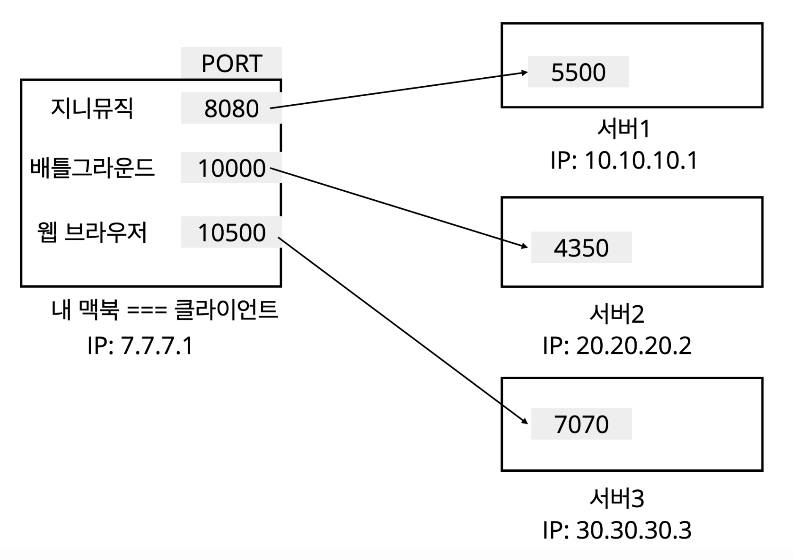
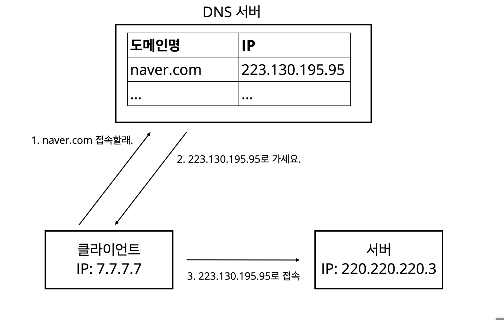

# 0112

## PORT

> 같은 IP 내에서의 프로세스 구분

내 맥북으로 지니뮤직도 듣고 있고, 스팀으로 온라인 게임도 하고 있고 공략을 보기위해 웹 브라우저 요청도 날리고 있다.

즉, 하나의 클라이언트가 여러 서버와 통신하고 있는 상황.

내 IP로 패킷들이 도착할텐데, 이게 지니뮤직인지 게임인지 웹 브라우저 요청인지 어떻게 알까?

IP만으로는 알 수가 없다.

그래서 `TCP/IP 패킷 정보` 에는 **PORT** 정보가 담긴다.

 

## DNS(도메인 네임 시스템 Domain Name System)

- IP는 기억하기 어렵다.
  - `321.28.48.3`? `403.123.492.9`??? ~~아니 이걸 어떻게 외워요~~
- IP는 쉽게 변경될 수 있다.
  - 어제는 `839.291.583.7` 인데 오늘은 `839.291.583.3` 이네

# 0114

https://code-masterjung.tistory.com/83