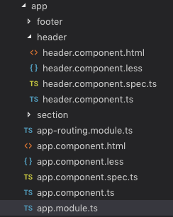
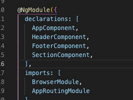

# angular cli

##

```
$ ng generate component [컴포넌트 이름]
//줄여쓰기 가능
$ ng g c [컴포넌트 이름]
```



이렇게 폴더 안에 다 생성해 줄 뿐 아니라...




app.module.ts에 등록도 해쥼.. 귣..


## 특정 폴더 내에 컴포넌트 생성

```
$ ng g c section/time-display
```


이렇게 section 폴더 안에 time-display 폴더 생김

물론 module에도 등록이 되었습니다.