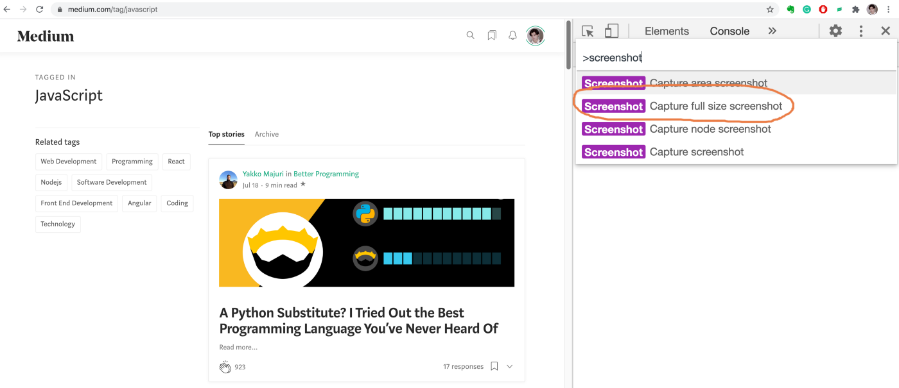
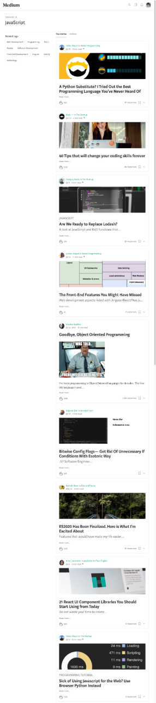
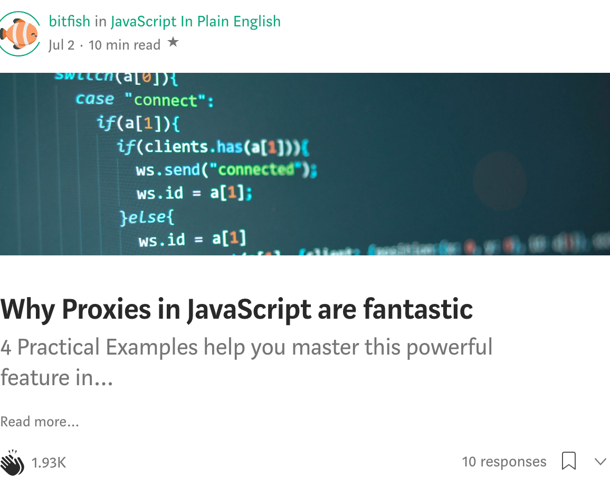
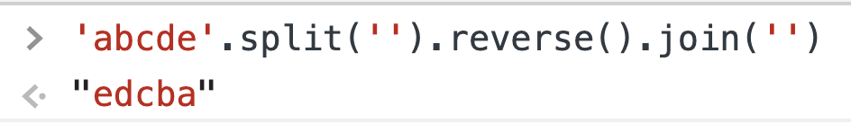
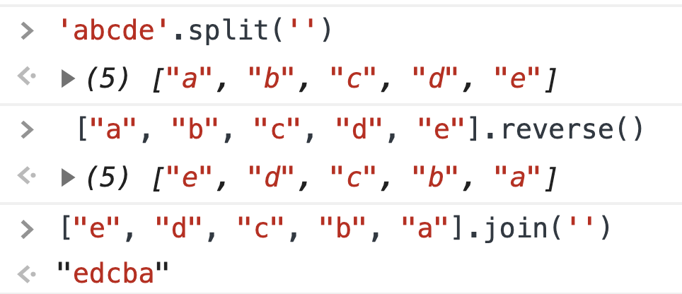
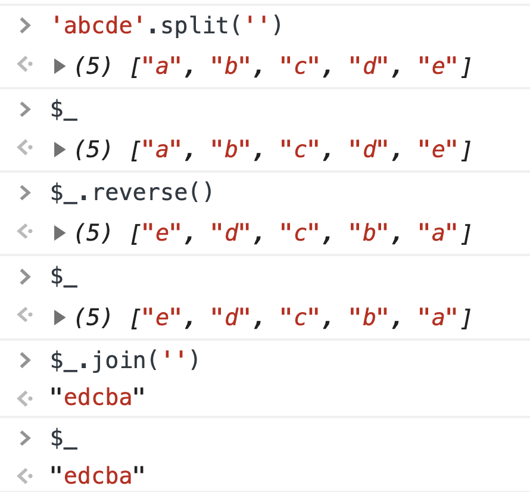
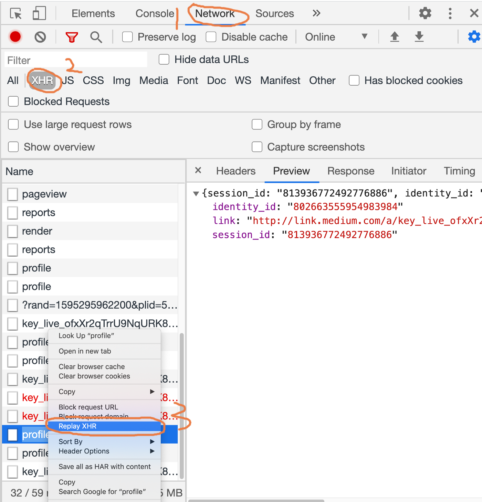
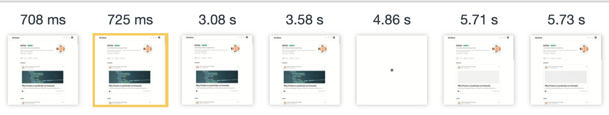

# 시니어 프론트엔드 개발자처럼 크롬 개발자도구 사용하기

자, 우리가 어떤 이유든 개발용 브라우저로 크롬을 선택했다고 치자. 그러면 디버깅을 위해 개발자 모드를 열게될 것이다.


<br>

console 패널을 열어 결과물을 확인하거나, element 패널을 열어 DOM요소에 대한 CSS코드를 확인하기도 한다.


여러분은 정말 크롬 개발자도구를 이해하고 있는가? 개발자도구는 개발 생산성을 높여주는 매우 강력하지만 잘 알려지지 않는 도구들을 제공한다.

가장 유용한 기능들 몇가지를 소개할텐데, 도움이 되었으면 좋겠다.

시작하기 전에, Command 메뉴를 소개해주고 싶다. 리눅스에게 셸(Shell)이 있듯, 크롬에게는 Command 메뉴가 있다.  Command 메뉴를 사용하여 명령어를 입력하면, 크롬을 조작할 수 있다.

먼저 크롬 개발자 도구를 연 뒤, 다음 단축키로 Command 메뉴를 열어보자.

- windows : Ctrl + Shift + P
- macOS : Cmd + Shift + P

또는 아래 버튼을 눌러보자.


그러면 Command 패널로 진입할 수 있는데, 여기서 강력한 기능들을 가지고 있는 명령어들을 사용할 수 있다.


<center>.  .  .</center>

## 강력한 스크린샷 기능

스크린샷은 자주 사용하는 기능이고, 편리한 스크린샷 소프트웨어들이 이미 많이 있다. 근데, 다음과같은 일들을 그 소프트웨어들로 할 수 있을까?

- 화면에 표시되지 않는 항목들까지 포함하여 웹페이지의 모든 것을 스크린샷찍고 싶은 경우
- DOM요소의 내용을 정확하게 캡쳐하고 싶을 때

2가지 흔한 경우지만, 스크린샷 도구들로는 쉽게 해결하기 어려운 경우다. 이러한 경우에 명령어를 입력하여 손쉽게 해결할 수 있다.

명령어는 다음과 같다:

- Screenshot Capture full size screenshot
- Screenshot Capture node screenshot

### 예시

자, 어떠한 페이지도 좋다. 난 미디엄의 자바스크립트 페이지를 열어보겠다.

[https://medium.com/tag/javascript](https://medium.com/tag/javascript)

Command 메뉴를 열고 `Screenshot Capture full size screenshot` 을 실행시켜보자.



그러면, 우린 현재 페이지 전부를 담은 스크린샷을 얻을 수 있다.



이 글에선 당신의 트래픽을 위해 이미지를 압축하여 올렸지만, 원본 이미지는 매우 선명하다.

마찬가지로, DOM 요소의 스크린샷을 얻길 원할 때, 스크린샷 도구를 사용할 수 있겠지만, 정확하게 해당 요소만 캡쳐해낼 수는 없을 것이다.

`Capture node screenshot` 을 사용해보자.

우선, Element 패널에서 요소를 선택한 뒤, 명령어를 실행해보자.


다음과 같이 정확한 스크린샷을 얻을 수 있다.



<br>

## 콘솔의 마지막 실행 결과 참조

우리는 종종 콘솔에서 코드를 디버깅한다. 자바스크립트에서 문자열의 순서를 거꾸로 뒤집기위해 웹에서 검색해보고, 다음 코드를 찾았다고 가정해보자.

```javascript
'abcde'.split('').reverse().join('')
```



자, 위의 코드는 문자열을 뒤집는다. 그러나 당신은 split(), reverse(), join() 메소드가 각각 무슨일을 하고, 각 단계에서 어떤 일들이 일어나고 있는지 이해하지 못한다. 그래서 위 코드를 순서대로 하나하나 실행시켜보게 된다.



이러한 과정을 거친 후, 각각의 메소드가 어떤 결과를 리턴하는지 알게 된다.

근데 이 과정들은 너무 장황하다. 오류가 발생하기 쉬우면서도 이해하기 어렵다. 

사실, 콘솔창에선 마법의 변수인 `$_` 를 사용하여 이전 결과값을 참조할 수 있다.



`$_` 는 콘솔창에서 가장 마지막으로 연산한 결과값과 같은 값을 갖는 특수한 변수이다. 당신의 코드를 편리하게 디버깅해주는 기술이다.


<br>

## XHR 재요청

프론트엔드 입장에선, 데이터를 얻기위한 리퀘스트를 백엔드로 날리기위해 XHR을 사용하는 일이 매우 흔하다. XHR 요청을 다시 날리고 싶다면 어떻게 할 것인가?

신입 개발자들은 화면을 새로고침할 지 모른다. 근데 이게 여간 귀찮은 일이 아니다. 우리는 Network 패널에서 바로 디버깅할 수 있다.



- Network 패널을 연다.
- XHR 버튼을 누른다.
- 재요청하고싶은 XHR 요청을 선택한다.
- Replay XHR

gif 예시를 보자:


<br>

## 화면 로딩 상태 추적하기

페이지가 처음부터 완전히 로딩되기까지 10초이상 걸릴 수 있다. 이러한 경우라면, 페이지가 각각의 시간에 어떻게 로딩되고 있는지 확인해봐야할 수 있다.

크롬 개발자도구에선, Network 패널에서 `Capture Screenshots` 기능을 사용하여 페이지 로딩 스크린샷을 찍을 수 있다.


각 스크린샷을 클릭해서 해당 시점의 네트워크 요청을 확인할 수 있다. 이러한 시각적 프레젠테이션을 통해 매 순간 어떤 네트워크 요청이 일어나고 있는지 더 잘 알 수 있다.



<br>

## 변수 복사

자바스크립트 변수를 다른 곳으로 복사할 수 있는가?

불가능해보이지만, 크롬에서는 `copy` 라는 기능을 통해 변수를 복사할 수 있다.


`copy` 는 ECMAScript 명세가 아닌, 크롬이 제공하는 기능이다. 이 기능을 통해, 자바스크립트 변수를 클립보드로 복사할 수 있다.

<br>

## 이미지를 data URI로 복사하기

페이지에 있는 이미지를 처리하는 방법은 두가지가 있는데, 하나는 외부 자원 링크를 통해 로드하는 것이고, 다른 하나는 이미지를 [data URIs](https://developer.mozilla.org/ko/docs/Web/HTTP/Basics_of_HTTP/Data_URIs)로 인코딩하는 것이다.

> **Data URIs**, 즉 `data:` 스킴이 접두어로 붙은 URL은 컨텐츠 작성자가 작은 파일을 문서 내에 인라인으로 임베드할 수 있도록 해줍니다.


