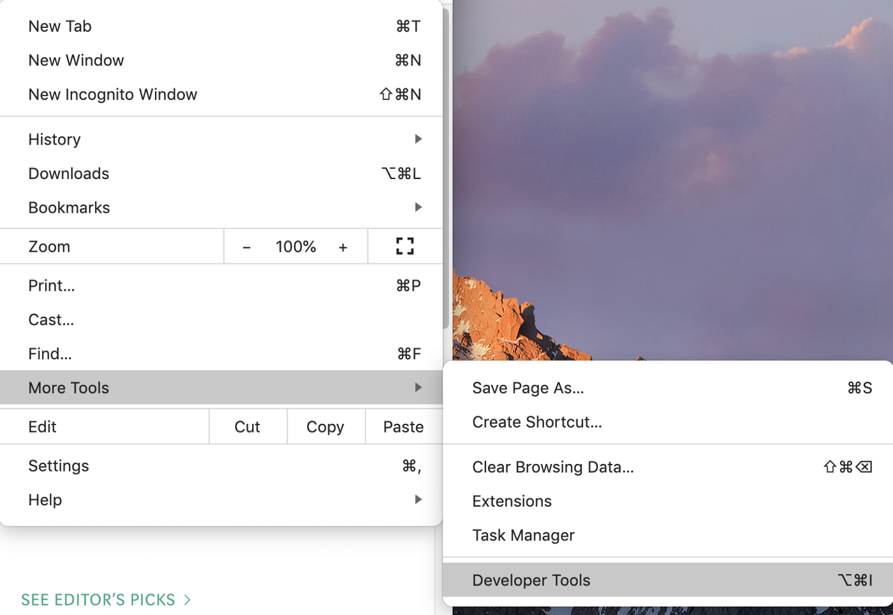
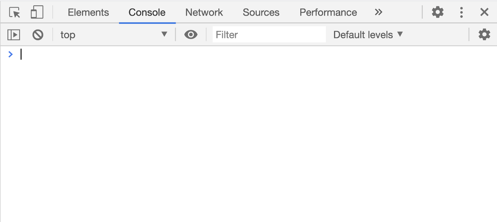
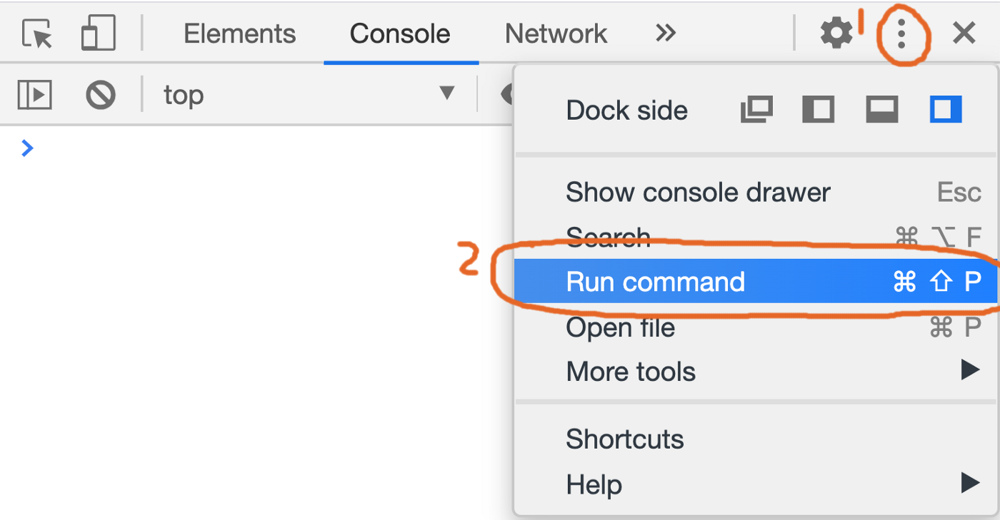

# 시니어 프론트엔드 개발자처럼 크롬 개발자도구 사용하기

자, 우리가 어떤 이유든 개발용 브라우저로 크롬을 선택했다고 치자. 그러면 디버깅을 위해 개발자 모드를 열게될 것이다.

 

console 패널을 열어 결과물을 확인하거나, element 패널을 열어 DOM요소에 대한 CSS코드를 확인하기도 한다.

여러분은 정말 크롬 개발자도구를 이해하고 있는가? 개발자도구는 개발 생산성을 높여주는 매우 강력하지만 잘 알려지지 않는 도구들을 제공한다.

가장 유용한 기능들 몇가지를 소개할텐데, 도움이 되었으면 좋겠다.

시작하기 전에, Command 메뉴를 소개해주고 싶다. 리눅스에게 셸(Shell)이 있듯, 크롬에게는 Command 메뉴가 있다.  Command 메뉴를 사용하여 명령어를 입력하면, 크롬을 조작할 수 있다.

먼저 크롬 개발자 도구를 연 뒤, 다음 단축키로 Command 메뉴를 열어보자.

- windows : Ctrl + Shift + P
- macOS : Cmd + Shift + P

또는 아래 버튼을 눌러보자.

그러면 Command 패널로 진입할 수 있는데, 여기서 강력한 기능들을 가지고 있는 명령어들을 사용할 수 있다.

.  .  .

## 강력한 스크린샷 기능

스크린샷은 자주 사용하는 기능이고, 편리한 스크린샷 소프트웨어들이 이미 많이 있다. 근데, 다음과같은 일들을 그 소프트웨어들로 할 수 있을까?

- 화면에 표시되지 않는 항목들까지 포함하여 웹페이지의 모든 것을 스크린샷찍고 싶은 경우
- DOM요소의 내용을 정확하게 캡쳐하고 싶을 때

2가지 흔한 경우지만, 스크린샷 도구들로는 쉽게 해결하기 어려운 경우다. 이러한 경우에 명령어를 입력하여 손쉽게 해결할 수 있다.

명령어는 다음과 같다:

- Screenshot Capture full size screenshot
- Screenshot Capture node screenshot

### 예시

자, 어떠한 페이지도 좋다. 난 미디엄의 자바스크립트 페이지를 열어보겠다.

[https://medium.com/tag/javascript](https://medium.com/tag/javascript)

Command 메뉴를 열고 `Screenshot Capture full size screenshot` 을 실행시켜보자.