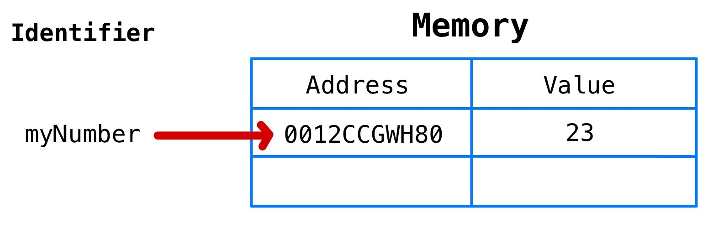
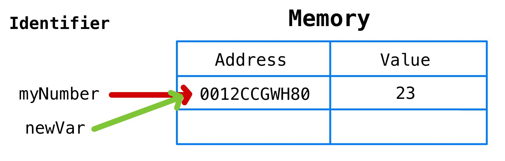

# 자바스크립트의 메모리 모델

```javascript
// 변수를 선언하고 초기화
var a = 5
let b = 'xy'
const c = true

//새로운 값을 할당합니다.
a = 6
b = b + 'z'
c = false //TypeError: Assignment to constant variable
```


변수를 선언하고, 초기화하고, 나중에 새로운 값을 할당하는 것은 프로그래머의 일상적인 일입니다.

그러나 이렇게하면 ***실제로는*** 어떤 일이 발생하나요? 자바스크립트는 이러한 기본적인 기능을 내부적으로는 어떻게 처리하나요? 그리고 더 중요한 건, 프로그래머가 자바스크립트의 이러한 세세한 내용까지 이해한다는 것은 어떠한 장점이 있을까요?

**전 이러한 내용들을 다루려고합니다.**

1. JS 원시 타입의 변수 선언 및 할당
2. 자바스크립트의 메모리 모델: 콜스택과 힙
3. JS 참조 타입의 변수 선언 및 할당
4. let과 const


## JS 원시타입의 변수 선언 및 할당

간단한 예부터 시작하겠습니다. 아래에서는, `myNumber` 라는 변수를 선언하고 23이라는 값으로 초기화합니다.

```javascript
let myNumber = 23
```

<br>이 코드가 실행될 때, 자바스크립트는...

1. 변수의 고유 식별자("myNumber")를 생성합니다.
2. 메모리에 주소를 할당합니다.(런타임에 할당될 것입니다.)
3. 할당된 주소에 값을 저장합니다(23).



<br>

우리는 보통 "myNumber는 23과 같다" 라고 말하지만, 보다 기술적으로는 "myNumber는 23이라는 값을 보유한 메모리 주소와 같다" 라고 해야합니다.

두 말의 차이점은 굉장히 중요합니다.

<br>

만약 우리가 `newVar` 라는 새 변수를 만들고 `myNumber` 를 할당한다면..

```javascript
let newVar = myNumber
```

...`myNumber` 는 기술적으로 “0012CCGWH80”와 같으므로, `newVar` 도 23이라는 값을 가진 메모리 주소인 “0012CCGWH80”와 같습니다.

이 말은즉슨, "newVar는 이제 23과 같습니다."라는 말과 같은 효과를 가지게 된 것이죠.



<center><small>myNumber는 메모리 주소 “0012CCGWH80”와 같으므로 newVar에 myNumber를 할당하면 newVar에 메모리 주소 “0012CCGWH80”이 할당됩니다.</small></center>

