# 자바스크립트의 메모리 모델

<br>

---

> 이 글은 Ethan Nam의 JavaScript's Memory Model을 번역한 글입니다.
>
> 원문 주소는 [JavaScript's Memory Model](https://medium.com/@ethannam/javascripts-memory-model-7c972cd2c239) 입니다.

---

<br>

```javascript
// 변수를 선언하고 초기화
var a = 5
let b = 'xy'
const c = true

//새로운 값을 할당합니다.
a = 6
b = b + 'z'
c = false //TypeError: Assignment to constant variable
```


변수를 선언하고, 초기화하고, 나중에 새로운 값을 할당하는 것은 프로그래머의 일상적인 일입니다.

그러나 이렇게하면 ***실제로는*** 어떤 일이 발생하나요? 자바스크립트는 이러한 기본적인 기능을 내부적으로는 어떻게 처리하나요? 그리고 더 중요한 건, 프로그래머가 자바스크립트의 이러한 세세한 내용까지 이해한다는 것은 어떠한 장점이 있을까요?

**전 이러한 내용들을 다루려고합니다.**

1. 자바스크립트 원시 타입의 변수 선언 및 할당
2. 자바스크립트의 메모리 모델: 콜스택과 힙
3. 자바스크립트 참조 타입의 변수 선언 및 할당
4. let과 const


## JS 원시타입의 변수 선언 및 할당

간단한 예부터 시작하겠습니다. 아래에서는, `myNumber` 라는 변수를 선언하고 23이라는 값(value)으로 초기화합니다.

```javascript
let myNumber = 23
```

<br>이 코드가 실행될 때, 자바스크립트는...

1. 변수의 고유 식별자("myNumber")를 생성합니다.
2. 메모리에 주소를 할당합니다.(런타임에 할당될 것입니다.)
3. 할당된 주소에 값(value)을 저장합니다(23).


<br>

우리는 보통 "myNumber는 23과 같다" 라고 말하지만, 사실 더 정확하게는 "myNumber는 23이라는 값(value)을 보유한 메모리 주소와 같다" 라고 해야합니다.

두 말의 차이점은 굉장히 중요합니다.

<br>

만약 우리가 `newVar` 라는 새 변수를 만들고 `myNumber` 를 할당한다면..

```javascript
let newVar = myNumber
```

...`myNumber` 는 “0012CCGWH80”라는 메모리 주소와 같으므로, `newVar` 도 23이라는 값을 가진 메모리 주소인 “0012CCGWH80”와 같습니다.

이 말은즉슨, "newVar는 이제 23과 같습니다."라는 말과 같은 효과를 가지게 된 것이죠.


<center><small>myNumber는 메모리 주소 “0012CCGWH80”와 같으므로 newVar에 myNumber를 할당하면 newVar에 메모리 주소 “0012CCGWH80”이 할당됩니다.</small></center>


자, 다음과 같이 입력하면 어떻게 될까요?

```javascript
myNumber = myNumber + 1
```

`myNumber` 는 너무나 당연하게 24라는 값을 가질 것입니다. 

 `newVar` 도 같은 메모리 주소를 가리키기 때문에 24라는 값을 가질까요?

<br>

아닙니다.

자바스크립트의 원시타입은 변경불가능(immutable)합니다.

 `myNumber + 1` 의 연산 결과가 `24` 로 확인되면, 자바스크립트는 메모리에 새로운 주소를 할당합니다.

그리고 그 메모리의 값으로 `24` 를 저장하고, `myNumber` 는 이 메모리 주소를 가리킵니다.

<br>

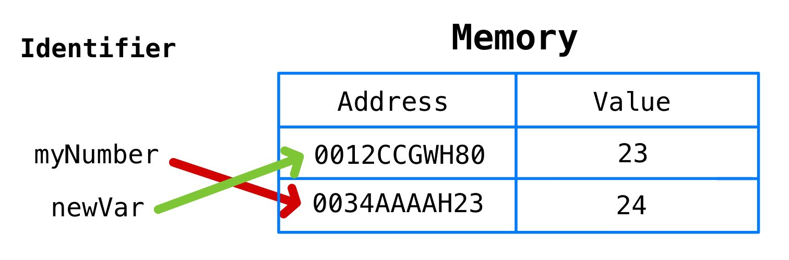

<br>

또 다른 예는 다음과 같습니다.

```javascript
let myString = 'abc'
myString = myString + 'd'
```

<br>

초보 자바스크립트 개발자는 위와 같은 상황을 이미 메모리 상에 존재하는 문자열 `abc` 에 단순히 문자열 `d` 를 추가하는 것이라고 생각할 수 있지만, 틀렸습니다.

자바스크립트의 문자열은 원시 타입이기때문에, `abc` 가 `d` 와 연결될 때 새로운 메모리 주소가 할당되고,  문자열 `abcd` 는 그 메모리 주소에 저장되고, `myString` 이라는 변수는 그 새로운 메모리 주소를 가리킵니다.

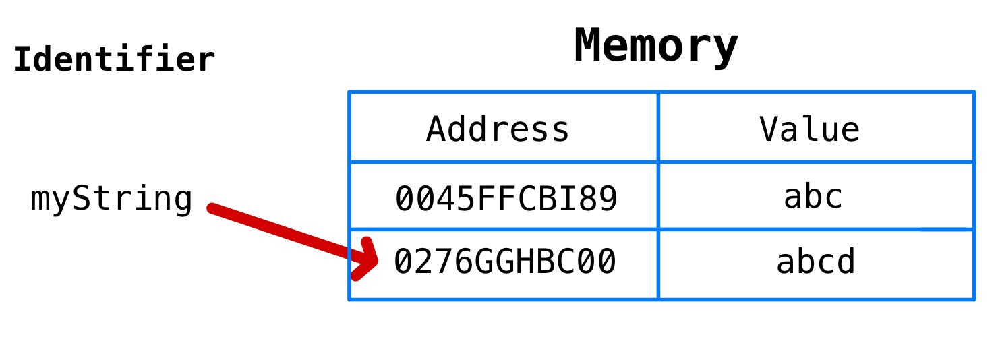

<br>

이제, 이러한 원시타입의 메모리 할당이 어디서 발생하는지 알아볼 차례입니다.

<br>

## 자바스크립트의 메모리 모델: 콜스택과 힙

이번 포스팅의 목적 상, 자바스크립트의 메모리 모델은 콜스택과 힙이라는 명확히 구분된 두가지 영역으로 이루어져있다고 이해하면 좋을 듯 합니다.

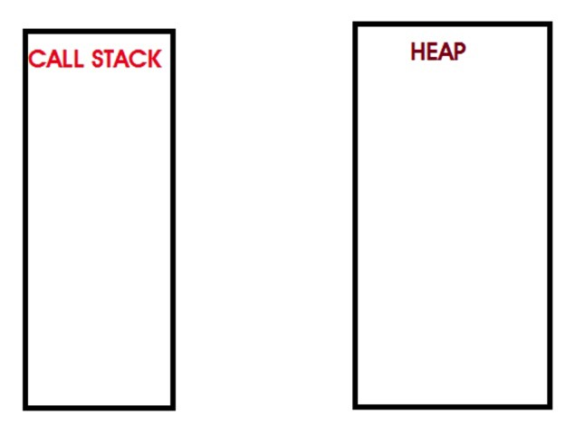

<br>

콜스택은 원시타입이 저장되는 공간입니다.(함수 호출도 이 곳에 저장이 됩니다.)

포스팅의 첫 부분에서 변수를 선언했을 때의 대략적인 표현을 그림으로 보자면 다음과 같습니다.

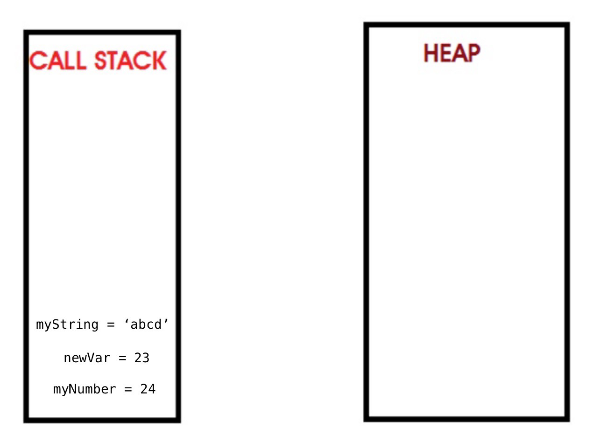

<br>

각 변수의 값을 보여주기 위해, 메모리 주소를 생략했습니다.

그러나, 변수는 값을 가지고있는 메모리 주소를 가리키고 있다는 사실을 잊으면 안됩니다.

이 사실이 let과 const에 대한 이해의 핵심이 되는 내용입니다.

<br>

이제, 힙을 살펴보죠.

<br>

힙은 원시타입이 아닌 타입들이 저장되는 공간입니다.

`힙은 갑자기 데이터가 커질 수도 있는, 배열과 객체와 같은 정렬되지 않은 데이터들을 저장할 수 있다는 점이 핵심포인트입니다.`

<br>

## 자바스크립트 참조 타입의 변수 선언 및 할당

자바스크립트의 참조타입은 원시타입과는 다르게 동작합니다.

간단한 예부터 살펴보죠.

아래에서는 `myArray` 라는 변수를 선언하고 빈 배열로 초기화합니다.

```javascript
let Array = []
```

`myArray` 변수를 선언하고 "[]"같은 참조타입을 할당 했을 때, 다음과 같은 일들이 메모리에서 일어나게 됩니다.

1. 변수의 고유 식별자를 생성합니다.("myArray")
2. 메모리에 주소를 할당합니다.(런타임에 할당될 것입니다.)
3. 힙에 할당된 메모리 주소를 값(value)으로 저장합니다.(런타임에 할당될 것입니다.)
4. 힙의 메모리 주소에 할당된 값(빈 배열 []) 을 저장합니다.

<br>

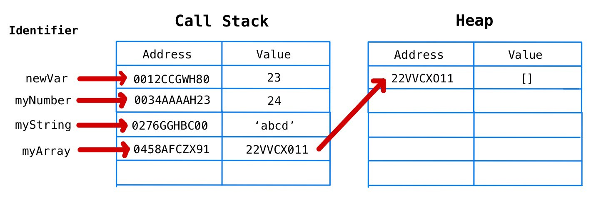

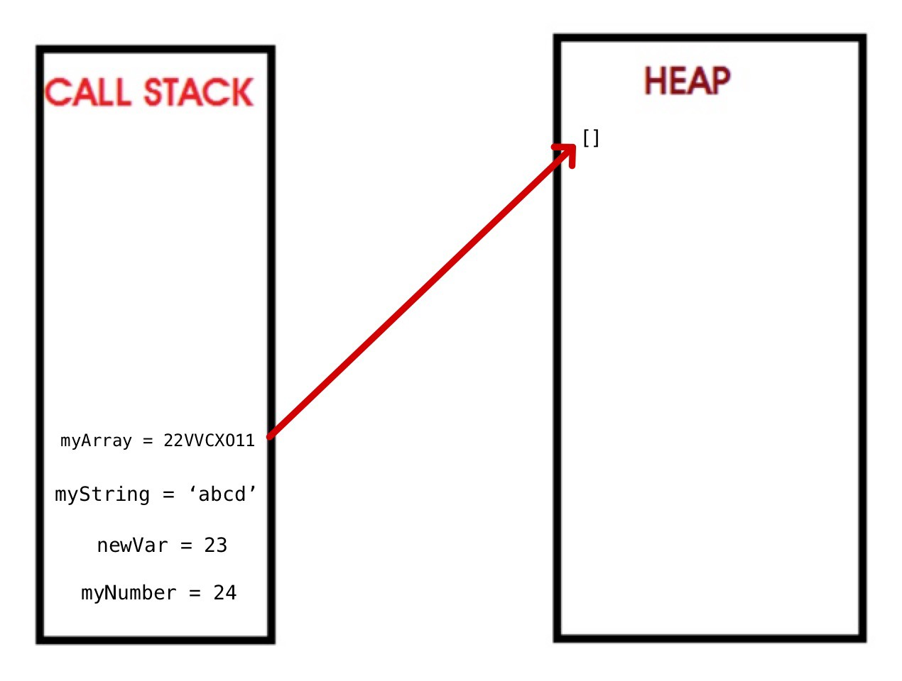

여기에서, `push` 나 `pop` 같은 메소드를 수행할 수 있습니다.

```javascript
myArray.push("first")
myArray.push("second")
myArray.push("third")
myArray.push("fourth")
myArray.pop()
```

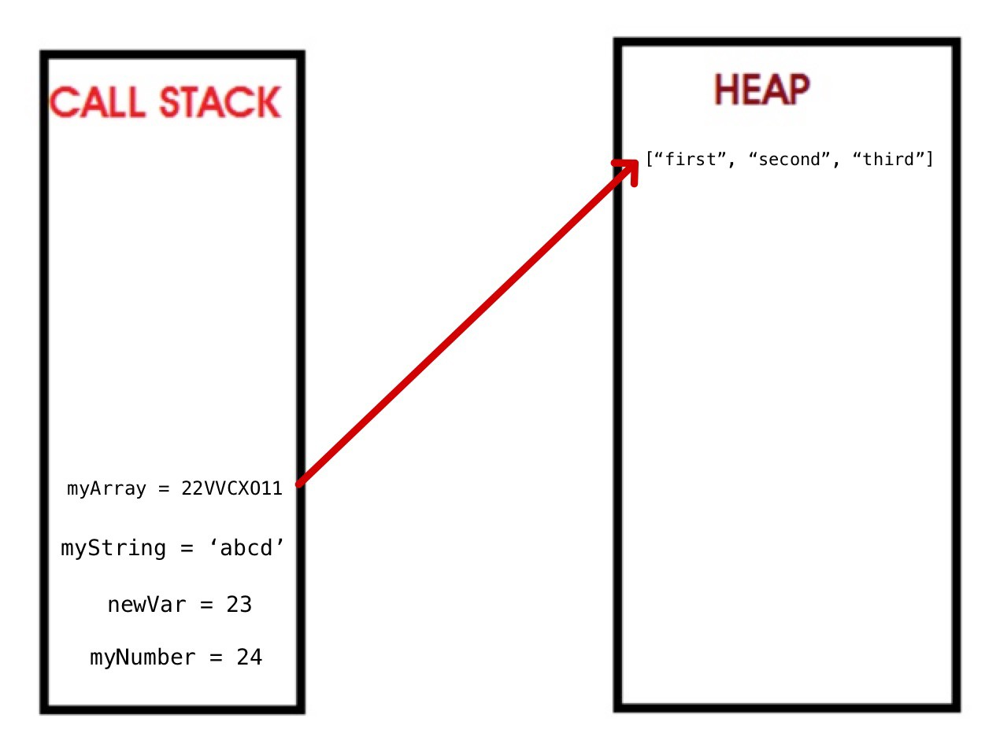

<br>

## let과 const

일반적으로, 우리는 가능한 한 `const` 를 사용해야하며 변수가 변경될 때만 `let` 을 사용해야합니다.

이 `변경` 이라는게 무슨 의미인지 명확히 짚고 넘어가야합니다.

가장 큰 실수는, `변경` 을 `값(value)의 변경`으로 해석하는 것입니다.

`변경` 을 이렇게 잘못 해석하는 자바스크립트 개발자는 다음과 같은 작업을 수행합니다.

```javascript
let sum = 0
sum = 1 + 2 + 3 + 4 + 5

let numbers = []
numbers.push(1)
numbers.push(2)
numbers.push(3)
numbers.push(4)
numbers.push(5)
```

<br>

이 개발자는 값이 변경될 것임을 알았기에, `let` 을 사용하여 "sum"을 올바르게 표현했습니다.

그러나 `push` 메소드를 사용하여 배열에 무언가를 넣는 행위를, 값이 `변경` 됨으로 해석해버려서 `let` 을 사용하여 변수를 선언하는 실수를 저질렀습니다.

<br>

**변경을 해석하는 올바른 방법은 메모리 주소의 변경입니다.**

`let` 은 메모리 주소를 변경할 수 있습니다.

`const` 는 메모리 주소를 변경할 수 없습니다.

<br>

```javascript
const importantID = 489
importantID = 100	// TypeError: Assignment to constant variable
```

무슨 일이 일어났는지 시각화해봅시다.

`importantID` 가 선언되면, 메모리 주소가 할당되고, 489라는 값(value)이 저장됩니다.

변수 `importantID` 는 메모리 주소와 같다는 점을 잊지마세요.

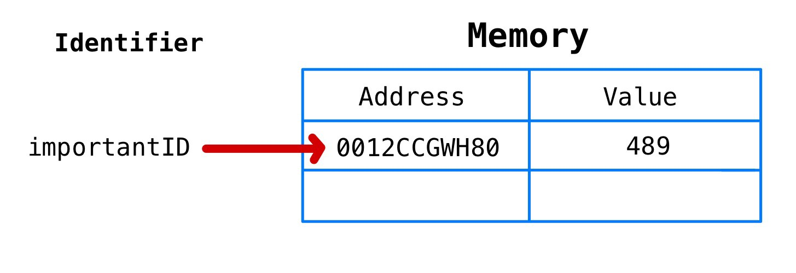

<br>

100이라는 값이 `importantID` 에 할당되면, 100은 원시타입이기때문에 새로운 메모리 주소가 할당되고, 100이라는 값(value)이 그 메모리 주소에 저장됩니다.

그리고 자바스크립트는 그 새로운 메모리 주소를 `importantID` 에 할당하려고 시도하며 이 부분에서 에러가 발생합니다

이 `importantID` 의 ID가 변하는 것을 원하지 않았기에, 우리가 원하는 대로 동작하고 있다고 볼 수 있습니다.

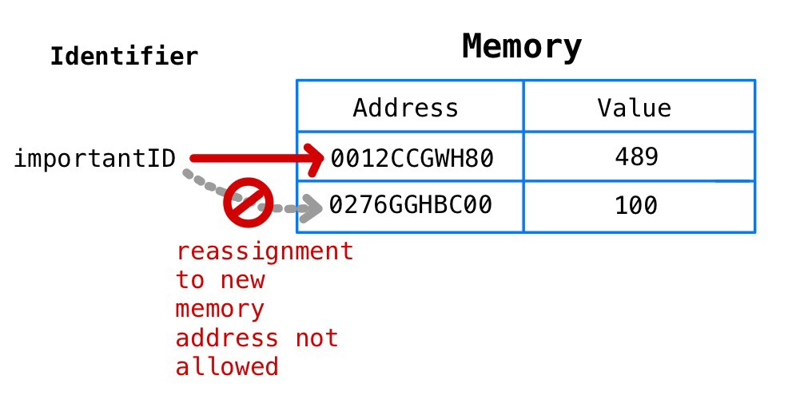

<center>
  <small>
    importantID에 100을 할당하면, 실제로 100이 저장된 새로운 메모리 주소를 할당하려고 합니다. 하지만 importantID가 const로 선언되었기때문에 허용되지 않습니다.
  </small>
</center>


<br>

위에서 언급했듯이, 초보 자바스크립트 개발자는 배열을 `let` 을 사용하여 잘못 선언했습니다.

대신에 `const` 를 사용하여 선언했어야합니다.

이 개념은 처음엔 혼란스러울 수 있습니다. 

네. 맞아요. 직관적이지않죠.

'배열은 변경할 수 있는 경우에만 유용한데, const는 이를 허용하지않으니..

그렇다면 왜 const를 사용하는거야?' 라고 생각할 수 있습니다.

그러나, `변경` 은 메모리 주소에 의해 정의된다는 것을 다시 한 번 기억해야합니다.

배열을 `const` 로 선언하는 것이 왜 괜찮고, 선호되는지 더욱 깊게 파고들어가 봅시다.

<br>

```javascript
const myArray = []
```

`myArray` 가 선언되면 메모리 주소가 콜스택에 할당되고, 그 메모리 주소의 값은 힙에 할당된 메모리 주소입니다.

힙에 저장된 값은 실제 빈 배열입니다.

시각화하면 다음과 같습니다.

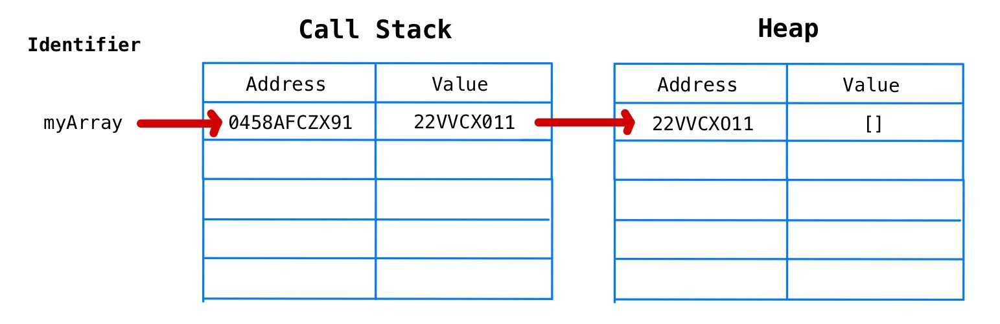

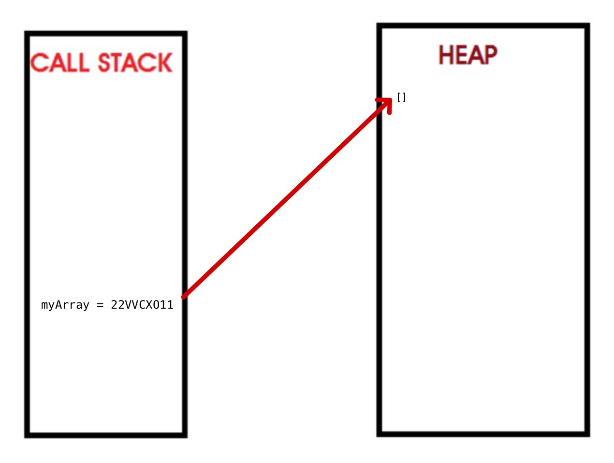

<br>

만약 이렇게 한다면...

```javascript
myArray.push(1)
myArray.push(2)
myArray.push(3)
myArray.push(4)
myArray.push(5)
```

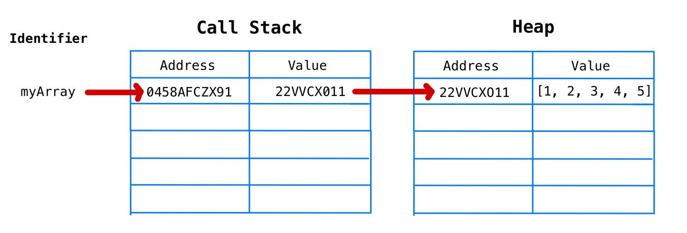

<br>

...`push` 메소드는 힙에 존재하는 배열에 숫자를 밀어넣습니다.

그러나, **변수 myArray의 메모리 주소는 변경되지 않습니다.**

이것이 `myArray` 가 `const`로 선언되었지만 에러가 발생하지 않는 이유입니다.

`myArray` 는 여전히 "0458AFCZX91" 라는 메모리 주소와 같으며, "0458AFCZX91"는 힙의 배열을 값(value)으로 가지는 "22VVCX011"를 값(value)으로 가지고 있습니다.

<br>

다음과 같이하면 에러가 발생합니다.

```javascript
myArray = 3
```

숫자 3은 원시 타입이기 때문에 콜스택의 메모리 주소가 할당되고, 3이라는 값이 저장되며, 그리고나서 이렇게 생긴 새로운 메모리 주소를 `myArray` 에 할당하려고 합니다.

그러나 `myArray` 는 `const` 로 선언되었기 때문에 이런 과정은 허용되지 않습니다.


<br>

오류를 발생시키는 또 다른 예 : 

```javascript
myArray = ['a']
```

<br>

['a'] 는 참조 타입인 배열이므로 콜스택에 새로운 메모리 주소가 할당되고, 콜스택 메모리 주소의 값(value)으로 힙 메모리 주소가 저장되며, 힙 메모리 주소의 값(value)은 ['a']입니다.

그런 다음 콜스택 메모리 주소를 `myArray` 에 할당하려 하면, 오류가 발생합니다.

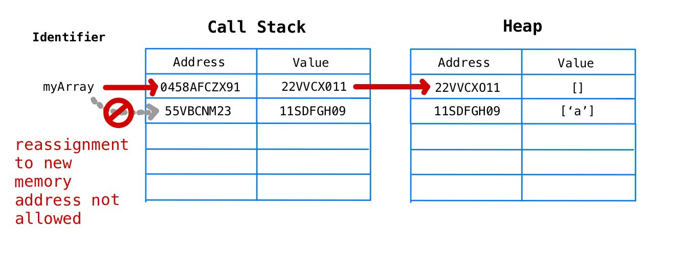

<br>

`const` 로 선언된 객체의 경우, 객체도 배열과 마찬가지로 참조 타입이므로 key값을 추가하고, 프로퍼티를 업데이트하는 등의 작업을 수행할 수 있습니다.

<br>

## 이러한 것을 아는게 왜 중요한가요?

[깃헙](https://github.blog/2018-11-15-state-of-the-octoverse-top-programming-languages/)과 [스택오버플로우의 설문조사](https://insights.stackoverflow.com/survey/2018/)에 따르면, 자바스크립트는 세계에서 가장 많이 사용되는 언어입니다.

실력을 향상시켜 "자바스크립트 고수"가 되는 것은 우리 모두의 목표입니다.

자바스크립트에 관한 많은 책들이 `var` 대신 `const` 와 `let` 을 사용하라고 말하지만, 왜 그것들을 사용해야 하는지를 알려주지 않는 경우가 많습니다.

초보 개발자에겐, 언제 `const` 를 쓰면 에러가 발생하고, 또 언제 `const` 를 써도 에러가 발생하지 않는지 직관적이지가 않습니다.

이러한 번거로움을 피하기위해 `let` 으로만 변수를 선언하는 초보 개발자들이 이해가 가기도 합니다.

<br>

그러나 이러한 방법은 권장되지 않습니다.

세계 최고의 개발자들이 일하고 있는 구글의 자바스크립트 스타일 가이드에는 다음과 같은 내용이 있습니다.

> 모든 지역 변수를 const나 let으로 선언해라.
>
> 변수를 재할당하지 않는 한, 기본적으로 const를 사용해라.
>
> var 키워드는 절대 사용하지마라.[(출처)](https://google.github.io/styleguide/jsguide.html#features-use-const-and-let)

<br>

왜 이렇게 사용해야하는지 이유가 적혀있지는 않지만, 몇가지 이유들을 제가 설명해드릴 수 있습니다.

1. 미래의 버그를 사전에 방지한다.
2. `const` 를 통해 선언된 변수는 반드시 선언과 동시에 초기화되어야하며, 이를 통해 개발자는 스코프적인 측면에서 더욱 신중하게 변수를 배치해야함을 강요받게 됩니다. 이는 궁극적으로 더 나은 메모리 관리 및 성능으로 이어지게됩니다.
3. 단지 코드를 보는 것 만으로도, 어떤 변수가 변경불가능하고, 또 어떤 변수가 재할당이 가능한지 커뮤니케이션할 수 있기 때문입니다.

<br>

지금까지의 설명이 여러분들에게 `const` 와 `let` 을 언제, 그리고 왜 사용해야할 지 결정하는데 도움이 되기를 바란다.

<br>

참고 문헌:

1. [https://google.github.io/styleguide/jsguide.html](https://google.github.io/styleguide/jsguide.html)
2. [https://blog.bitsrc.io/master-javascript-call-by-sharing-parameter-passing-7049d65163ed](https://blog.bitsrc.io/master-javascript-call-by-sharing-parameter-passing-7049d65163ed)
3. [https://blog.sessionstack.com/how-javascript-works-memory-management-how-to-handle-4-common-memory-leaks-3f28b94cfbec](https://blog.sessionstack.com/how-javascript-works-memory-management-how-to-handle-4-common-memory-leaks-3f28b94cfbec)


---

## 번역후기


 