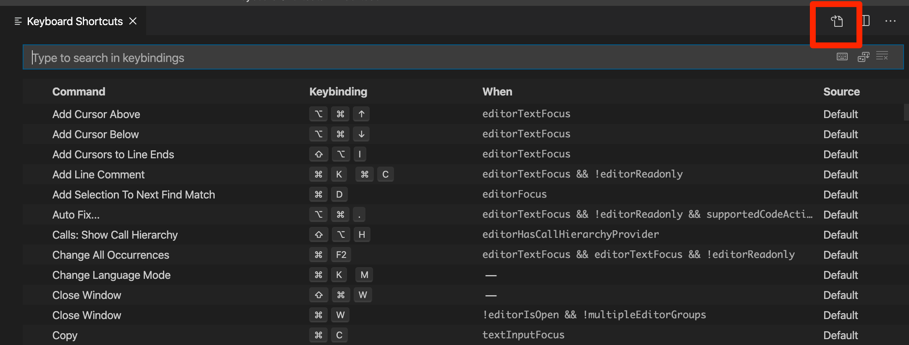

# 개발 환경 설정

##  #Mac

### 환경설정 > 트랙패드

- 탭하여 클릭하기
- 추가 제스처 네 손가락 설정

### 환경설정 > 손쉬운 사용 > 포인터 제어기 > 트랙패드 옵션 > 드래그 활성화 "세 손가락으로"


### 환경설정 > 디스플레이 > 정렬

- 모니터에 맞춰서 정렬..

### 환경설정 > 데스크탑 및 화면보호기 > 핫코너

- 왼쪽 상단: 잠금화면

### 환경설정 > Dock

- 자동으로 Dock 가리기와 보기
- Dock 나타나는 애니메이션 삭제하여 반응성 향상
  터미널 열고 아래 명령어 실행

```
defaults write com.apple.dock autohide -bool true && defaults write com.apple.dock autohide-delay -float 0 && defaults write com.apple.dock autohide-time-modifier -float 0 && killall Dock
```


##  #iTerm2

### 1-0 설치

[https://www.iterm2.com/](https://www.iterm2.com/)

### 1-1 brew설치

```
/usr/bin/ruby -e "$(curl -fsSL https://raw.githubusercontent.com/Homebrew/install/master/install)"
```

### 1-2 zsh 설치

```
brew install zsh
```

### 1-3 oh my ZSH 설치

```
sh -c "$(curl -fsSL https://raw.github.com/robbyrussell/oh-my-zsh/master/tools/install.sh)"
```

### 1-4 agnoster 테마 설치

```
vim ~/.zshrc

ZSH_THEME="robyrussell" -> ZSH_THEME="agnoster"
```

### 1-5 폰트 변경

[https://github.com/naver/d2codingfont](https://github.com/naver/d2codingfont) 들어가서 폰트 다운로드

압축풀고 폰트 더블클릭 후, '서체 설치' 눌러서 설치.

참고 : [https://m.blog.naver.com/PostView.nhn?blogId=lxxjxxx&logNo=221181233993&proxyReferer=https:%2F%2Fwww.google.com%2F](https://m.blog.naver.com/PostView.nhn?blogId=lxxjxxx&logNo=221181233993&proxyReferer=https:%2F%2Fwww.google.com%2F)

Preference > Profile > Text에서 D2Coding폰트 적용 및 13pt로 폰트크기 변경

### 1-6 macbook-pro부분 삭제

```
vim ~/.zshrc
```

들어가서,

```
prompt_context() {
  if [[ "$USER" != "$DEFAULT_USER" || -n "$SSH_CLIENT" ]]; then
    prompt_segment black default "%(!.%.)$USER"
  fi
}
```

복붙 후 저장.

<br>

---

### -iTerm2 부르기

```
Preference -> Keys -> Hotkey
```


---

### - command + 좌우화살표 / option + 좌우화살표로 단어 사이 옮겨다니기

```
iTerm2 -> Preferences -> Profiles -> Keys -> Presets.. -> Natural text editing
```


### - zsh 조금 더 이쁘게 꾸미기

zshrc를 열어준다.

```
vim ~/.zshrc
```

파일 하단에 아래 코드를 복붙

```
prompt_context() { # Custom (Random emoji) emojis=("⚡️" "🔥" "🇰" "👑" "😎" "🐸" "🐵"  "🌈" "🍻" "🚀" "💡" "🎉" "🔑" "🚦" "🌙") RAND_EMOJI_N=$(( $RANDOM % ${#emojis[@]} + 1)) prompt_segment black default "{하고싶은이름} ${emojis[$RAND_EMOJI_N]} " }
```


Reference: https://fernando.kr/15?category=790197

---

##  #Git

### - 커밋 메세지 템플릿 


우선, 가이드대로 `~/.gitmessage.txt` 파일을 만들어주고, 에디터로 진입.

```
touch ~/.gitmessage.txt
nano .gitmessate.txt
```

아래 커스텀 템플릿을 복붙해주고 저장.

```
# <타입>: <제목>

##### 제목은 최대 50 글자까지만 입력 ############## -> |


# 본문은 위에 작성
######## 본문은 한 줄에 최대 72 글자까지만 입력 ########################### -> |

# 꼬릿말은 아래에 작성: ex) #이슈 번호

# --- COMMIT END ---
# <타입> 리스트
#   feat    : 기능 (새로운 기능)
#   fix     : 버그 (버그 수정)
#   refactor: 리팩토링
#   style   : 스타일 (코드 형식, 세미콜론 추가: 비즈니스 로직에 변경 없음)
#   docs    : 문서 (문서 추가, 수정, 삭제)
#   test    : 테스트 (테스트 코드 추가, 수정, 삭제: 비즈니스 로직에 변경 없음)
#   chore   : 기타 변경사항 (빌드 스크립트 수정 등)
# ------------------
# Remember me ~
#   Capitalize the subject line
#   	제목 첫 글자를 대문자로
#   Use the imperative mood in the subject line
#     제목은 명령문으로
#   Do not end the subject line with a period
#     제목 끝에 마침표(.) 금지
#   Separate subject from body with a blank line
#     제목과 본문을 한 줄 띄워 분리하기
#   Use the body to explain what and why vs. how
#     본문은 "어떻게" 보다 "무엇을", "왜"를 설명한다.
#   Can use multiple lines with "-" for bullet points in body
#     본문에 여러줄의 메시지를 작성할 땐 "-"로 구분
# ------------------
```

그리고 `git commit.template` 에 이 파일을 설정해준다.

```
git config --global commit.template ~/.gitmessage.txt
```

Reference

- [https://git-scm.com/book/ko/v2/Git%EB%A7%9E%EC%B6%A4-Git-%EC%84%A4%EC%A0%95%ED%95%98%EA%B8%B0](https://git-scm.com/book/ko/v2/Git맞춤-Git-설정하기)


---

##  #VSCode

### code . 적용

```
Shift + Command +  P and type `shell command`
```

<br>

### 단축키로 선택된 디렉토리에 새 파일 생성

새 파일은 `command` + `n` 단축키로 생성할 수 있다.

하지만 내가 선택한 워킹 디렉토리에 생성되지않아 매우 불편하다.

keybinding.json을 수정하여 디폴트 커맨드를 수정해줄 수 있다.

1. `shift` + `command` + `p` 를 누른뒤 `key` 를 검색해준다.
2. Keyboard shortcut을 선택해준다.
3. 우측 keyboardbinding.json을 눌러준다.



4. JSON형식에 맞춰 덮어씌워준다.

```
// Place your key bindings in this file to override the defaults
[
  {
    "key": "cmd+n",
    "command": "explorer.newFile"
  }
]
```

5. 이제 현재 활성화된 워킹 디렉토리에 파일이 생성된다.

<br>

---

### 항상 새 탭으로 파일 열기

새로운 파일을 열면 기존 탭에서 열리고 보고있던 파일은 사라져버린다. 

매우 행복해진다..(대체 왜 이게 디폴트일까?)

1. `shift` + `command` + `p` 를 누른 뒤, `settings` 를 검색해준다.
2. `Open settings` 를 열어주자. 
3. JSON 파일이 나온다. 옵션을 추가해주자.

```
{
    "workbench.editor.enablePreview": false
}
```

4. 편-안

<br>

## #Chrome Extension

### vimium

```
gu: 상위 경로 url로 이동한다

현재 url이 https://junwoo45.github.io/archive/2020-03-26-hoisting 이라면
https://junwoo45.github.io/archive 로 이동한다.

gU: 최상위 경로 url로 이동한다.
현재 url이 https://junwoo45.github.io/archive/2020-03-26-hoisting 이라면
https://junwoo45.github.io로 이동한다.


스크롤
gg: 페이지 최상단으로 스크롤
G: 페이지 최하단으로 스크롤
u: 반페이지 만큼 위로 스크롤
d: 반페이지 만큼 아래로 스크롤

r: 새로고침
H: 뒤로가기
L: 앞으로가기

탭
T: 열려있는 탭 검색
J: 탭 왼쪽으로 이동
K: 탭 오른쪽으로 이동
g0: 첫번째 탭으로 이동
g$: 마지막 탭으로 이동
x: 탭 닫기
```

