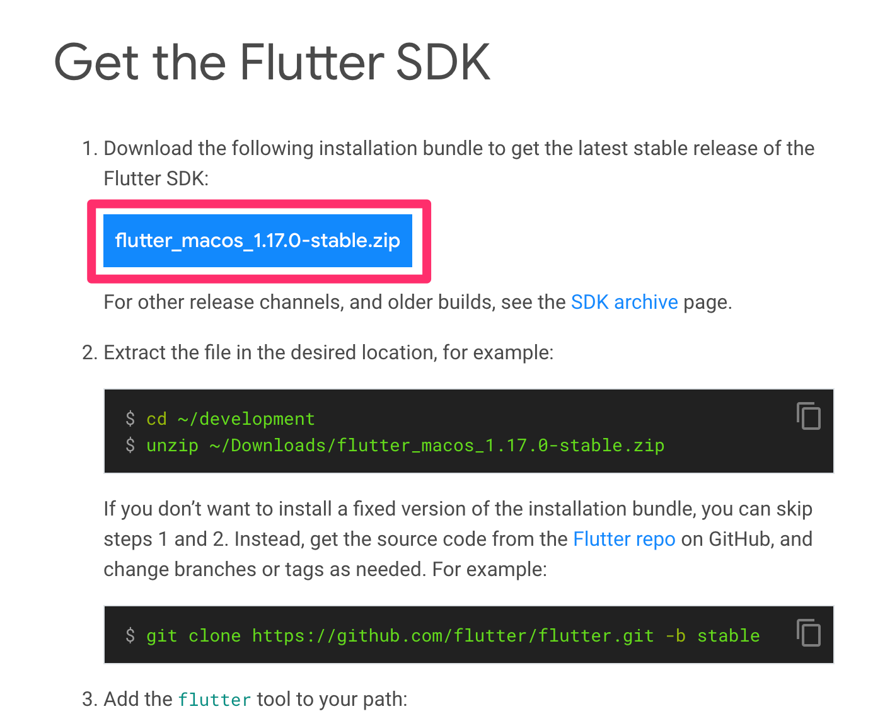
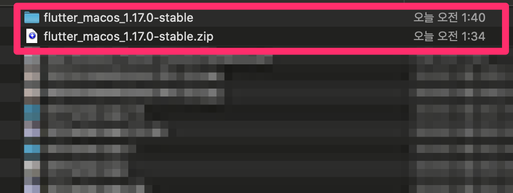
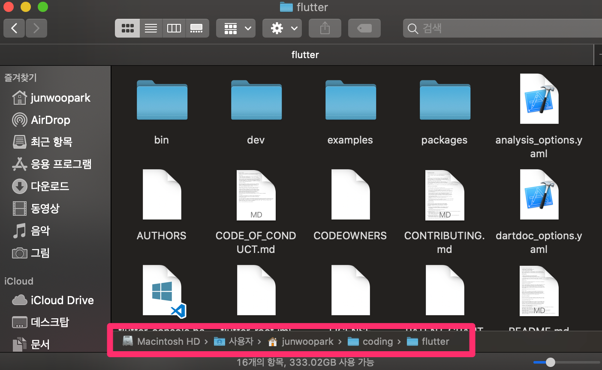
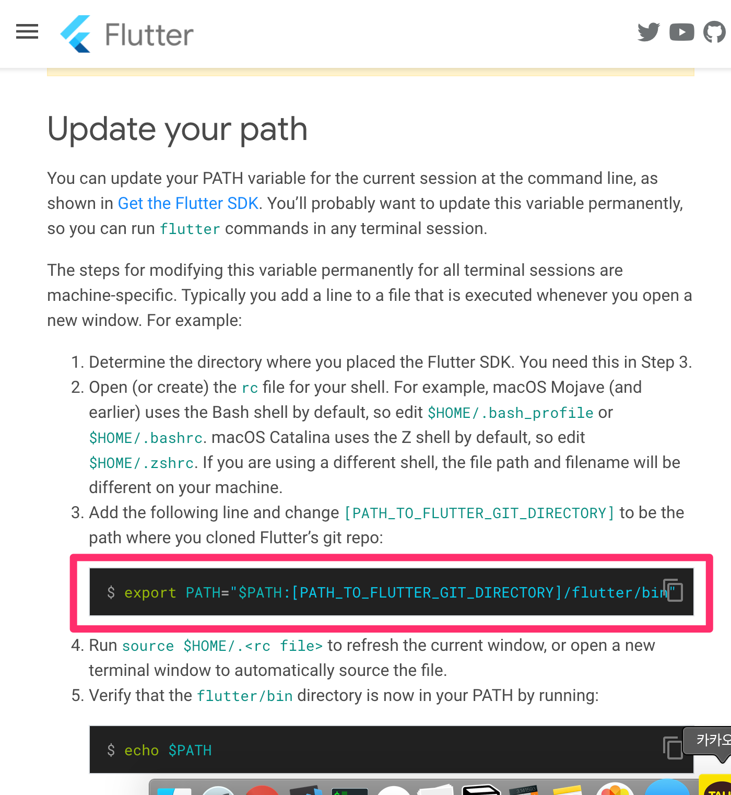
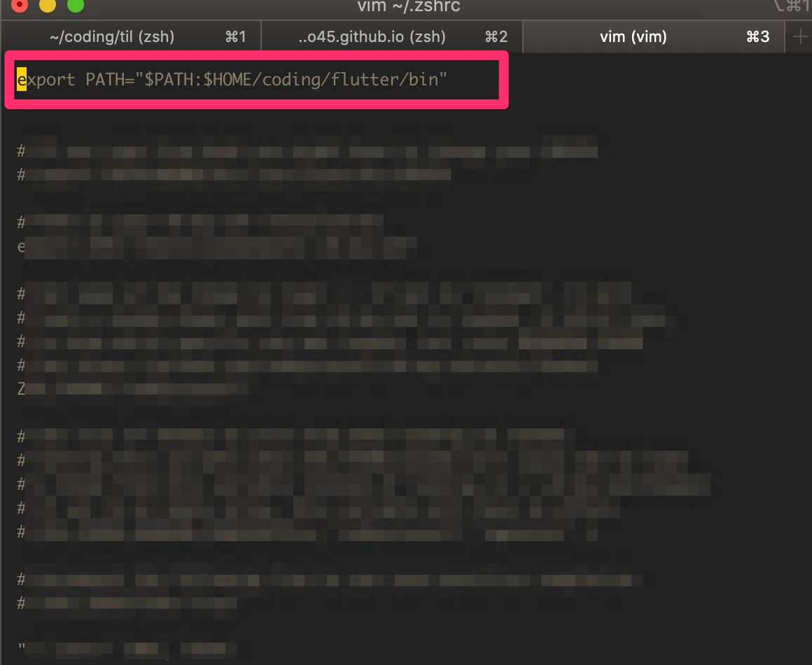
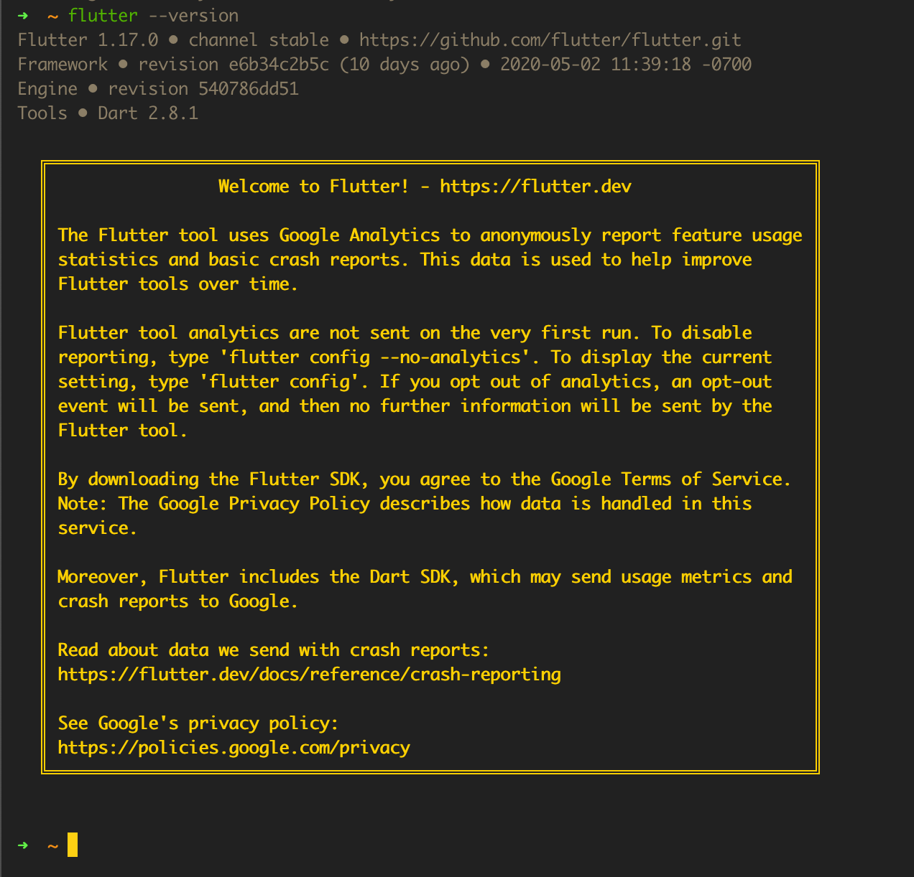

# Flutter

<br>

## Flutter SDK설치

[https://flutter.dev/docs/get-started/install/macos](https://flutter.dev/docs/get-started/install/macos) 로 들어갑니다.



<br>

설치가 완료되면 압축을 풀어줍니다.



<br>

저장할 디렉토리로 옮겨줍니다.

저장한 디렉토리를 잘 기억하고 있어야합니다.

<br>



<br>

이제부터 macOS Catalina & zsh 기준입니다.

`zshrc` 를 열어줍니다.

```
$ vim ~/.zshrc
```


[https://flutter.dev/docs/get-started/install/macos](https://flutter.dev/docs/get-started/install/macos) 를 확인해보면 `Update your path` 항목이 있습니다.



<br>

복사해서 터미널로 돌아가 `zshrc` 에 붙여넣기 해줍니다.



아까 저장했던 디렉토리로 수정해줍니다.

<br>

새 터미널을 엽니다.

그리고 다음 명령어로 잘 flutter가 잘 설치되었는지 확인합니다.

```
$ flutter --version
```



<br>

잘 되었습니다!