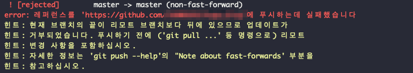

# git pull 이후 non-fast-forward 문제 해결


##문제

자주 마주치는 문제인데요.

```
$ git init
$ git remote add origin <repository url>
```

이후에

```
$ git pull
```

을 진행하면 이 에러가 발생했을 때,



##해결

```
git pull origin master --allow-unrelated-histories
```


## 왜 발생할까?

git은 관련이 없는 두 저장소를 병합하는 것을 기본적으로 거부한다고 합니다.

(pull 하려고 한 원격저장소에 readme.md가 있어서 그런걸까..!?)

따라서 두 저장소를 병합하는 것을 허용하도록 옵션을 추가해주었습니다.