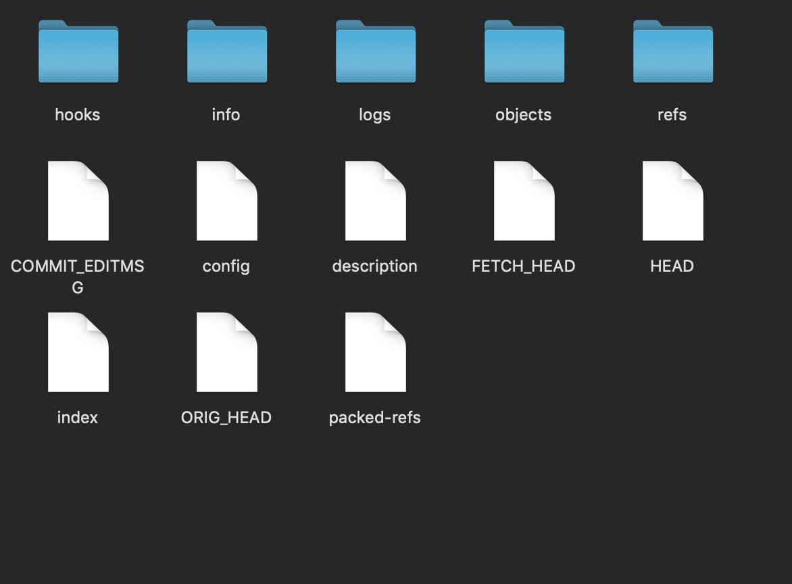

<h1>
  Git의 내부
</h1>


Git은 변경이 발생하지 않은 파일은 이전 파일을 그대로 참조하고 변경이 발생한 파일은 통째로 다시 저장합니다.

하나의 버전은 온전한 소스파일을 모두 가지고 있습니다.

그래서 Git은 스냅샷방식으로 이력을 관리한다고 얘기합니다.

> 스냅샷
>
> 스냅샷이란, 사진을 찍듯이 특정 시점의 상태를 그대로 복사해 저장하는 행위를 의미합니다.


<h2>
  Git 저장소
</h2>

git init 명령어로 저장소를 생성하거나, git clone 명령어로 원격저장소를 복제했을때, 저장소가 생깁니다.

프로젝트를 관리하는 디렉토리 아래의 .git 디렉토리가 Git저장소입니다.


.git디렉토리가 존재하는 지금 이 공간을 작업 디렉토리라고 부르며, Git으로 추적&관리하는 대상입니다.

.git폴더 내부로 들어가보겠습니다.


<h3>
  Bare저장소
</h3>



.git으로 들어왔을때 처음 마주치는 이 공간을 Bare 저장소라고 부릅니다.


<h3>
  objects 디렉토리
</h3>

이 곳은 파일이 저장되는 디렉토리입니다.

Git은 모든 파일을 객체형식으로 저장하는데요.

아래 사진의 info와 pack을 제외한 수많은 폴더들이 객체가 저장된 디렉토리입니다.


objects 디렉토리에 객체가 생성되는 시점은 작업 디렉토리에 파일을 저장하는 시점이 아닙니다!

git add 명령어로 파일을 스테이징시킬때 생성됩니다.(Staging Area에 파일을 등록한다고도 합니다.)

Staging Area에는 직후의 commit에 어떤 것들이 포함될지 알려주는 정보를 가지고 있는 파일입니다.

따라서, Staging Area에 등록된다는 소리는, objects 디렉토리에 객체로 생성된다는 의미이기도 합니다.


<h3>
  refs 디렉토리
</h3>

공부하다보니 엄청 어렵네요.

refs 디렉토리는 레퍼런스와 관련되어있는데요.

간단하게, 기본으로 존재하는 마스터 브랜치는 refs/heads/master파일에 마지막 커밋의 아이디가 저장됩니다.


레퍼런스는 특정 commit을 가리키고, 각 커밋은 부모 커밋의 정보를 포함한다고합니다.

따라서 레퍼런스가 가리키는 커밋에서부터 이와 연결된 모든 커밋을 추적할 수 있어, 커밋에 포함된 모든 객체에 접근 가능하다고 합니다.

이해하기가 무척이나 어렵지만, 제가 자주 사용하는 git reflog명령어처럼, 그동안의 이력을 이 디렉토리를 통해서 추적하는게 아닐까 싶네요.


<h3>
  info 디렉토리
</h3>

info 디렉토리에는 Git관리제외 대상 목록을 저장한 exclude파일과 레퍼런스 목록을 저장한 refs파일이 있다고 합니다.


저는 exclude파일만 있네요.

exclude파일은 .gitignore파일과 기능은 동일합니다.

하지만 다른 사람과 공유되지 않습니다.

다른 사람과 공유할 필요가 없는 파일이나 디렉토리를 지정하고(.gitignore기능), 이러한 제외 목록까지도 다른이들과 공유할 필요가 없을때 유용하게 사용할 수 있습니다!


<h3>
  hooks 디렉토리
</h3>


hooks디렉토리에는 훅 스크립트 파일이 저장됩니다.

특정한 Git 명령어가 실행될 때 자동으로 실행되는 명령어의 묶음입니다.


<h3>
  config 파일
</h3>

config파일을 파일이 있는 저장소에 적용되는 설정파일입니다.


git init명령어로 새로운 저장소를 만든 직후에는 [core]부분만 존재합니다.

```
[core]
    repositoryformatversion = 0
    filemode = false
    bare = false
    logallrefupdates = true
    symlinks = false
    ignorecase = true
    hideDotFiles = dotGitOnly
```

하지만, git clone명령어로 원격 저장소를 복제해서 새로운 저장소를 만들면 다음과 같습니다.

```
[core]
    repositoryformatversion = 0
    filemode = false
    bare = false
    logallrefupdates = true
    symlinks = false
    ignorecase = true
    hideDotFiles = dotGitOnly
[remote "origin"]
    url = https://github.com/깃헙아이디/레포지토리이름.git
    fetch = +refs/heads/*:refs/remotes/origin/*
[branch "master"]
    remote = origin
    merge = refs/heads/master
```

git init명령어로 저장소를 생성하고, 그 이후 원격저장소를 등록해주는 git remote add origin 명령어로 입력했을때 새로운 부분들이 생기나봅니다..

> 참고로 config파일의 fetch속성값인 +refs/heads/*:refs/remotes/origin/*는
>
> '[+]{출발지의 레퍼런스}:{목적지의 레퍼런스}'형식입니다.


<h3>
  HEAD파일
</h3>

HEAD레퍼런스가 가리키는 commit아이디를 저장한 파일입니다.

HEAD레퍼런스는 현재 작업 디렉토리의 체크아웃된 버전을 가리킵니다.

따라서 만약 브랜치를 체크아웃한다면, HEAD파일에는 이 브랜치의 레퍼런스가 저장됩니다!


<h3> 그 외의 디렉토리</h3>

- logs디렉토리 : commit, checkout같은 기본적인 Git작업을 진행하면 이에대한 기록이 여기에 남습니다.

- modules디렉토리 : Git 서브 모듈을 사용하면 이곳에 저장소가 만들어집니다.
- ORIG_HEAD파일 : HEAD레퍼런스를 변경하는 명령을 실행하면, 변경 전의 HEAD레퍼런스가 기리키던 커밋 아이디를 이 곳에 저장합니다.
- FETCH_HEAD파일 : 원격 저장소로부터 변경사항을 받아오는 git fetch명령을 실행할 때 마지막으로 가져온 원격 브랜치의 commit 아이디를 저장합니다.


<h3>
  버전관리 프로세스
</h3>


그림 출처 : https://d2.naver.com/helloworld/1859580


공부 자료 : https://d2.naver.com/helloworld/1859580