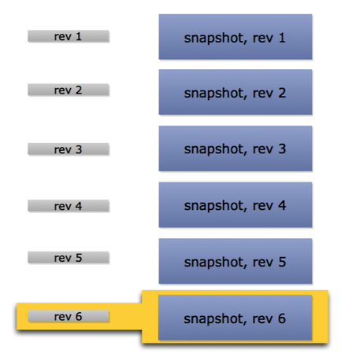
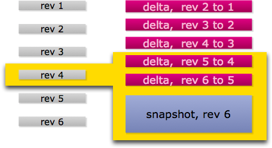

```
git을 잘다루고 싶습니다.

그러려면 공부를 열심히 해야겠고, 평소에도 잘 사용해야겠져..

그리고 git을 cli로 잘 다루고 싶습니다.

왜냐면 멋있어서....
```


# git의 저장방식

---

> git이 단순히 스냅샷으로만 관리한다라는 말은 맞으면서도 잘못된 말입니다.
>
> git은 각 시점의 스냅샷을 저장하고, 또 그 스냅샷들 사이의 델타 또한 저장합니다.


커밋을 하면, git은 기본적으로 스냅샷을 저장합니다.

예를 들어보면,

처음 snapshot.txt파일을 커밋하면 rev1에 저장됩니다.

그리고 snapshot.txt파일을 수정한 뒤 또 커밋하게되면, 이젠 rev2에 저장이 됩니다.

이때 rev2에는 snapshot.txt파일이 통째로 저장이 됩니다.

즉, `.git` 저장소에는 rev1일 때의 snapshot.txt파일과 rev2일 때의 snapshot.txt가 모두 들어있는 것이죠.

그림으로 보면 다음과 같습니다.




하지만 git은 이렇게 스냅샷만 저장하지 않습니다.

앞서 말했듯이 델타도 저장하는데요.

델타란, 저장소의 이전버전과 다음버전의 변경내역의 차이라고 생각하면 됩니다.

git은 적절한 시점, 그리고 적절한 방식..... 즉 Garbage Collection이 실행되며 저장방식이 바뀌게 됩니다.




마지막 버전의 파일 하나만 스냅샷방식으로(**통째로**) 저장하고, 그 이전 버전들은 모두 델타를 저장하게 바뀝니다.

따라서 위 이미지같은 상황에서 rev4를 요구한다면, rev6의 스냅샷에서 rev5, rev4의 델타를 적용해서 보여주게 됩니다.


처음과 같은 방식에서는 1kb짜리 스냅샷을 계속 통째로 저장하기에, 100개의 수정과 저장을 반복하게된다면 100kb의 용량이 되버립니다.

하지만 이렇게 마지막 버전만 스냅샷으로 저장하고 그 이전버전들은 델타를 저장하게 된다면, 100번을 수정하더라도 1kb에서 크게 증가하지는 않게 됩니다.

게다가 gzip으로 압축을 진행하기때문에 더더욱 효율적이라고 합니다.


```
공부자료
https://www.youtube.com/watch?v=sH5_uRbaWLo&list=PLq7lxfc2HLJCA99u0YHLGUeyCoeEaxRA7&index=1
http://dogfeet.github.io/articles/2012/git-delta.html
```

```
사진출처
http://dogfeet.github.io/articles/2012/git-delta.html
```

