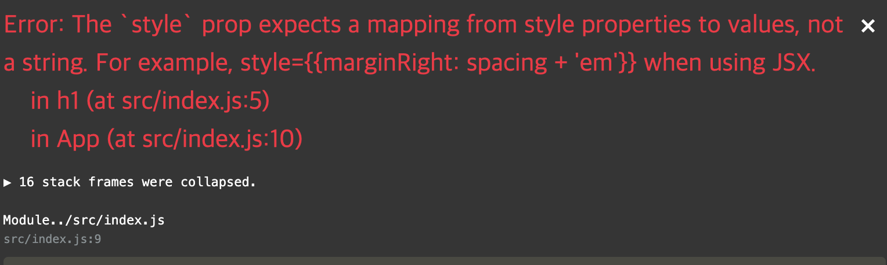

# React

<br>

## Basic

```typescript
import React from 'react';
import ReactDom from 'react-dom';

const App = () => {
    return <h1>Hi There!</h1>
};

ReactDom.render(
    <App />,
    document.querySelector('#root')
);

```

<br>

> 음... 렌더링이 참 빠르다는 느낌이다.
>
> 앵귤러만 하다와서 그런가..?
>
> 굉장히 깔끔허다..

<br>

---

## JSX


리액트에서는 `.js` 파일에 JSX를 작성하고 있다.

그리고 웹 브라우저는 JSX를 읽을 수 없다.

그렇다면 무언가가 JSX를 자바스크립트로 바꿔주고 있는 거 아닐까.

<br>

[바벨 Try it out](https://babeljs.io/repl#?browsers=defaults%2C not ie 11%2C not ie_mob 11&build=&builtIns=false&spec=false&loose=false&code_lz=Q&debug=false&forceAllTransforms=false&shippedProposals=false&circleciRepo=&evaluate=false&fileSize=false&timeTravel=false&sourceType=module&lineWrap=true&presets=env%2Creact%2Cstage-2%2Cenv&prettier=false&targets=&version=7.9.6&externalPlugins=)에 들어가보자.

왼쪽에 코드를 적으면, ES5로 변환해준다.

```
// Before
const App = () => {
    return <h1>Hi There!</h1>
};

//After
"use strict";

const App = () => {
  return /*#__PURE__*/React.createElement("h1", null, "Hi There!");
};
```

`return <h1>Hi There!</h1>` 은 다음과 같다.

 `React.createElement("h1", null, "Hi There!")` 

이렇게 바뀌는구나.

<br>

### HTML to JSX

나는 얘를 표현하고 싶다.

```html
<h1 style="background-color: blue; color: white;">Hi There!</h1>
```

JSX에 이렇게 작성하면 에러가 발생한다.



```html
// 이렇게 바꿔줘야한다.
<h1 style={{ backgroundColor: 'blue', color: 'white' }}></h1>
```

<br>

### class vs className

헷갈리지말고, `className`으로 사용하자.

<br>

### Referencing JavaScript Variables

컬리브레이스가 하나인게.. 앵귤러와 참 헷갈리다 -_-;;

```typescript
...

const App = () => {
  const buttonText = 'Click ME~!!';
  
  return (
  	<h1>{ buttonText }</h1>
  );
}

...
```

<br>

이렇게도 가능하다.

```typescript
...
const getButtonTxt = () => 'custom button txt!';

const App = () => {
  const buttonText = 'Click ME~!!';
  
  return (
  	<h1>{ getButtonTxt() }</h1>
  );
}

...
```

<br>

