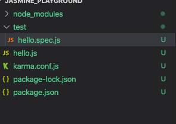

## 테스트?

개발자의 관점에선, 범위에 따른 구분을 많이 사용합니다.

크게 단위 테스트, 통합 테스트, E2E(End to End) 테스트로 구분할 수 있습니다.

이들을 잘 구분해서 상황에 따라 적절한 방식을 선택하는 것이 중요합니다.

### 단위 테스트

작은 단위(모듈)를 전체 어플리케이션에서 떼어 내어 분리된 환경에서 테스트하는 것을 의미합니다.

하나의 모듈이나 클래스에대해 세밀한 부분까지 테스트할 수 있고, 넓은 범위의 테스트에비해 훨씬 빠르게 실행해볼 수 있다는 특징이 있습니다.

하지만, 의존성이 있는 모듈을 제어하기위해 모의 객체(Mocking) 을 사용할 수 밖에 없으며, 이 말은 각각의 모듈들이 잘 연결되어 상호작용하는지는 검증하지 못함을 뜻합니다.

<br>

### 통합 테스트

단위 테스트보다 좀 더 넓은 범위의 테스트를 뜻하며, 보통 두 개 이상의 모듈이 연결된 상태를 테스트합니다.

<br>

### E2E 테스트

실제 사용자의 관점에서 테스트를 진행합니다.(그런 의미에서 기능 테스트, 혹은 UI 테스트라고 부르기도 합니다.)

---

## 테스트 실행 환경

자바스크립트 테스트는 브라우저 환경과 노드js환경 모두에서 실행할 수 있습니다.

두 환경에는 장단점이 있어서, 적절한 테스트 러너를 선택해야 합니다.

### 브라우저 환경

실제 브라우저를 실행해서 테스트 코드를 실행하는 방식을 의미합니다.

대표적으로 Karma가 있습니다. Karma는 테스트 러너의 역할만 하기 때문에, 별도의 테스트 프레임워크가 추가로 필요하며 보통 Jasmine을 많이 사용합니다.

#### - 동작방식

커맨드라인에서 Karma를 실행하면 우선 자체 웹서버를 구동한 뒤 테스트 실행을 위한 HTML페이지를 생성하고, 작성된 테스트 코드 및 소스 코드 전부를 해당 페이지에 로드합니다.

이후 브라우저를 직접 실행해서 해당 웹페이지에 접속하면, 로드된 코드가 실행되고 테스트의 실행 결과가 브라우저에 출력됩니다.

Karma는 이 정보를 받아와 결과를 정리한 후 커맨드라인에 보여줍니다.

### Node.js 환경

Mocha와 Jest가 대표적입니다.

테스트 러너와 테스트 프레임워크가 통합되어 있어 설치 및 실행이 비교적 간단하고 실행속도가 빠릅니다.

하지만 브라우저가 제공하는 API들을 모두 사용할 수 없다는 단점이 있습니다.

노드에는 DOM이나 BOM이 없기 때문에 UI 요소의 레이아웃등에 대한 테스트가 어렵습니다.

---

## Jasmine

Jasmine은 BDD스타일의 단언(Assertion) API를 사용하는 통합 테스트 프레임워크입니다.

노드와 브라우저 환경 모두에서 사용가능합니다.


### 테스트해보기

(시간이 지난 뒤 다시 해보려면.. 전 분명 까먹었을테니깐 기록으로 남겨둡니다..)

Jasmine과 Karma를 같이 사용했습니다.


1. 프로젝트를 하나 만들어줍니다. `hello.js` 만 만들었습니다.

2. `npm init` 명령어를 입력해서 package.json 파일을 생성합니다.

3. [Karma Installation](http://karma-runner.github.io/5.0/intro/installation.html) 의 가이드 대로 모듈을 설치해줍니다.

   ```javascript
   # Install Karma:
   $ npm install karma --save-dev
   
   # Install plugins that your project needs:
   $ npm install karma-jasmine karma-chrome-launcher jasmine-core --save-dev
   ```

4. `karma-cli` 도 추가로 설치해서 cli 커맨드라인을 사용해보려고 합니다.

   ```
   $ npm install -g karma-cli
   ```

   설치 권한이 없다네요..

   ```
   $ sudo npm install -g karma-cli
   ```

   sudo로 설치했음다..
   설치가 잘 되었는지 확인해봅니다.

   ```
   $ karma --version //2.0.0
   ```

5. `karma init` 명령어로 카르마 설정파일을 생성합니다.
   이 때, 테스트의 대상이 될 파일과 테스트 파일이 이미 생성되어 있어야하는 듯 합니다.
   

   전 이런 디렉토리 구조로 생성..

6. 모든 질문에 답변을 하면 `karma.conf.js` 파일이 생성됩니다.

7. hello.js 파일에 코드를 작성해봅니다.

   ```javascript
   const Hello = {
     message: 'Hello world',
     greeting() {
       return this.message;
     }
   };
   ```

8. test/hello.spec.js 파일에 테스트 코드를 작성해 봅니다.(두근두근.. 첨 해봅니다.)

   ```javascript
   describe('Hello', () => {
     describe('greeting', () => {
       it('인사를 한다.', () => {
         const expectedStr = Hello.message;
         const actualStr = Hello.greeting();
   
         expect(actualStr).toBe(expectedStr);
       })
     })
   });
   ```

9. `karma start` 명령어를 입력해줍니다.
   


   테스트가 성공했네요.

---

### 스파이 테스트

`spyOn` 함수를 사용하여 함수 호출 여부를 검증할 수 있다.

```javascript
// hello.js

const Hello = {
  message: 'hello. my name is junwoo',
  greeting() {
    return this.hello + ' ' + this.getName();
  },
  getName() {
    return 'my name is junwoo!';
  }
}
```


```javascript
// test/hello.spec.js

describe('Hello 모듈의', () => {
  describe('greeting 함수는', () => {
    it('getName 함수를 호출한다', () => {
      spyOn(Hello, 'getName');
      Hello.greeting();
      expect(Hello.getName).toHaveBeenCalled();
    })
  })
});
```

`spyOn` 메서드로 Hello 모듈의 getName메서드에 스파이를 심었다!

`toHaveBeenCalled` 매처로 검사했더니..


테스트케이스를 잘 통과한다.

<br>

근데 사실 여기에 함정코드가 있는데... getName메서드는 마지막에 느낌표가 추가되어있다.

`Hello.message !== Hello.greeting()` 인 상황이다. 이건 지금 검사하지않아서 테스트를 안하고 있는거다.

```javascript
describe('Hello 모듈의', () => {
  describe('greeting 함수는', () => {
    it('getName 함수를 호출한다', () => {
      spyOn(Hello, 'getName');
      Hello.greeting();
      expect(Hello.getName).toHaveBeenCalled();
    });
    
    it('message와 값이 같아야 한다', () => {
      expect(Hello.greeting()).toBe(Hello.message)
    });
    
  });
});
```

이런식으로 테스트케이스를 추가해주면,


테스트케이스가 취소되는 것을 볼 수 있다.

`describe` 와 `it` 의 첫번째 인자들을 조합해서 저렇게 매끄러운 문장을 만들 수 있다.

잘 활용하는게 좋을 것 같다. 말이되는(?) 문장을 만들어냄으로써 테스트의 논리적인 계층구조도 표현해낼 수 있을 것 같다.

---

### Ajax 테스트

자스민에서는 ajax테스트를위한 [jasmin-ajax 라이브러리](https://github.com/jasmine/jasmine-ajax)를 제공한다.

지금 개발환경에서는 카르마로 자스민을 실행하고 있기 때문에, `karma-jasmine-ajax` 를 사용하도록 한다.

```
$ npm install karma-jasmine-ajax --save-dev
```

`karma.conf.js` 에서 프레임워크를 추가해주어야한다.

```
// karma.conf.js

... 
//순서가 중요하다.
frameworks: ['jasmine-ajax', 'jasmine']
...
```

```javascript
// hello.js
const Hello = {
	...
	getData() {
    return fetch('https://koreanjson.com/posts/1')
    .then(response => response.json())
    .then(json => json)
  },
  ...
}
```

```javascript
// test/hello.spec.js

describe('getData함수는 응답값', () => {
    const responseJSON = {
      "id": 1,
      "title": "정당의 목적이나 활동이 민주적 기본질서에 위배될 때에는 정부는 헌법재판소에 그 해산을 제소할 수 있고, 정당은 헌법재판소의 심판에 의하여 해산된다.",
      "content": "모든 국민은 인간으로서의 존엄과 가치를 가지며, 행복을 추구할 권리를 가진다. 모든 국민은 종교의 자유를 가진다. 국가는 농·어민과 중소기업의 자조조직을 육성하여야 하며, 그 자율적 활동과 발전을 보장한다. 모든 국민은 양심의 자유를 가진다. 누구든지 체포 또는 구속을 당한 때에는 즉시 변호인의 조력을 받을 권리를 가진다.",
      "createdAt": "2019-02-24T16:17:47.000Z",
      "updatedAt": "2019-02-24T16:17:47.000Z",
      "UserId": 1
    };

    it('id는 1이다', () => {
      return Hello.getData().then(({ id }) => {
        expect(id).toEqual(responseJSON.id);
      })
    });

    it('title값 테스트', () => {
      return Hello.getData().then(({ title }) => {
        expect(title).toEqual(responseJSON.title);
      })
    });

    it('id는 1이다', () => {
      return Hello.getData().then(({ content }) => {
        expect(content).toEqual(responseJSON.content);
      })
    });
  
    it('전체 응답 비교', () => {
      return Hello.getData().then(result => {
        expect(result).toEqual(responseJSON);
      }) 
    });
  });
```

---

## Jasmine Methods

### Global

#### beforeEach, afterEach

반복적인 초기화 작업이 필요한 경우 주로 사용한다.

`describe` 안의 각각의 스펙이 실행되기 전, 후에 호출된다.

#### beforeAll, afterAll

`describe` 안의 스펙이 실행되기 전, 후로 딱 한 번만 실행된다.

#### describe

스펙의 그룹을 만들어준다.

#### expect

스펙의 예상값을 만들어준다.

#### expectAsync

스펙의 비동기 예상값을 만들어준다.

```javascript
describe('비동기 테스트 : ', () => {
  const pie = Promise.resolve(3.14);
  it('expectAsync 테스트1', () => {
    return expectAsync(pie).toBeResolvedTo(3.14);
  })

  it('expectAsync 테스트2', () => {
    return expectAsync(pie).not.toBeResolvedTo(3.145);
  })
})
```


## Reference

[https://ui.toast.com/fe-guide/ko_TEST/](https://ui.toast.com/fe-guide/ko_TEST/)

[http://jeonghwan-kim.github.io/tool/2017/03/28/jasmine.html](http://jeonghwan-kim.github.io/tool/2017/03/28/jasmine.html)

[https://sculove.github.io/slides/testing/#/53](