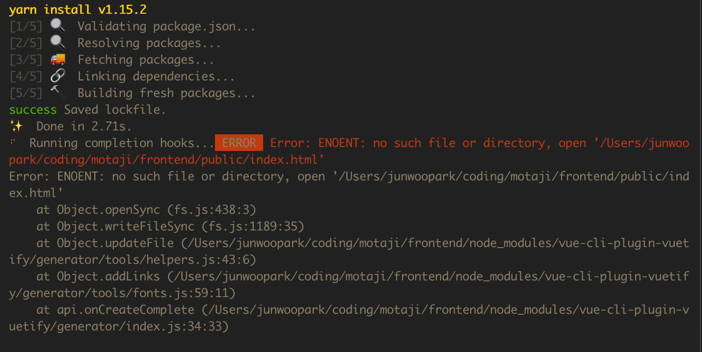

#vue-cli와 vuetify를 사용하면서 겪은 문제


```
$ vue init webpack <project>
```

명령어로 vue 세팅을하고, 

```
$ vue add vuetify
```

로 vuetify를 설치하려는데….자꾸 에러가 뜹니다.




음, public/index.html이 없다네요.

`vue init [template] [project name]` 으로 생성한 프로젝트는 `public/index.html`이 생성되지 않습니다.

대신에 root directory에 `index.html`이 생성되죠.

그래서 타겟 폴더를 찾지 못하고 에러를 뿜뿜...

vuetify plugin은 vue cli의 `$ vue create [project name]` 명령어로 생성된 프로젝트 에서만 동작한다고 하네요.

```
https://github.com/vuetifyjs/vue-cli-plugin-vuetify/issues/65
```


그래서 [이렇게](https://vuetifyjs.com/en/getting-started/quick-start#existing-applications) vuetify를 설치했습니당.